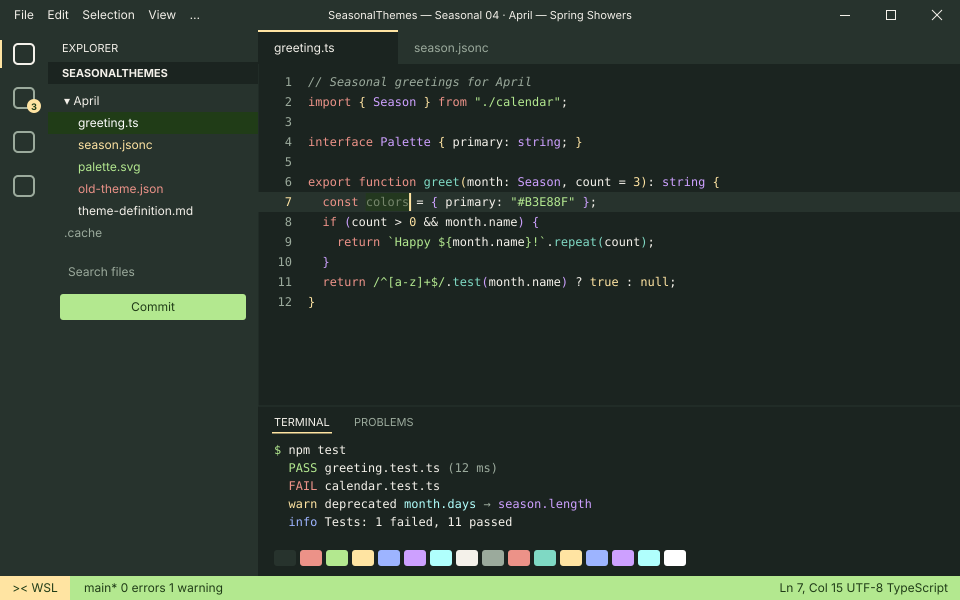
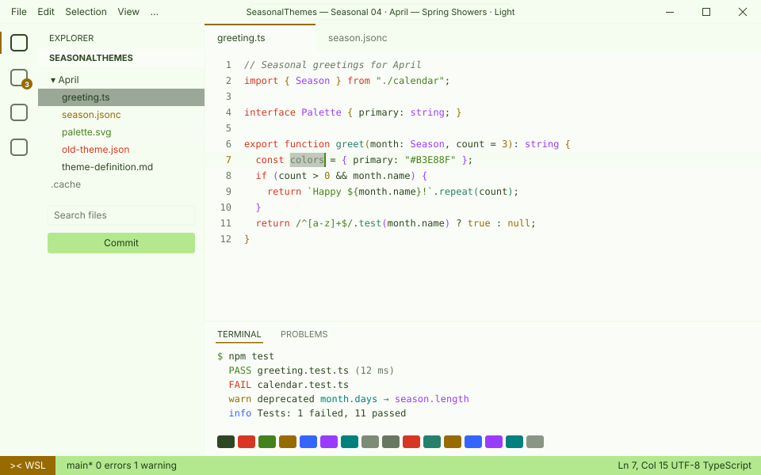
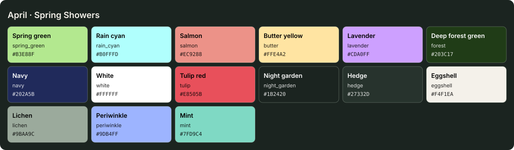

<!-- Generated by Generate-Themes.ps1 from season.jsonc. Edit season.jsonc, not this file. -->

# 🐰 April: Spring Showers

> Pastel blooms, bunnies and bugs after the rain

April is spring in full pastel: light green, sky cyan, salmon, butter yellow and lavender.

The icons are the garden waking up (seedlings, sunflowers, bees, butterflies and ladybugs), with an Easter bunny and a rainbow after the April showers.

<p> </p>

- **Holidays:** April Fools' Day (Apr 1); Easter (Apr 5, a Sunday between March 22 and April 25); Earth Day (Apr 22)
- **Mood:** fresh, gentle, playful, blooming
- **Modes:** dark (default), light

## Colours

| Role | Colour |
|---|---|
| Primary | Spring green `#B3E88F` |
| Secondary | Rain cyan `#B0FFFD` |
| Tertiary | Salmon `#EC9288` |
| Accent | Butter yellow `#FFE4A2` |
| Highlight | Lavender `#CDA0FF` |
| VS Code status bar | Spring green `#B3E88F` |
| Dark editor background | Night garden `#1B2420` |
| Light editor background | `#FAFDF7` |



## Icons

| Shell | Admin | Folder | Home | Git | Run time | Clock | Success | Failure |
|---|---|---|---|---|---|---|---|---|
| 🐰 | 🌿 | 🌻 | 🏡 | 🌞 | 🌈 | 🕰️ | 🌱 | 🥀 |

The prompt, illustrated:

```text
╭─🐰 pwsh  🌻 ~/code  🌞 main ✏️ ~1  🌈 12ms          🕰️ 7:30 PM
⌂──🌱
```

## Use it

- **VS Code:** pick *Seasonal 04 · April — Spring Showers · Dark* or *Seasonal 04 · April — Spring Showers · Light* with **Preferences: Color Theme**. The Seasonal Themes extension switches to it during April on its own.
- **Oh My Posh:** [davids-April.omp.json](davids-April.omp.json) (dark), [davids-April-light.omp.json](davids-April-light.omp.json) (light). `Get-SeasonalTheme.ps1` picks the right one for today.

---

Every colour role, the light-mode changes and all generated files are in [theme-definition.md](theme-definition.md). To change the month, edit [season.jsonc](season.jsonc) and run `pwsh ./Generate-Themes.ps1`.
