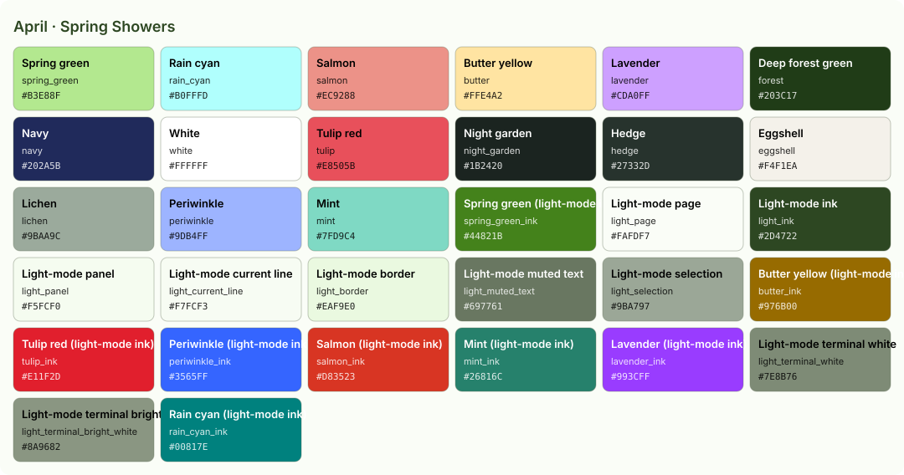

<!-- Generated by Generate-Themes.ps1 from season.jsonc. Edit season.jsonc, not this file. -->

# April: Spring Showers

> Pastel blooms, bunnies and bugs after the rain

April is spring in full pastel: light green, sky cyan, salmon, butter yellow and lavender.

The icons are the garden waking up (seedlings, sunflowers, bees, butterflies and ladybugs), with an Easter bunny and a rainbow after the April showers.

| | |
|---|---|
| **Appearance** | dark |
| **Mood** | fresh, gentle, playful, blooming |
| **Holidays** | April Fools' Day (Apr 1); Easter (Apr 5), a Sunday between March 22 and April 25; Earth Day (Apr 22) |
| **Imagery** | spring garden, Easter eggs, bunny, tulips, rain showers, rainbow, butterflies, bees |

## Palette

| Key | Name | Hex | Note |
|---|---|---|---|
| `spring_green` | Spring green | `#B3E88F` |  |
| `rain_cyan` | Rain cyan | `#B0FFFD` |  |
| `salmon` | Salmon | `#EC9288` |  |
| `butter` | Butter yellow | `#FFE4A2` |  |
| `lavender` | Lavender | `#CDA0FF` |  |
| `forest` | Deep forest green | `#203C17` |  |
| `navy` | Navy | `#202A5B` |  |
| `white` | White | `#FFFFFF` |  |
| `tulip` | Tulip red | `#E8505B` | New: the old theme had no error colour |
| `night_garden` | Night garden | `#1B2420` | Proposed: editor and terminal background |
| `hedge` | Hedge | `#27332D` | Proposed: panels, borders, current line |
| `eggshell` | Eggshell | `#F4F1EA` | Proposed: editor text |
| `lichen` | Lichen | `#9BAA9C` | Proposed: comments, muted text |
| `periwinkle` | Periwinkle | `#9DB4FF` | Proposed: terminal blue, info |
| `mint` | Mint | `#7FD9C4` | Proposed: functions |

## Colour roles

Roles marked *inherits* are not set in `season.jsonc` and take the colour of the role named.

### Brand

The month's signature colours. Prompt segments, badges, status bars and accents.

| Role | Colour | Hex | Text on it | Notes |
|---|---|---|---|---|
| `primary` | spring_green | `#B3E88F` | `#203C17` 8.6:1 |  |
| `secondary` | rain_cyan | `#B0FFFD` | `#203C17` 10.8:1 |  |
| `accent` | butter | `#FFE4A2` | `#203C17` 9.8:1 |  |
| `tertiary` | salmon | `#EC9288` | `#203C17` 5.3:1 |  |
| `accent_alt` | butter | `#FFE4A2` | `#203C17` 9.8:1 |  |
| `highlight` | lavender | `#CDA0FF` | `#203C17` 5.9:1 |  |
| `deep` | rain_cyan | `#B0FFFD` | `#203C17` 10.8:1 |  |
| `text_accent` | navy | `#202A5B` | `#FFFFFF` 13.6:1 |  |
| `line` | spring_green | `#B3E88F` | `#203C17` 8.6:1 |  |

### UI

Surfaces and text of an application window.

| Role | Colour | Hex | Notes |
|---|---|---|---|
| `text_light` | white | `#FFFFFF` |  |
| `text_dark` | forest | `#203C17` |  |
| `background` | night_garden | `#1B2420` |  |
| `foreground` | eggshell | `#F4F1EA` |  |
| `surface` | hedge | `#27332D` |  |
| `line_highlight` | hedge | `#27332D` |  |
| `border` | hedge | `#27332D` |  |
| `muted` | lichen | `#9BAA9C` |  |
| `selection` | forest | `#203C17` |  |
| `cursor` | butter | `#FFE4A2` |  |
| `accent` | butter | `#FFE4A2` | *inherits* `brand.accent` |

### Status

Meaningful states.

| Role | Colour | Hex | Notes |
|---|---|---|---|
| `error` | tulip | `#E8505B` |  |
| `success` | spring_green | `#B3E88F` |  |
| `warning` | butter | `#FFE4A2` |  |
| `info` | periwinkle | `#9DB4FF` |  |

### Syntax

Code highlighting (editors, bat, delta...).

| Role | Colour | Hex | Notes |
|---|---|---|---|
| `comment` | lichen | `#9BAA9C` | italic |
| `keyword` | salmon | `#EC9288` |  |
| `string` | spring_green | `#B3E88F` |  |
| `number` | butter | `#FFE4A2` |  |
| `constant` | butter | `#FFE4A2` |  |
| `function` | mint | `#7FD9C4` |  |
| `type` | lavender | `#CDA0FF` |  |
| `variable` | eggshell | `#F4F1EA` |  |
| `parameter` | eggshell | `#F4F1EA` | *inherits* `syntax.variable` |
| `property` | eggshell | `#F4F1EA` | *inherits* `syntax.variable` |
| `operator` | eggshell | `#F4F1EA` | *inherits* `ui.foreground` |
| `punctuation` | eggshell | `#F4F1EA` | *inherits* `ui.foreground` |
| `tag` | salmon | `#EC9288` | *inherits* `syntax.keyword` |
| `attribute` | mint | `#7FD9C4` | *inherits* `syntax.function` |
| `regex` | spring_green | `#B3E88F` | *inherits* `syntax.string` |
| `invalid` | salmon | `#EC9288` |  |

### Terminal

The 16 ANSI colours plus terminal chrome. Used by terminal emulators and every CLI tool that prints colour. Keep each hue recognisable (red should read as red).

| Role | Colour | Hex | Notes |
|---|---|---|---|
| `background` | night_garden | `#1B2420` | *inherits* `ui.background` |
| `foreground` | eggshell | `#F4F1EA` | *inherits* `ui.foreground` |
| `cursor` | butter | `#FFE4A2` | *inherits* `ui.cursor` |
| `selection` | forest | `#203C17` | *inherits* `ui.selection` |
| `black` | hedge | `#27332D` |  |
| `red` | salmon | `#EC9288` |  |
| `green` | spring_green | `#B3E88F` |  |
| `yellow` | butter | `#FFE4A2` |  |
| `blue` | periwinkle | `#9DB4FF` |  |
| `magenta` | lavender | `#CDA0FF` |  |
| `cyan` | rain_cyan | `#B0FFFD` |  |
| `white` | eggshell | `#F4F1EA` |  |
| `bright_black` | lichen | `#9BAA9C` |  |
| `bright_red` | salmon | `#EC9288` | *inherits* `terminal.red` |
| `bright_green` | mint | `#7FD9C4` |  |
| `bright_yellow` | butter | `#FFE4A2` | *inherits* `terminal.yellow` |
| `bright_blue` | periwinkle | `#9DB4FF` | *inherits* `terminal.blue` |
| `bright_magenta` | lavender | `#CDA0FF` | *inherits* `terminal.magenta` |
| `bright_cyan` | rain_cyan | `#B0FFFD` | *inherits* `terminal.cyan` |
| `bright_white` | white | `#FFFFFF` |  |

## Icons

| Role | Icon | Code points | Notes |
|---|---|---|---|
| `shell` | 🐰 | U+1F430 |  |
| `path` | 🌻 | U+1F33B |  |
| `git` | 🌞 | U+1F31E |  |
| `exec_time` | 🌈 | U+1F308 |  |
| `clock` | 🕰️ | U+1F570 U+FE0F |  |
| `status_ok` | 🌱 | U+1F331 |  |
| `root` | 🌿 | U+1F33F |  |
| `folder` | 🌻 | U+1F33B |  |
| `home` | 🏡 | U+1F3E1 |  |
| `battery` | 📊 | U+1F4CA |  |
| `status_err` | 🥀 | U+1F940 |  |
| `language` | 🌱 | U+1F331 |  |
| `prompt` | ⌂ | U+2302 | *default* |

**Languages and tools** (anything not listed uses `language`: 🌱)

| Segment | Icon |
|---|---|
| `node` | 🐝 |
| `npm` | 🐝 |
| `yarn` | 🌈 |
| `python` | 🦋 |
| `java` | 🐌 |
| `dotnet` | 🐞 |
| `go` | 🐜 |
| `rust` | 🦗 |
| `dart` | 🕷️ |
| `angular` | 🐢 |
| `nx` | 🐛 |
| `julia` | 🌸 |
| `ruby` | 🌼 |
| `azfunc` | ☂️ |
| `aws` | ⛅ |
| `kubectl` | 🌧️ |

**Operating systems** (anything not listed uses `shell`: 🐰)

| OS | Icon |
|---|---|
| `linux` | 🌅 |
| `macos` | 🌅 |
| `windows` | 🌅 |

**Spares:** 🌼 ☔ 🐣 🥚 🐇 🌷 🌳 🍀 🍃 🦔 🦢 🐑 🧺 🐤 🥕

## Light mode

The month is dark by default. In light mode (for programs that follow the system's light/dark setting), these roles change; everything else is the same.

| Role | Dark | Light |
|---|---|---|
| `brand.line` | `#B3E88F` | `#44821B` spring_green_ink |
| `ui.background` | `#1B2420` | `#FAFDF7` light_page |
| `ui.foreground` | `#F4F1EA` | `#2D4722` light_ink |
| `ui.surface` | `#27332D` | `#F5FCF0` light_panel |
| `ui.line_highlight` | `#27332D` | `#F7FCF3` light_current_line |
| `ui.border` | `#27332D` | `#EAF9E0` light_border |
| `ui.muted` | `#9BAA9C` | `#697761` light_muted_text |
| `ui.selection` | `#203C17` | `#9BA797` light_selection |
| `ui.cursor` | `#FFE4A2` | `#44821B` spring_green_ink |
| `ui.accent` | `#FFE4A2` | `#976B00` butter_ink |
| `status.error` | `#E8505B` | `#E11F2D` tulip_ink |
| `status.success` | `#B3E88F` | `#44821B` spring_green_ink |
| `status.warning` | `#FFE4A2` | `#976B00` butter_ink |
| `status.info` | `#9DB4FF` | `#3565FF` periwinkle_ink |
| `syntax.comment` | `#9BAA9C` | `#697761` light_muted_text |
| `syntax.keyword` | `#EC9288` | `#D83523` salmon_ink |
| `syntax.string` | `#B3E88F` | `#44821B` spring_green_ink |
| `syntax.number` | `#FFE4A2` | `#976B00` butter_ink |
| `syntax.constant` | `#FFE4A2` | `#976B00` butter_ink |
| `syntax.function` | `#7FD9C4` | `#26816C` mint_ink |
| `syntax.type` | `#CDA0FF` | `#993CFF` lavender_ink |
| `syntax.variable` | `#F4F1EA` | `#2D4722` light_ink |
| `syntax.parameter` | `#F4F1EA` | `#2D4722` light_ink |
| `syntax.property` | `#F4F1EA` | `#2D4722` light_ink |
| `syntax.operator` | `#F4F1EA` | `#2D4722` light_ink |
| `syntax.punctuation` | `#F4F1EA` | `#2D4722` light_ink |
| `syntax.tag` | `#EC9288` | `#D83523` salmon_ink |
| `syntax.attribute` | `#7FD9C4` | `#26816C` mint_ink |
| `syntax.regex` | `#B3E88F` | `#44821B` spring_green_ink |
| `syntax.invalid` | `#EC9288` | `#D83523` salmon_ink |
| `terminal.background` | `#1B2420` | `#FAFDF7` light_page |
| `terminal.foreground` | `#F4F1EA` | `#2D4722` light_ink |
| `terminal.cursor` | `#FFE4A2` | `#44821B` spring_green_ink |
| `terminal.selection` | `#203C17` | `#9BA797` light_selection |
| `terminal.black` | `#27332D` | `#2D4722` light_ink |
| `terminal.red` | `#EC9288` | `#D83523` salmon_ink |
| `terminal.green` | `#B3E88F` | `#44821B` spring_green_ink |
| `terminal.yellow` | `#FFE4A2` | `#976B00` butter_ink |
| `terminal.blue` | `#9DB4FF` | `#3565FF` periwinkle_ink |
| `terminal.magenta` | `#CDA0FF` | `#993CFF` lavender_ink |
| `terminal.cyan` | `#B0FFFD` | `#00817E` rain_cyan_ink |
| `terminal.white` | `#F4F1EA` | `#7E8B76` light_terminal_white |
| `terminal.bright_black` | `#9BAA9C` | `#697761` light_muted_text |
| `terminal.bright_red` | `#EC9288` | `#D83523` salmon_ink |
| `terminal.bright_green` | `#7FD9C4` | `#26816C` mint_ink |
| `terminal.bright_yellow` | `#FFE4A2` | `#976B00` butter_ink |
| `terminal.bright_blue` | `#9DB4FF` | `#3565FF` periwinkle_ink |
| `terminal.bright_magenta` | `#CDA0FF` | `#993CFF` lavender_ink |
| `terminal.bright_cyan` | `#B0FFFD` | `#00817E` rain_cyan_ink |
| `terminal.bright_white` | `#FFFFFF` | `#8A9682` light_terminal_bright_white |

## VS Code

Part of the Seasonal Themes extension in `vscode/`.

- [Seasonal 04 · April — Spring Showers · Dark](../vscode/themes/april-dark.json)
- [Seasonal 04 · April — Spring Showers · Light](../vscode/themes/april-light.json)

## Ideas

- The old theme gave every pastel its own matching dark text (forest, navy, mahogany, golden brown, plum); the layout could support a text colour per role
- A light editor theme would suit April's pastels
- The battery segment used April's own pastels for charging / discharging / full

## Links

- [Emojipedia: Easter](https://emojipedia.org/easter)
- [Emojipedia: Spring](https://emojipedia.org/spring)

## Generated files

- [davids-April.omp.json](davids-April.omp.json): Oh My Posh prompt.
  Try it with `oh-my-posh init pwsh --config <repo>/April/davids-April.omp.json | Invoke-Expression`.
- [palette.svg](palette.svg): palette swatch sheet.
- [davids-April-light.omp.json](davids-April-light.omp.json): oh-my-posh, light mode.
- [palette-light.svg](palette-light.svg): palette-svg, light mode.
- [vscode-preview-light.svg](vscode-preview-light.svg): vscode-preview, light mode.
- [../vscode/themes/april-light.json](../vscode/themes/april-light.json): vscode-theme, light mode.
- [../vscode/themes/april-dark.json](../vscode/themes/april-dark.json): vscode theme.
- [vscode-preview-dark.svg](vscode-preview-dark.svg): vscode preview.
