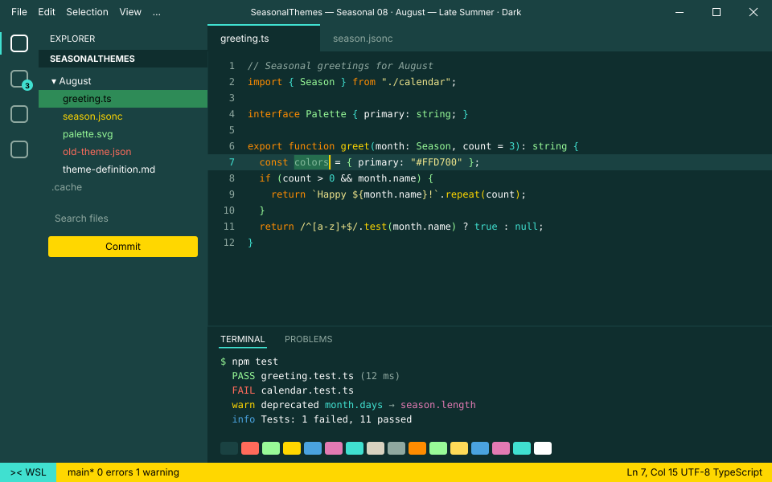
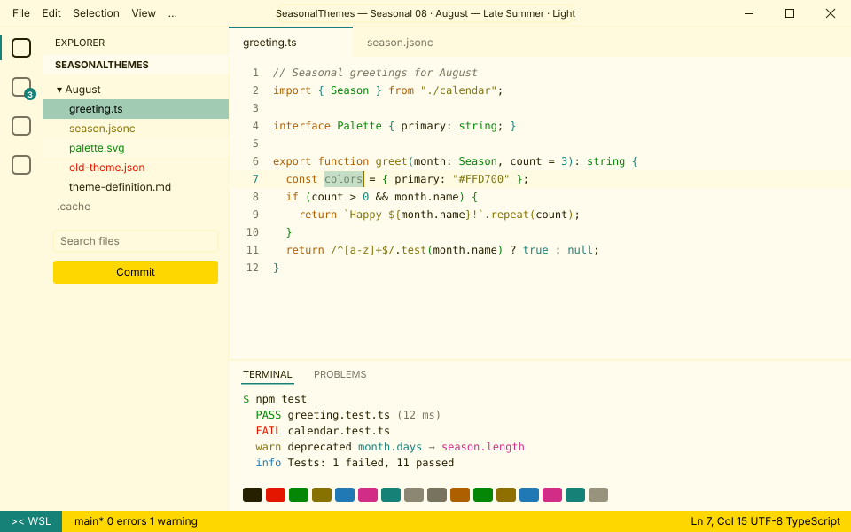

<!-- Generated by Generate-Themes.ps1 from season.jsonc. Edit season.jsonc, not this file. -->

# ☀️ August: Late Summer

> Golden sun, turquoise water and the first of the harvest

August captures late summer: warm golden tones, beach vibes and the first hints of harvest.

Bright summer colours (sun gold, sunset orange, turquoise water) sit next to the sea greens and wheat of the coming harvest season.

<p> </p>

- **Mood:** sunny, relaxed, warm, golden
- **Modes:** dark (default), light

## Colours

| Role | Colour |
|---|---|
| Primary | Golden sun `#FFD700` |
| Secondary | Sunset orange `#FF8C00` |
| Tertiary | Turquoise water `#40E0D0` |
| Accent | Sea green `#2E8B57` |
| Highlight | Sand khaki `#F0E68C` |
| VS Code status bar | Golden sun `#FFD700` |
| Dark editor background | Night lagoon `#0F2E2E` |
| Light editor background | `#FFFCED` |


## Icons

| Shell | Admin | Folder | Home | Git | Run time | Clock | Success | Failure |
|---|---|---|---|---|---|---|---|---|
| ☀️ | 🏖️ | 🌻 | 🏡 | 🌾 | 🍦 | 🌅 | 🍉 | 🔥 |

The prompt, illustrated:

```text
╭─☀️ pwsh  🌻 ~/code  🌾 main ✏️ ~1  🍦 12ms          🌅 7:30 PM
⌂──🍉
```

## Use it

- **VS Code:** pick *Seasonal 08 · August — Late Summer · Dark* or *Seasonal 08 · August — Late Summer · Light* with **Preferences: Color Theme**. The Seasonal Themes extension switches to it during August on its own.
- **Oh My Posh:** [davids-August.omp.json](davids-August.omp.json) (dark), [davids-August-light.omp.json](davids-August-light.omp.json) (light). `Get-SeasonalTheme.ps1` picks the right one for today.

---

Every colour role, the light-mode changes and all generated files are in [theme-definition.md](theme-definition.md). To change the month, edit [season.jsonc](season.jsonc) and run `pwsh ./Generate-Themes.ps1`.
