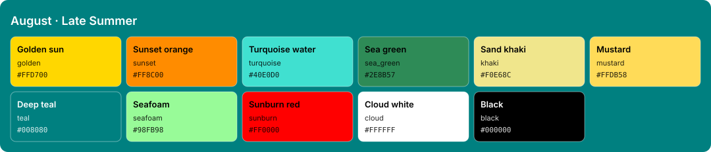

<!-- Generated by Generate-Themes.ps1 from season.jsonc. Edit season.jsonc, not this file. -->

# August: Late Summer

> Golden sun, turquoise water and the first of the harvest

August captures late summer: warm golden tones, beach vibes and the first hints of harvest.

Bright summer colours (sun gold, sunset orange, turquoise water) sit next to the sea greens and wheat of the coming harvest season.

| | |
|---|---|
| **Appearance** | dark |
| **Mood** | sunny, relaxed, warm, golden |
| **Imagery** | sunflower field, beach umbrella, palm trees, turquoise water, wheat field, sunset, watermelon |

## Palette

| Key | Name | Hex | Note |
|---|---|---|---|
| `golden` | Golden sun | `#FFD700` |  |
| `sunset` | Sunset orange | `#FF8C00` |  |
| `turquoise` | Turquoise water | `#40E0D0` |  |
| `sea_green` | Sea green | `#2E8B57` |  |
| `khaki` | Sand khaki | `#F0E68C` |  |
| `mustard` | Mustard | `#FFDB58` |  |
| `teal` | Deep teal | `#008080` |  |
| `seafoam` | Seafoam | `#98FB98` |  |
| `sunburn` | Sunburn red | `#FF0000` |  |
| `cloud` | Cloud white | `#FFFFFF` |  |
| `black` | Black | `#000000` |  |

## Colour roles

Roles marked *inherits* are not set in `season.jsonc` and take the colour of the role named.

### Brand

The month's signature colours. Prompt segments, badges, status bars and accents.

| Role | Colour | Hex | Text on it | Notes |
|---|---|---|---|---|
| `primary` | golden | `#FFD700` | `#000000` 15.0:1 |  |
| `secondary` | sunset | `#FF8C00` | `#000000` 9.0:1 |  |
| `accent` | sea_green | `#2E8B57` | `#000000` 4.9:1 |  |
| `tertiary` | turquoise | `#40E0D0` | `#000000` 12.8:1 |  |
| `accent_alt` | mustard | `#FFDB58` | `#000000` 15.5:1 |  |
| `highlight` | khaki | `#F0E68C` | `#000000` 16.4:1 |  |
| `deep` | teal | `#008080` | `#FFFFFF` 4.8:1 |  |
| `text_accent` | cloud | `#FFFFFF` | `#000000` 21.0:1 |  |
| `line` | golden | `#FFD700` | `#000000` 15.0:1 | *inherits* `brand.primary` |

### UI

Surfaces and text of an application window.

| Role | Colour | Hex | Notes |
|---|---|---|---|
| `text_light` | cloud | `#FFFFFF` |  |
| `text_dark` | black | `#000000` |  |
| `background` | teal | `#008080` | *inherits* `brand.deep` |
| `foreground` | cloud | `#FFFFFF` | *inherits* `ui.text_light` |
| `surface` | teal | `#008080` | *inherits* `ui.background` |
| `line_highlight` | teal | `#008080` | *inherits* `ui.surface` |
| `border` | teal | `#008080` | *inherits* `ui.surface` |
| `muted` | cloud | `#FFFFFF` | *inherits* `ui.foreground` |
| `selection` | sunset | `#FF8C00` | *inherits* `brand.secondary` |
| `cursor` | golden | `#FFD700` | *inherits* `brand.primary` |

### Status

Meaningful states.

| Role | Colour | Hex | Notes |
|---|---|---|---|
| `error` | sunburn | `#FF0000` |  |
| `success` | seafoam | `#98FB98` |  |
| `warning` | sea_green | `#2E8B57` | *inherits* `brand.accent` |
| `info` | khaki | `#F0E68C` | *inherits* `brand.highlight` |

### Syntax

Code highlighting (editors, bat, delta...).

| Role | Colour | Hex | Notes |
|---|---|---|---|
| `comment` | cloud | `#FFFFFF` | *inherits* `ui.muted` |
| `keyword` | golden | `#FFD700` | *inherits* `brand.primary` |
| `string` | sea_green | `#2E8B57` | *inherits* `brand.accent` |
| `number` | turquoise | `#40E0D0` | *inherits* `brand.tertiary` |
| `constant` | turquoise | `#40E0D0` | *inherits* `syntax.number` |
| `function` | mustard | `#FFDB58` | *inherits* `brand.accent_alt` |
| `type` | khaki | `#F0E68C` | *inherits* `brand.highlight` |
| `variable` | cloud | `#FFFFFF` | *inherits* `ui.foreground` |
| `parameter` | cloud | `#FFFFFF` | *inherits* `syntax.variable` |
| `property` | cloud | `#FFFFFF` | *inherits* `syntax.variable` |
| `operator` | cloud | `#FFFFFF` | *inherits* `ui.foreground` |
| `punctuation` | cloud | `#FFFFFF` | *inherits* `ui.foreground` |
| `tag` | golden | `#FFD700` | *inherits* `syntax.keyword` |
| `attribute` | mustard | `#FFDB58` | *inherits* `syntax.function` |
| `regex` | sea_green | `#2E8B57` | *inherits* `syntax.string` |
| `invalid` | sunburn | `#FF0000` | *inherits* `status.error` |

### Terminal

The 16 ANSI colours plus terminal chrome. Used by terminal emulators and every CLI tool that prints colour. Keep each hue recognisable (red should read as red).

| Role | Colour | Hex | Notes |
|---|---|---|---|
| `background` | teal | `#008080` | *inherits* `ui.background` |
| `foreground` | cloud | `#FFFFFF` | *inherits* `ui.foreground` |
| `cursor` | golden | `#FFD700` | *inherits* `ui.cursor` |
| `selection` | sunset | `#FF8C00` | *inherits* `ui.selection` |
| `black` | teal | `#008080` | *inherits* `ui.background` |
| `red` | sunburn | `#FF0000` | *inherits* `status.error` |
| `green` | seafoam | `#98FB98` | *inherits* `status.success` |
| `yellow` | sea_green | `#2E8B57` | *inherits* `status.warning` |
| `blue` | khaki | `#F0E68C` | *inherits* `status.info` |
| `magenta` | khaki | `#F0E68C` | *inherits* `brand.highlight` |
| `cyan` | khaki | `#F0E68C` | *inherits* `status.info` |
| `white` | cloud | `#FFFFFF` | *inherits* `ui.foreground` |
| `bright_black` | cloud | `#FFFFFF` | *inherits* `ui.muted` |
| `bright_red` | sunburn | `#FF0000` | *inherits* `terminal.red` |
| `bright_green` | seafoam | `#98FB98` | *inherits* `terminal.green` |
| `bright_yellow` | sea_green | `#2E8B57` | *inherits* `terminal.yellow` |
| `bright_blue` | khaki | `#F0E68C` | *inherits* `terminal.blue` |
| `bright_magenta` | khaki | `#F0E68C` | *inherits* `terminal.magenta` |
| `bright_cyan` | khaki | `#F0E68C` | *inherits* `terminal.cyan` |
| `bright_white` | cloud | `#FFFFFF` | *inherits* `terminal.white` |

## Icons

| Role | Icon | Code points | Notes |
|---|---|---|---|
| `shell` | ☀️ | U+2600 U+FE0F |  |
| `path` | 🌻 | U+1F33B |  |
| `git` | 🌾 | U+1F33E |  |
| `exec_time` | 🍦 | U+1F366 |  |
| `clock` | 🌅 | U+1F305 |  |
| `status_ok` | 🍉 | U+1F349 |  |
| `root` | 🏖️ | U+1F3D6 U+FE0F |  |
| `folder` | 🌴 | U+1F334 |  |
| `home` | 🏡 | U+1F3E1 |  |
| `battery` | 🥵 | U+1F975 |  |
| `status_err` | 🔥 | U+1F525 |  |
| `language` | 🌊 | U+1F30A |  |
| `prompt` | ⌂ | U+2302 | *default* |

**Languages and tools** (anything not listed uses `language`: 🌊)

| Segment | Icon |
|---|---|
| `node` | 🍉 |
| `npm` | 🍦 |
| `yarn` | 🍑 |
| `java` | 🌻 |
| `go` | 🌻 |
| `dart` | 🌻 |
| `nx` | 🌻 |
| `ruby` | 🌻 |
| `kubectl` | 🌻 |

**Operating systems** (anything not listed uses `shell`: ☀️)

| OS | Icon |
|---|---|
| `linux` | 🐚 |
| `macos` | 🌴 |
| `windows` | 🏄 |

**Spares:** 🐚 🏊 👡 😎 🏝️ 🕶️ 👙 🌞 🍹 🏄 🩱 🩴 🩳 🍨 🧢 🌄 🌡️ 🥥 🍇 🍑 🍓

## Ideas

- More summer fruit for the harvest: 🍇 🍑 🍓
- Sunset gradient colours for a late summer evening feel
- 🏊 swimming icons for a summer recreation theme
- The old theme coloured execution time yellow over 300 ms and red over 1 s; the shared layout could bring that back for every month

## Links

- [Emojipedia: Summer](https://emojipedia.org/summer)

## Generated files

- [davids-August.omp.json](davids-August.omp.json): Oh My Posh prompt.
  Try it with `oh-my-posh init pwsh --config <repo>/August/davids-August.omp.json | Invoke-Expression`.
- [palette.svg](palette.svg): palette swatch sheet.
