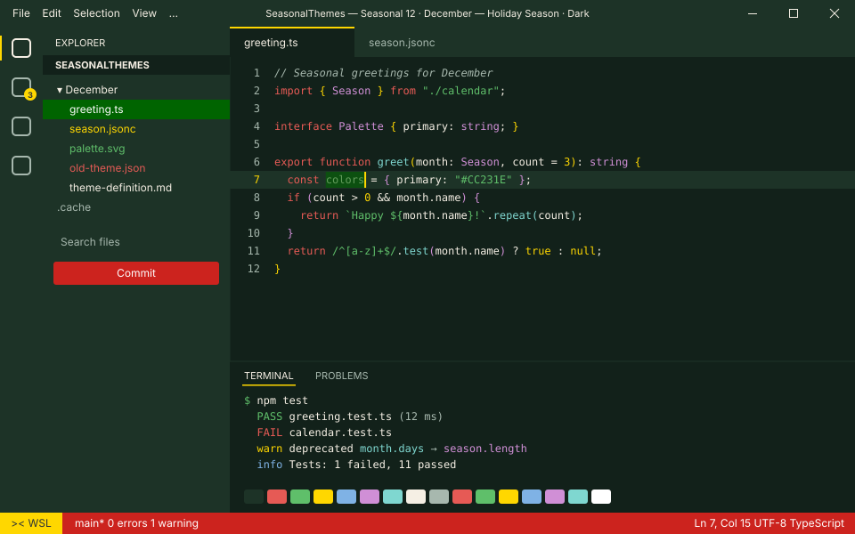
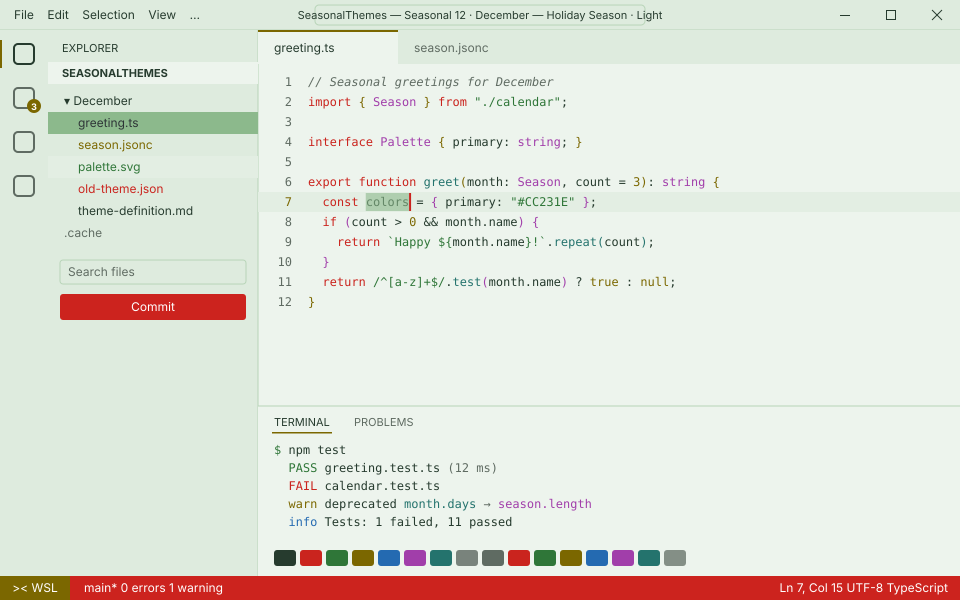
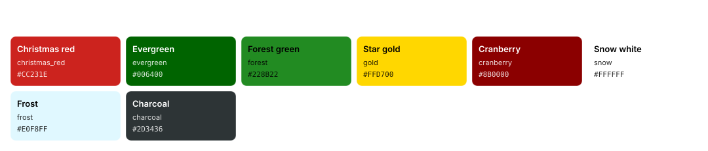
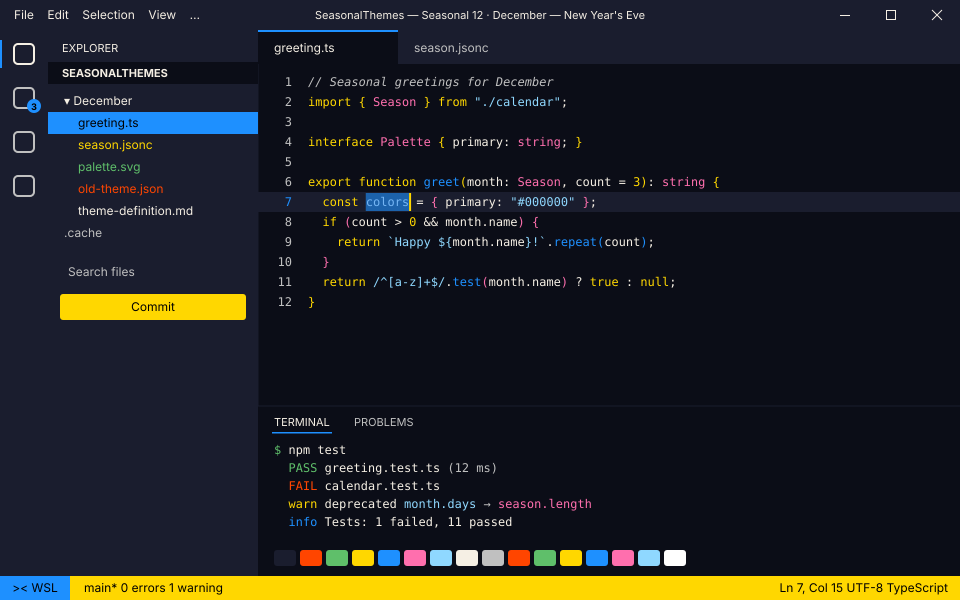
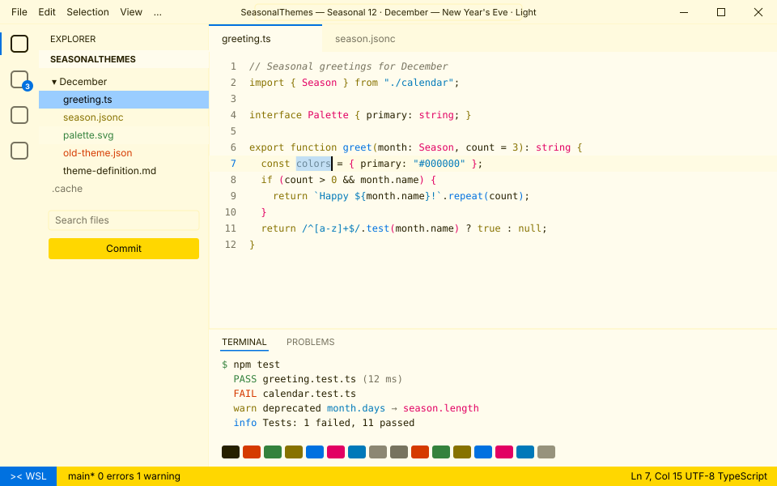

<!-- Generated by Generate-Themes.ps1 from season.jsonc. Edit season.jsonc, not this file. -->

# 🎄 December: Holiday Season

> Christmas trees, wrapped gifts and cookies for Santa

December captures the winter holiday spirit: Christmas red, evergreen and forest greens with star gold and snow white.

Trees, gifts, candles and Santa, with milk and cookies on the clock. After Christmas it turns into New Year's Eve: midnight black, fireworks blue, silver and champagne.

<p> </p>

- **Holidays:** Winter solstice (Dec 21, around the 21st); Christmas Eve (Dec 24); Christmas Day (Dec 25); New Year's Eve (Dec 31)
- **Mood:** festive, cozy, joyful, sparkling
- **Modes:** dark (default), light
- **Variants:** New Year's Eve (Dec 26 to Dec 31)

## Colours

| Role | Colour |
|---|---|
| Primary | Christmas red `#CC231E` |
| Secondary | Evergreen `#006400` |
| Tertiary | Forest green `#228B22` |
| Accent | Star gold `#FFD700` |
| Highlight | Cranberry `#8B0000` |
| VS Code status bar | Christmas red `#CC231E` |
| Dark editor background | Pine night `#12211A` |
| Light editor background | `#EDF4ED` |



## Icons

| Shell | Admin | Folder | Home | Git | Run time | Clock | Success | Failure |
|---|---|---|---|---|---|---|---|---|
| 🎄 | 🎅 | 🎁 | 🌟 | ⭐ | 🕯️ | 🍪🥛 | 🧑‍🎄 | 🧑‍🎄 |

The prompt, illustrated:

```text
╭─🎄 pwsh  🎁 ~/code  ⭐ main ✏️ ~1  🕯️ 12ms          🍪🥛 7:30 PM
⌂──🧑‍🎄
```

## Use it

- **VS Code:** pick *Seasonal 12 · December — Holiday Season · Dark* or *Seasonal 12 · December — Holiday Season · Light* with **Preferences: Color Theme**. The Seasonal Themes extension switches to it during December on its own.
- **Oh My Posh:** [davids-December.omp.json](davids-December.omp.json) (dark), [davids-December-light.omp.json](davids-December-light.omp.json) (light). `Get-SeasonalTheme.ps1` picks the right one for today.

## New Year's Eve

Dec 26 to Dec 31: Midnight, fireworks and a champagne toast.

<p> </p>

Oh My Posh: [davids-December-new-years-eve.omp.json](davids-December-new-years-eve.omp.json) (dark), [davids-December-new-years-eve-light.omp.json](davids-December-new-years-eve-light.omp.json) (light).

---

Every colour role, the light-mode changes and all generated files are in [theme-definition.md](theme-definition.md). To change the month, edit [season.jsonc](season.jsonc) and run `pwsh ./Generate-Themes.ps1`.
