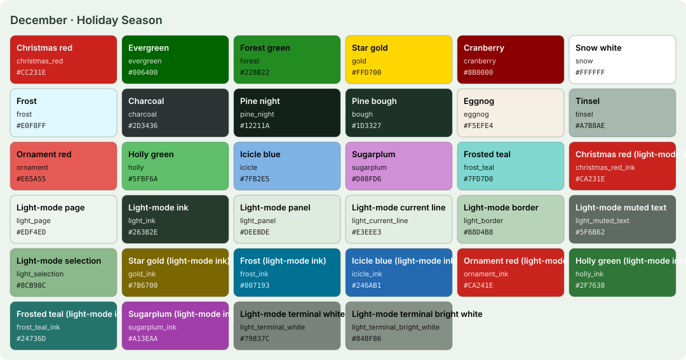

<!-- Generated by Generate-Themes.ps1 from season.jsonc. Edit season.jsonc, not this file. -->

# December: Holiday Season

> Christmas trees, wrapped gifts and cookies for Santa

December captures the winter holiday spirit: Christmas red, evergreen and forest greens with star gold and snow white.

Trees, gifts, candles and Santa, with milk and cookies on the clock. After Christmas it turns into New Year's Eve: midnight black, fireworks blue, silver and champagne.

| | |
|---|---|
| **Appearance** | dark |
| **Mood** | festive, cozy, joyful, sparkling |
| **Holidays** | Winter solstice (Dec 21), around the 21st; Christmas Eve (Dec 24); Christmas Day (Dec 25); New Year's Eve (Dec 31) |
| **Imagery** | Christmas tree, wrapped presents, candlelight, snowy village, stockings, fireworks, champagne |

## Palette

| Key | Name | Hex | Note |
|---|---|---|---|
| `christmas_red` | Christmas red | `#CC231E` |  |
| `evergreen` | Evergreen | `#006400` |  |
| `forest` | Forest green | `#228B22` |  |
| `gold` | Star gold | `#FFD700` |  |
| `cranberry` | Cranberry | `#8B0000` |  |
| `snow` | Snow white | `#FFFFFF` |  |
| `frost` | Frost | `#E0F8FF` |  |
| `charcoal` | Charcoal | `#2D3436` |  |
| `pine_night` | Pine night | `#12211A` | Proposed: editor and terminal background |
| `bough` | Pine bough | `#1D3327` | Proposed: panels, borders, current line |
| `eggnog` | Eggnog | `#F5EFE4` | Proposed: editor text |
| `tinsel` | Tinsel | `#A7B8AE` | Proposed: comments, muted text |
| `ornament` | Ornament red | `#E65A55` | Proposed: Christmas red lightened (terminal red, keywords, invalid code) |
| `holly` | Holly green | `#5FBF6A` | Proposed: terminal green, strings |
| `icicle` | Icicle blue | `#7FB2E5` | Proposed: terminal blue, info |
| `sugarplum` | Sugarplum | `#D08FD6` | Proposed: terminal magenta, types |
| `frost_teal` | Frosted teal | `#7FD7D0` | Proposed: terminal cyan |

## Colour roles

Roles marked *inherits* are not set in `season.jsonc` and take the colour of the role named.

### Brand

The month's signature colours. Prompt segments, badges, status bars and accents.

| Role | Colour | Hex | Text on it | Notes |
|---|---|---|---|---|
| `primary` | christmas_red | `#CC231E` | `#FFFFFF` 5.5:1 |  |
| `secondary` | evergreen | `#006400` | `#FFFFFF` 7.4:1 |  |
| `accent` | gold | `#FFD700` | `#2D3436` 9.0:1 |  |
| `tertiary` | forest | `#228B22` | `#FFFFFF` 4.4:1 |  |
| `accent_alt` | gold | `#FFD700` | `#2D3436` 9.0:1 |  |
| `highlight` | cranberry | `#8B0000` | `#FFFFFF` 10.0:1 |  |
| `deep` | snow | `#FFFFFF` | `#2D3436` 12.7:1 |  |
| `text_accent` | gold | `#FFD700` | `#2D3436` 9.0:1 |  |
| `line` | christmas_red | `#CC231E` | `#FFFFFF` 5.5:1 | *inherits* `brand.primary` |

### UI

Surfaces and text of an application window.

| Role | Colour | Hex | Notes |
|---|---|---|---|
| `text_light` | snow | `#FFFFFF` |  |
| `text_dark` | charcoal | `#2D3436` |  |
| `background` | pine_night | `#12211A` |  |
| `foreground` | eggnog | `#F5EFE4` |  |
| `surface` | bough | `#1D3327` |  |
| `line_highlight` | bough | `#1D3327` |  |
| `border` | bough | `#1D3327` |  |
| `muted` | tinsel | `#A7B8AE` |  |
| `selection` | evergreen | `#006400` |  |
| `cursor` | gold | `#FFD700` |  |
| `accent` | gold | `#FFD700` | *inherits* `brand.accent` |

### Status

Meaningful states.

| Role | Colour | Hex | Notes |
|---|---|---|---|
| `error` | evergreen | `#006400` |  |
| `success` | frost | `#E0F8FF` |  |
| `warning` | gold | `#FFD700` |  |
| `info` | icicle | `#7FB2E5` |  |

### Syntax

Code highlighting (editors, bat, delta...).

| Role | Colour | Hex | Notes |
|---|---|---|---|
| `comment` | tinsel | `#A7B8AE` | italic |
| `keyword` | ornament | `#E65A55` |  |
| `string` | holly | `#5FBF6A` |  |
| `number` | gold | `#FFD700` |  |
| `constant` | gold | `#FFD700` |  |
| `function` | frost_teal | `#7FD7D0` |  |
| `type` | sugarplum | `#D08FD6` |  |
| `variable` | eggnog | `#F5EFE4` |  |
| `parameter` | eggnog | `#F5EFE4` | *inherits* `syntax.variable` |
| `property` | eggnog | `#F5EFE4` | *inherits* `syntax.variable` |
| `operator` | eggnog | `#F5EFE4` | *inherits* `ui.foreground` |
| `punctuation` | eggnog | `#F5EFE4` | *inherits* `ui.foreground` |
| `tag` | ornament | `#E65A55` | *inherits* `syntax.keyword` |
| `attribute` | frost_teal | `#7FD7D0` | *inherits* `syntax.function` |
| `regex` | holly | `#5FBF6A` | *inherits* `syntax.string` |
| `invalid` | ornament | `#E65A55` |  |

### Terminal

The 16 ANSI colours plus terminal chrome. Used by terminal emulators and every CLI tool that prints colour. Keep each hue recognisable (red should read as red).

| Role | Colour | Hex | Notes |
|---|---|---|---|
| `background` | pine_night | `#12211A` | *inherits* `ui.background` |
| `foreground` | eggnog | `#F5EFE4` | *inherits* `ui.foreground` |
| `cursor` | gold | `#FFD700` | *inherits* `ui.cursor` |
| `selection` | evergreen | `#006400` | *inherits* `ui.selection` |
| `black` | bough | `#1D3327` |  |
| `red` | ornament | `#E65A55` |  |
| `green` | holly | `#5FBF6A` |  |
| `yellow` | gold | `#FFD700` |  |
| `blue` | icicle | `#7FB2E5` |  |
| `magenta` | sugarplum | `#D08FD6` |  |
| `cyan` | frost_teal | `#7FD7D0` |  |
| `white` | eggnog | `#F5EFE4` |  |
| `bright_black` | tinsel | `#A7B8AE` |  |
| `bright_red` | ornament | `#E65A55` | *inherits* `terminal.red` |
| `bright_green` | holly | `#5FBF6A` | *inherits* `terminal.green` |
| `bright_yellow` | gold | `#FFD700` | *inherits* `terminal.yellow` |
| `bright_blue` | icicle | `#7FB2E5` | *inherits* `terminal.blue` |
| `bright_magenta` | sugarplum | `#D08FD6` | *inherits* `terminal.magenta` |
| `bright_cyan` | frost_teal | `#7FD7D0` | *inherits* `terminal.cyan` |
| `bright_white` | snow | `#FFFFFF` |  |

## Icons

| Role | Icon | Code points | Notes |
|---|---|---|---|
| `shell` | 🎄 | U+1F384 |  |
| `path` | 🎁 | U+1F381 |  |
| `git` | ⭐ | U+2B50 |  |
| `exec_time` | 🕯️ | U+1F56F U+FE0F |  |
| `clock` | 🍪🥛 | U+1F36A U+1F95B |  |
| `status_ok` | 🧑‍🎄 | U+1F9D1 U+200D U+1F384 |  |
| `root` | 🎅 | U+1F385 |  |
| `folder` | 🎁 | U+1F381 |  |
| `home` | 🌟 | U+1F31F |  |
| `battery` | ❄️ | U+2744 U+FE0F |  |
| `status_err` | 🧑‍🎄 | U+1F9D1 U+200D U+1F384 |  |
| `language` | 🎄 | U+1F384 |  |
| `prompt` | ⌂ | U+2302 | *default* |

**Languages and tools** (anything not listed uses `language`: 🎄)

| Segment | Icon |
|---|---|
| `yarn` | 🎅 |
| `python` | 🎅 |
| `java` | 🎁 |
| `dotnet` | ⭐ |
| `rust` | 🎅 |
| `dart` | 🎁 |
| `angular` | ⭐ |
| `julia` | 🎅 |
| `ruby` | 🎁 |
| `azfunc` | ⭐ |
| `kubectl` | 🎅 |

**Operating systems** (anything not listed uses `shell`: 🎄)

| OS | Icon |
|---|---|
| `linux` | 🎄 |
| `macos` | 🍎 |
| `windows` | 🎅 |

**Spares:** 🔔 🕯️ 👼 🤶 ☃️ ⛄ 🦌 🍪 🥛 🧝 🧦 🛷 🌨️ 🎀 🌲 🔥

## Variants

| Variant | Dates | Changes | Files |
|---|---|---|---|
| New Year's Eve | Dec 26 to Dec 31 | tagline, palette (9), colors.brand (7), colors.ui (7), colors.syntax (6), colors.terminal (6), colors.status (2), icons (12), targets (2), modes (1) | [davids-December-new-years-eve.omp.json](davids-December-new-years-eve.omp.json), [palette-new-years-eve.svg](palette-new-years-eve.svg), [vscode-preview-new-years-eve-dark.svg](vscode-preview-new-years-eve-dark.svg), [../vscode/themes/december-new-years-eve-dark.json](../vscode/themes/december-new-years-eve-dark.json) |

## Light mode

The month is dark by default. In light mode (for programs that follow the system's light/dark setting), these roles change; everything else is the same.

| Role | Dark | Light |
|---|---|---|
| `brand.line` | `#CC231E` | `#CA231E` christmas_red_ink |
| `ui.background` | `#12211A` | `#EDF4ED` light_page |
| `ui.foreground` | `#F5EFE4` | `#263B2E` light_ink |
| `ui.surface` | `#1D3327` | `#DEEBDE` light_panel |
| `ui.line_highlight` | `#1D3327` | `#E3EEE3` light_current_line |
| `ui.border` | `#1D3327` | `#B8D4B8` light_border |
| `ui.muted` | `#A7B8AE` | `#5F6B62` light_muted_text |
| `ui.selection` | `#006400` | `#8CB98C` light_selection |
| `ui.cursor` | `#FFD700` | `#CA231E` christmas_red_ink |
| `ui.accent` | `#FFD700` | `#7B6700` gold_ink |
| `status.success` | `#E0F8FF` | `#007193` frost_ink |
| `status.warning` | `#FFD700` | `#7B6700` gold_ink |
| `status.info` | `#7FB2E5` | `#246AB1` icicle_ink |
| `syntax.comment` | `#A7B8AE` | `#5F6B62` light_muted_text |
| `syntax.keyword` | `#E65A55` | `#CA241E` ornament_ink |
| `syntax.string` | `#5FBF6A` | `#2F7638` holly_ink |
| `syntax.number` | `#FFD700` | `#7B6700` gold_ink |
| `syntax.constant` | `#FFD700` | `#7B6700` gold_ink |
| `syntax.function` | `#7FD7D0` | `#24736D` frost_teal_ink |
| `syntax.type` | `#D08FD6` | `#A13EAA` sugarplum_ink |
| `syntax.variable` | `#F5EFE4` | `#263B2E` light_ink |
| `syntax.parameter` | `#F5EFE4` | `#263B2E` light_ink |
| `syntax.property` | `#F5EFE4` | `#263B2E` light_ink |
| `syntax.operator` | `#F5EFE4` | `#263B2E` light_ink |
| `syntax.punctuation` | `#F5EFE4` | `#263B2E` light_ink |
| `syntax.tag` | `#E65A55` | `#CA241E` ornament_ink |
| `syntax.attribute` | `#7FD7D0` | `#24736D` frost_teal_ink |
| `syntax.regex` | `#5FBF6A` | `#2F7638` holly_ink |
| `syntax.invalid` | `#E65A55` | `#CA241E` ornament_ink |
| `terminal.background` | `#12211A` | `#EDF4ED` light_page |
| `terminal.foreground` | `#F5EFE4` | `#263B2E` light_ink |
| `terminal.cursor` | `#FFD700` | `#CA231E` christmas_red_ink |
| `terminal.selection` | `#006400` | `#8CB98C` light_selection |
| `terminal.black` | `#1D3327` | `#263B2E` light_ink |
| `terminal.red` | `#E65A55` | `#CA241E` ornament_ink |
| `terminal.green` | `#5FBF6A` | `#2F7638` holly_ink |
| `terminal.yellow` | `#FFD700` | `#7B6700` gold_ink |
| `terminal.blue` | `#7FB2E5` | `#246AB1` icicle_ink |
| `terminal.magenta` | `#D08FD6` | `#A13EAA` sugarplum_ink |
| `terminal.cyan` | `#7FD7D0` | `#24736D` frost_teal_ink |
| `terminal.white` | `#F5EFE4` | `#79837C` light_terminal_white |
| `terminal.bright_black` | `#A7B8AE` | `#5F6B62` light_muted_text |
| `terminal.bright_red` | `#E65A55` | `#CA241E` ornament_ink |
| `terminal.bright_green` | `#5FBF6A` | `#2F7638` holly_ink |
| `terminal.bright_yellow` | `#FFD700` | `#7B6700` gold_ink |
| `terminal.bright_blue` | `#7FB2E5` | `#246AB1` icicle_ink |
| `terminal.bright_magenta` | `#D08FD6` | `#A13EAA` sugarplum_ink |
| `terminal.bright_cyan` | `#7FD7D0` | `#24736D` frost_teal_ink |
| `terminal.bright_white` | `#FFFFFF` | `#848F86` light_terminal_bright_white |

## VS Code

Part of the Seasonal Themes extension in `vscode/`.

- [Seasonal 12 · December — Holiday Season · Dark](../vscode/themes/december-dark.json)
- [Seasonal 12 · December — Holiday Season · Light](../vscode/themes/december-light.json)

## Ideas

- More holiday icons: 🕯️ candle, 🦌 deer, 🧦 stocking
- 🎅 Santa as the admin indicator
- Alternating red and green segments for a candy-cane effect
- ☃️ snowman for system monitoring

## Links

- [Emojipedia: Christmas](https://emojipedia.org/christmas)
- [Emojipedia: New Year's Eve](https://emojipedia.org/new-years-eve)

## Generated files

- [davids-December.omp.json](davids-December.omp.json): Oh My Posh prompt.
  Try it with `oh-my-posh init pwsh --config <repo>/December/davids-December.omp.json | Invoke-Expression`.
- [palette.svg](palette.svg): palette swatch sheet.
- [davids-December-light.omp.json](davids-December-light.omp.json): oh-my-posh, light mode.
- [palette-light.svg](palette-light.svg): palette-svg, light mode.
- [vscode-preview-light.svg](vscode-preview-light.svg): vscode-preview, light mode.
- [../vscode/themes/december-light.json](../vscode/themes/december-light.json): vscode-theme, light mode.
- [../vscode/themes/december-dark.json](../vscode/themes/december-dark.json): vscode theme.
- [vscode-preview-dark.svg](vscode-preview-dark.svg): vscode preview.
