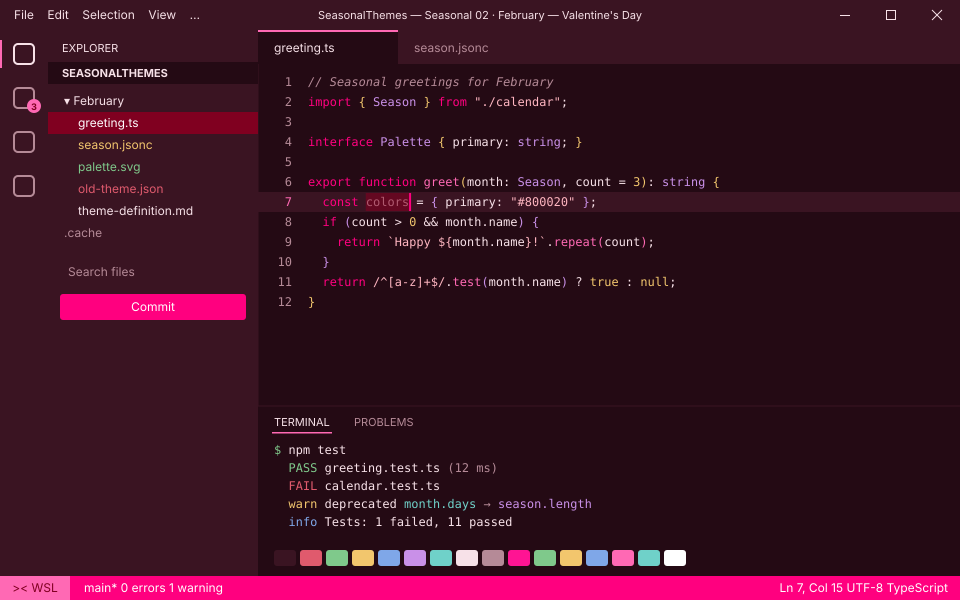
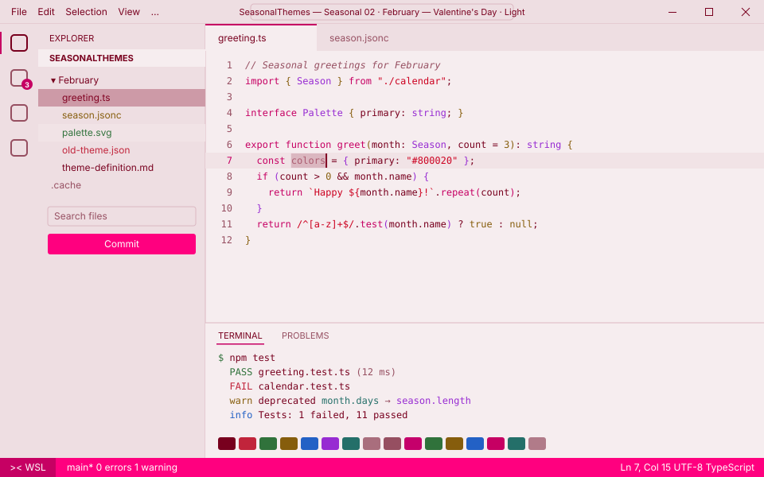

<!-- Generated by Generate-Themes.ps1 from season.jsonc. Edit season.jsonc, not this file. -->

# 🌹 February: Valentine's Day

> Roses, love letters and a box of chocolates

February celebrates Valentine's Day with romantic burgundy, rose and deep pink, and hearts everywhere.

Rose-pink text on white 'Valentine card' segments sits next to deep burgundy ones, like a box of chocolates and a love letter.

<p> </p>

- **Holidays:** Valentine's Day (Feb 14)
- **Mood:** romantic, sweet, warm, playful
- **Modes:** dark (default), light

## Colours

| Role | Colour |
|---|---|
| Primary | Burgundy `#800020` |
| Secondary | Rose `#FF007F` |
| VS Code status bar | Rose `#FF007F` |
| Dark editor background | Red wine `#240A14` |
| Light editor background | `#F6EDEF` |


## Icons

| Shell | Admin | Folder | Home | Git | Run time | Clock | Success | Failure |
|---|---|---|---|---|---|---|---|---|
| 🌹 | ✨ | 💗 | 💒 | 💏 | 😘 | 💐🧸 | 🫶 | 💔 |

The prompt, illustrated:

```text
╭─🌹 pwsh  💗 ~/code  💏 main ✏️ ~1  😘 12ms          💐🧸 7:30 PM
💌──🫶
```

## Use it

- **VS Code:** pick *Seasonal 02 · February — Valentine's Day · Dark* or *Seasonal 02 · February — Valentine's Day · Light* with **Preferences: Color Theme**. The Seasonal Themes extension switches to it during February on its own.
- **Oh My Posh:** [davids-February.omp.json](davids-February.omp.json) (dark), [davids-February-light.omp.json](davids-February-light.omp.json) (light). `Get-SeasonalTheme.ps1` picks the right one for today.

---

Every colour role, the light-mode changes and all generated files are in [theme-definition.md](theme-definition.md). To change the month, edit [season.jsonc](season.jsonc) and run `pwsh ./Generate-Themes.ps1`.
