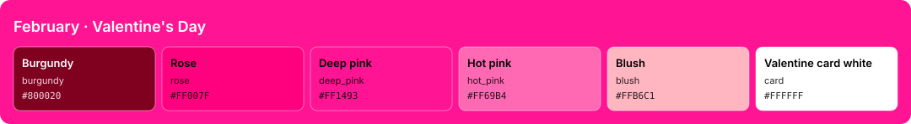

<!-- Generated by Generate-Themes.ps1 from season.jsonc. Edit season.jsonc, not this file. -->

# February: Valentine's Day

> Roses, love letters and a box of chocolates

February celebrates Valentine's Day with romantic burgundy, rose and deep pink, and hearts everywhere.

Rose-pink text on white 'Valentine card' segments sits next to deep burgundy ones, like a box of chocolates and a love letter.

| | |
|---|---|
| **Appearance** | dark |
| **Mood** | romantic, sweet, warm, playful |
| **Holidays** | Valentine's Day (Feb 14) |
| **Imagery** | red roses, love letter, box of chocolates, hearts, teddy bear, bouquet, wax seal |

## Palette

| Key | Name | Hex | Note |
|---|---|---|---|
| `burgundy` | Burgundy | `#800020` |  |
| `rose` | Rose | `#FF007F` |  |
| `deep_pink` | Deep pink | `#FF1493` |  |
| `hot_pink` | Hot pink | `#FF69B4` |  |
| `blush` | Blush | `#FFB6C1` |  |
| `card` | Valentine card white | `#FFFFFF` |  |
| `wine` | Red wine | `#240A14` | Proposed: editor and terminal background |
| `velvet` | Velvet | `#3A1422` | Proposed: panels, borders, current line |
| `petal` | Rose petal | `#F7E1E8` | Proposed: editor text |
| `mauve` | Dusty mauve | `#B58A97` | Proposed: comments, muted text |
| `cherry` | Cherry | `#E05A6D` | Proposed: terminal red, invalid code |
| `mint` | Mint leaf | `#7FC98B` | Proposed: terminal green |
| `honey` | Honey gold | `#F2C66D` | Proposed: terminal yellow, numbers |
| `cupid` | Cupid blue | `#7FA7E8` | Proposed: terminal blue, info |
| `lilac` | Lilac | `#C990E8` | Proposed: terminal magenta, types |
| `aqua` | Sea glass | `#6FD1C9` | Proposed: terminal cyan |

## Colour roles

Roles marked *inherits* are not set in `season.jsonc` and take the colour of the role named.

### Brand

The month's signature colours. Prompt segments, badges, status bars and accents.

| Role | Colour | Hex | Text on it | Notes |
|---|---|---|---|---|
| `primary` | burgundy | `#800020` | `#FFFFFF` 10.8:1 |  |
| `secondary` | rose | `#FF007F` | `#FFFFFF` 3.8:1 |  |
| `accent` | rose | `#FF007F` | `#FFFFFF` 3.8:1 |  |
| `tertiary` | burgundy | `#800020` | `#FFFFFF` 10.8:1 |  |
| `accent_alt` | card | `#FFFFFF` | `#800020` 10.8:1 |  |
| `highlight` | burgundy | `#800020` | `#FFFFFF` 10.8:1 |  |
| `deep` | deep_pink | `#FF1493` | `#FFFFFF` 3.6:1 |  |
| `text_accent` | card | `#FFFFFF` | `#800020` 10.8:1 |  |
| `line` | hot_pink | `#FF69B4` | `#800020` 4.1:1 |  |

### UI

Surfaces and text of an application window.

| Role | Colour | Hex | Notes |
|---|---|---|---|
| `text_light` | card | `#FFFFFF` |  |
| `text_dark` | burgundy | `#800020` |  |
| `background` | wine | `#240A14` |  |
| `foreground` | petal | `#F7E1E8` |  |
| `surface` | velvet | `#3A1422` |  |
| `line_highlight` | velvet | `#3A1422` |  |
| `border` | velvet | `#3A1422` |  |
| `muted` | mauve | `#B58A97` |  |
| `selection` | burgundy | `#800020` |  |
| `cursor` | rose | `#FF007F` |  |

### Status

Meaningful states.

| Role | Colour | Hex | Notes |
|---|---|---|---|
| `error` | deep_pink | `#FF1493` |  |
| `success` | card | `#FFFFFF` |  |
| `warning` | honey | `#F2C66D` |  |
| `info` | cupid | `#7FA7E8` |  |

### Syntax

Code highlighting (editors, bat, delta...).

| Role | Colour | Hex | Notes |
|---|---|---|---|
| `comment` | mauve | `#B58A97` | italic |
| `keyword` | rose | `#FF007F` |  |
| `string` | blush | `#FFB6C1` |  |
| `number` | honey | `#F2C66D` |  |
| `constant` | honey | `#F2C66D` |  |
| `function` | hot_pink | `#FF69B4` |  |
| `type` | lilac | `#C990E8` |  |
| `variable` | petal | `#F7E1E8` |  |
| `parameter` | petal | `#F7E1E8` | *inherits* `syntax.variable` |
| `property` | petal | `#F7E1E8` | *inherits* `syntax.variable` |
| `operator` | petal | `#F7E1E8` | *inherits* `ui.foreground` |
| `punctuation` | petal | `#F7E1E8` | *inherits* `ui.foreground` |
| `tag` | rose | `#FF007F` | *inherits* `syntax.keyword` |
| `attribute` | hot_pink | `#FF69B4` | *inherits* `syntax.function` |
| `regex` | blush | `#FFB6C1` | *inherits* `syntax.string` |
| `invalid` | cherry | `#E05A6D` |  |

### Terminal

The 16 ANSI colours plus terminal chrome. Used by terminal emulators and every CLI tool that prints colour. Keep each hue recognisable (red should read as red).

| Role | Colour | Hex | Notes |
|---|---|---|---|
| `background` | wine | `#240A14` | *inherits* `ui.background` |
| `foreground` | petal | `#F7E1E8` | *inherits* `ui.foreground` |
| `cursor` | rose | `#FF007F` | *inherits* `ui.cursor` |
| `selection` | burgundy | `#800020` | *inherits* `ui.selection` |
| `black` | velvet | `#3A1422` |  |
| `red` | cherry | `#E05A6D` |  |
| `green` | mint | `#7FC98B` |  |
| `yellow` | honey | `#F2C66D` |  |
| `blue` | cupid | `#7FA7E8` |  |
| `magenta` | lilac | `#C990E8` |  |
| `cyan` | aqua | `#6FD1C9` |  |
| `white` | petal | `#F7E1E8` |  |
| `bright_black` | mauve | `#B58A97` |  |
| `bright_red` | deep_pink | `#FF1493` |  |
| `bright_green` | mint | `#7FC98B` | *inherits* `terminal.green` |
| `bright_yellow` | honey | `#F2C66D` | *inherits* `terminal.yellow` |
| `bright_blue` | cupid | `#7FA7E8` | *inherits* `terminal.blue` |
| `bright_magenta` | hot_pink | `#FF69B4` |  |
| `bright_cyan` | aqua | `#6FD1C9` | *inherits* `terminal.cyan` |
| `bright_white` | card | `#FFFFFF` |  |

## Icons

| Role | Icon | Code points | Notes |
|---|---|---|---|
| `shell` | 🌹 | U+1F339 |  |
| `path` | 💗 | U+1F497 |  |
| `git` | 💏 | U+1F48F |  |
| `exec_time` | 😘 | U+1F618 |  |
| `clock` | 💐🧸 | U+1F490 U+1F9F8 |  |
| `status_ok` | 🫶 | U+1FAF6 |  |
| `root` | ✨ | U+2728 |  |
| `folder` | 💟 | U+1F49F |  |
| `home` | 💒 | U+1F492 |  |
| `battery` | 💗 | U+1F497 |  |
| `status_err` | 💔 | U+1F494 |  |
| `language` | 💕 | U+1F495 |  |
| `prompt` | 💌 | U+1F48C |  |

**Languages and tools** (anything not listed uses `language`: 💕)

| Segment | Icon |
|---|---|
| `npm` | 💐 |
| `yarn` | 🧸 |
| `node` | 🤍 |
| `python` | 💗 |
| `dotnet` | 💘 |
| `go` | 🧸 |
| `rust` | 💖 |
| `dart` | 💗 |
| `nx` | 💘 |
| `julia` | 💝 |
| `ruby` | 💖 |
| `azfunc` | 💗 |
| `kubectl` | 💘 |

**Operating systems** (anything not listed uses `shell`: 🌹)

| OS | Icon |
|---|---|
| `linux` | 💝 |
| `macos` | 🍎 |
| `windows` | 💖 |

**Spares:** ❤️ 💞 💓 💮 📮 🎀 🎁 😍 💋 🌷 💍 🍫 🥰 💑 🍓

## Ideas

- More heart variations: 💓 💗 💖 💕 for different segments
- Darker red backgrounds with white text for readability
- Light pink backgrounds with dark red text for contrast

## Links

- [Emojipedia: Valentine's Day](https://emojipedia.org/valentines-day)
- [Emojipedia: Hearts](https://emojipedia.org/hearts)

## Generated files

- [davids-February.omp.json](davids-February.omp.json): Oh My Posh prompt.
  Try it with `oh-my-posh init pwsh --config <repo>/February/davids-February.omp.json | Invoke-Expression`.
- [palette.svg](palette.svg): palette swatch sheet.
