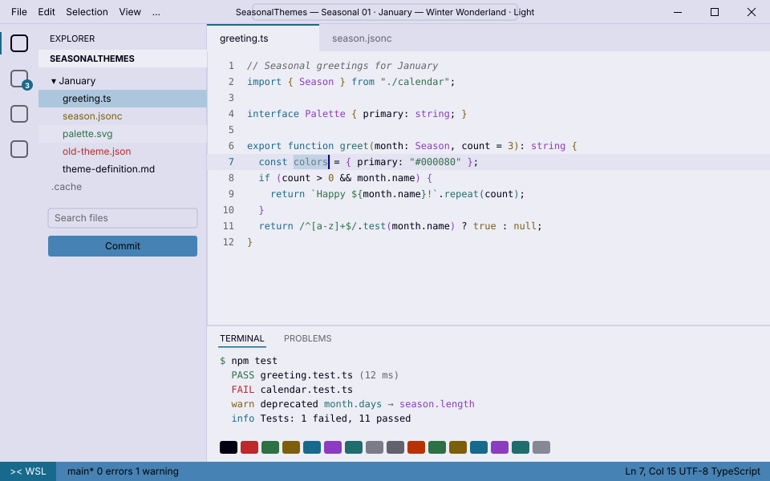

<!-- Generated by Generate-Themes.ps1 from season.jsonc. Edit season.jsonc, not this file. -->

# ❄️ January: Winter Wonderland

> Crisp blue skies over fresh snow

January captures the essence of winter with cool blues, whites and winter icons.

It should feel like a crisp winter day over snow-covered landscapes: navy night, steel-blue ice, evergreen and a pale winter sky.

<p> </p>

- **Holidays:** New Year's Day (Jan 1); Martin Luther King Jr. Day (Jan 15, 3rd Monday)
- **Mood:** crisp, calm, cold, fresh
- **Modes:** dark (default), light

## Colours

| Role | Colour |
|---|---|
| Primary | Winter night navy `#000080` |
| Secondary | Steel blue ice `#4682B4` |
| Tertiary | Evergreen `#2E8B57` |
| Accent | Winter sky `#87CEEB` |
| VS Code status bar | Steel blue ice `#4682B4` |
| Dark editor background | Polar night `#0B1B2E` |
| Light editor background | `#EDEDF6` |


## Icons

| Shell | Admin | Folder | Home | Git | Run time | Clock | Success | Failure |
|---|---|---|---|---|---|---|---|---|
| ❄️ | ⛄ | 🎿 | 🏔️ | ❄️ | 🧤🧣 | ❄️⛄ | ⛄ | 🥶 |

The prompt, illustrated:

```text
╭─❄️ pwsh  🎿 ~/code  ❄️ main ✏️ ~1  🧤🧣 12ms          ❄️⛄ 7:30 PM
⌂──⛄
```

## Use it

- **VS Code:** pick *Seasonal 01 · January — Winter Wonderland · Dark* or *Seasonal 01 · January — Winter Wonderland · Light* with **Preferences: Color Theme**. The Seasonal Themes extension switches to it during January on its own.
- **Oh My Posh:** [davids-January.omp.json](davids-January.omp.json) (dark), [davids-January-light.omp.json](davids-January-light.omp.json) (light). `Get-SeasonalTheme.ps1` picks the right one for today.

---

Every colour role, the light-mode changes and all generated files are in [theme-definition.md](theme-definition.md). To change the month, edit [season.jsonc](season.jsonc) and run `pwsh ./Generate-Themes.ps1`.
