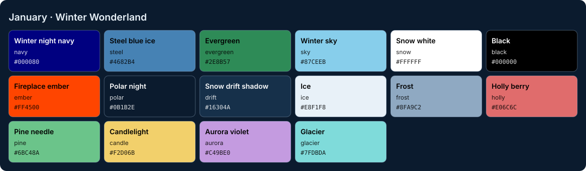

<!-- Generated by Generate-Themes.ps1 from season.jsonc. Edit season.jsonc, not this file. -->

# January: Winter Wonderland

> Crisp blue skies over fresh snow

January captures the essence of winter with cool blues, whites and winter icons.

It should feel like a crisp winter day over snow-covered landscapes: navy night, steel-blue ice, evergreen and a pale winter sky.

| | |
|---|---|
| **Appearance** | dark |
| **Mood** | crisp, calm, cold, fresh |
| **Holidays** | New Year's Day (Jan 1); Martin Luther King Jr. Day (Jan 15), 3rd Monday |
| **Imagery** | snow-covered mountains, snowflakes, snowman, ski slope, evergreen forest, frozen lake, hot tea |

## Palette

| Key | Name | Hex | Note |
|---|---|---|---|
| `navy` | Winter night navy | `#000080` |  |
| `steel` | Steel blue ice | `#4682B4` |  |
| `evergreen` | Evergreen | `#2E8B57` |  |
| `sky` | Winter sky | `#87CEEB` |  |
| `snow` | Snow white | `#FFFFFF` |  |
| `black` | Black | `#000000` |  |
| `ember` | Fireplace ember | `#FF4500` |  |

## Colour roles

Roles marked *inherits* are not set in `season.jsonc` and take the colour of the role named.

### Brand

The month's signature colours. Prompt segments, badges, status bars and accents.

| Role | Colour | Hex | Text on it | Notes |
|---|---|---|---|---|
| `primary` | navy | `#000080` | `#FFFFFF` 16.0:1 |  |
| `secondary` | steel | `#4682B4` | `#000000` 5.1:1 |  |
| `accent` | sky | `#87CEEB` | `#000000` 12.1:1 |  |
| `tertiary` | evergreen | `#2E8B57` | `#000000` 4.9:1 |  |
| `accent_alt` | sky | `#87CEEB` | `#000000` 12.1:1 |  |
| `highlight` | navy | `#000080` | `#FFFFFF` 16.0:1 |  |
| `deep` | navy | `#000080` | `#FFFFFF` 16.0:1 |  |
| `text_accent` | snow | `#FFFFFF` | `#000000` 21.0:1 |  |
| `line` | navy | `#000080` | `#FFFFFF` 16.0:1 | *inherits* `brand.primary` |

### UI

Surfaces and text of an application window.

| Role | Colour | Hex | Notes |
|---|---|---|---|
| `text_light` | snow | `#FFFFFF` |  |
| `text_dark` | black | `#000000` |  |
| `background` | navy | `#000080` | *inherits* `brand.deep` |
| `foreground` | snow | `#FFFFFF` | *inherits* `ui.text_light` |
| `surface` | navy | `#000080` | *inherits* `ui.background` |
| `line_highlight` | navy | `#000080` | *inherits* `ui.surface` |
| `border` | navy | `#000080` | *inherits* `ui.surface` |
| `muted` | snow | `#FFFFFF` | *inherits* `ui.foreground` |
| `selection` | steel | `#4682B4` | *inherits* `brand.secondary` |
| `cursor` | navy | `#000080` | *inherits* `brand.primary` |

### Status

Meaningful states.

| Role | Colour | Hex | Notes |
|---|---|---|---|
| `error` | ember | `#FF4500` |  |
| `success` | snow | `#FFFFFF` |  |
| `warning` | sky | `#87CEEB` | *inherits* `brand.accent` |
| `info` | navy | `#000080` | *inherits* `brand.highlight` |

### Syntax

Code highlighting (editors, bat, delta...).

| Role | Colour | Hex | Notes |
|---|---|---|---|
| `comment` | snow | `#FFFFFF` | *inherits* `ui.muted` |
| `keyword` | navy | `#000080` | *inherits* `brand.primary` |
| `string` | sky | `#87CEEB` | *inherits* `brand.accent` |
| `number` | evergreen | `#2E8B57` | *inherits* `brand.tertiary` |
| `constant` | evergreen | `#2E8B57` | *inherits* `syntax.number` |
| `function` | sky | `#87CEEB` | *inherits* `brand.accent_alt` |
| `type` | navy | `#000080` | *inherits* `brand.highlight` |
| `variable` | snow | `#FFFFFF` | *inherits* `ui.foreground` |
| `parameter` | snow | `#FFFFFF` | *inherits* `syntax.variable` |
| `property` | snow | `#FFFFFF` | *inherits* `syntax.variable` |
| `operator` | snow | `#FFFFFF` | *inherits* `ui.foreground` |
| `punctuation` | snow | `#FFFFFF` | *inherits* `ui.foreground` |
| `tag` | navy | `#000080` | *inherits* `syntax.keyword` |
| `attribute` | sky | `#87CEEB` | *inherits* `syntax.function` |
| `regex` | sky | `#87CEEB` | *inherits* `syntax.string` |
| `invalid` | ember | `#FF4500` | *inherits* `status.error` |

### Terminal

The 16 ANSI colours plus terminal chrome. Used by terminal emulators and every CLI tool that prints colour. Keep each hue recognisable (red should read as red).

| Role | Colour | Hex | Notes |
|---|---|---|---|
| `background` | navy | `#000080` | *inherits* `ui.background` |
| `foreground` | snow | `#FFFFFF` | *inherits* `ui.foreground` |
| `cursor` | navy | `#000080` | *inherits* `ui.cursor` |
| `selection` | steel | `#4682B4` | *inherits* `ui.selection` |
| `black` | navy | `#000080` | *inherits* `ui.background` |
| `red` | ember | `#FF4500` | *inherits* `status.error` |
| `green` | snow | `#FFFFFF` | *inherits* `status.success` |
| `yellow` | sky | `#87CEEB` | *inherits* `status.warning` |
| `blue` | navy | `#000080` | *inherits* `status.info` |
| `magenta` | navy | `#000080` | *inherits* `brand.highlight` |
| `cyan` | navy | `#000080` | *inherits* `status.info` |
| `white` | snow | `#FFFFFF` | *inherits* `ui.foreground` |
| `bright_black` | snow | `#FFFFFF` | *inherits* `ui.muted` |
| `bright_red` | ember | `#FF4500` | *inherits* `terminal.red` |
| `bright_green` | snow | `#FFFFFF` | *inherits* `terminal.green` |
| `bright_yellow` | sky | `#87CEEB` | *inherits* `terminal.yellow` |
| `bright_blue` | navy | `#000080` | *inherits* `terminal.blue` |
| `bright_magenta` | navy | `#000080` | *inherits* `terminal.magenta` |
| `bright_cyan` | navy | `#000080` | *inherits* `terminal.cyan` |
| `bright_white` | snow | `#FFFFFF` | *inherits* `terminal.white` |

## Icons

| Role | Icon | Code points | Notes |
|---|---|---|---|
| `shell` | ❄️ | U+2744 U+FE0F |  |
| `path` | 🎿 | U+1F3BF |  |
| `git` | ❄️ | U+2744 U+FE0F |  |
| `exec_time` | 🧤🧣 | U+1F9E4 U+1F9E3 |  |
| `clock` | ❄️⛄ | U+2744 U+FE0F U+26C4 |  |
| `status_ok` | ⛄ | U+26C4 |  |
| `root` | ⛄ | U+26C4 |  |
| `folder` | 🎿 | U+1F3BF |  |
| `home` | 🏔️ | U+1F3D4 U+FE0F |  |
| `battery` | ❄️ | U+2744 U+FE0F |  |
| `status_err` | 🥶 | U+1F976 |  |
| `language` | 🌬️ | U+1F32C U+FE0F |  |
| `prompt` | ⌂ | U+2302 | *default* |

**Languages and tools** (anything not listed uses `language`: 🌬️)

| Segment | Icon |
|---|---|
| `yarn` | 🌂 |
| `python` | ⛄ |
| `java` | 🎿 |
| `dotnet` | ❄️ |
| `rust` | ⛄ |
| `dart` | 🎿 |
| `angular` | ❄️ |
| `julia` | ⛄ |
| `ruby` | 🎿 |
| `azfunc` | ❄️ |
| `kubectl` | ⛄ |

**Operating systems** (anything not listed uses `shell`: ❄️)

| OS | Icon |
|---|---|
| `linux` | ❄️ |
| `macos` | 🍎 |
| `windows` | ⛄ |

**Spares:** ☃️ ⛷️ 🏂 🍵 🛷 🌨️ 🌁 🌲 🧥 🧣 🧤 ☔ 🏔️

## Ideas

- Lighter or darker blues depending on the terminal background
- ❄️ snowflakes in more segments for a consistent winter feel
- A light blue battery segment for 'cold' winter energy

## Links

- [Emojipedia: Winter](https://emojipedia.org/winter)

## Generated files

- [davids-January.omp.json](davids-January.omp.json): Oh My Posh prompt.
  Try it with `oh-my-posh init pwsh --config <repo>/January/davids-January.omp.json | Invoke-Expression`.
- [palette.svg](palette.svg): palette swatch sheet.
