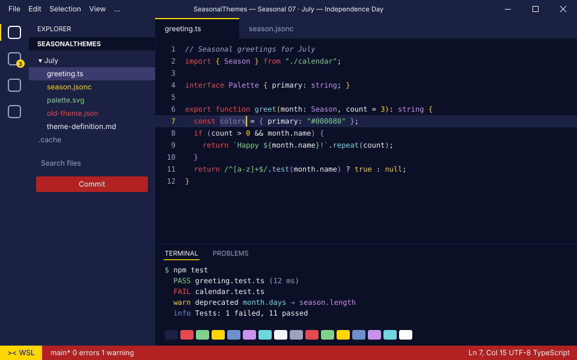
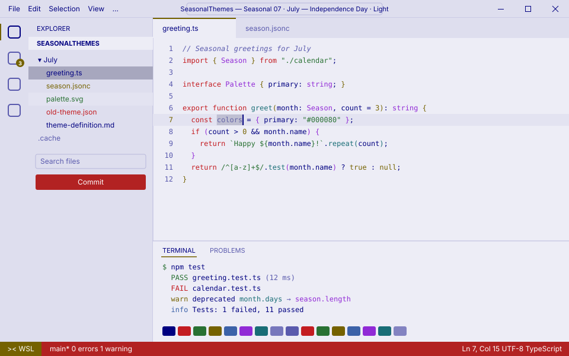

<!-- Generated by Generate-Themes.ps1 from season.jsonc. Edit season.jsonc, not this file. -->

# 🎆 July: Independence Day

> Stars, stripes and fireworks over a summer night

July celebrates Independence Day with patriotic red, white and blue, stars, stripes and traditional American symbols.

Navy and firebrick red, the flag's own Old Glory blue and red, Air Force blue and white, with fireworks, sparklers and the eagle.

<p> </p>

- **Holidays:** Independence Day (Jul 4)
- **Mood:** patriotic, festive, proud, summery
- **Modes:** dark (default), light

## Colours

| Role | Colour |
|---|---|
| Primary | Navy blue `#000080` |
| Secondary | Firebrick red `#B22222` |
| Tertiary | Old Glory blue `#3C3B6E` |
| Accent | Old Glory red `#B31942` |
| Highlight | Stars white `#FFFFFF` |
| VS Code status bar | Firebrick red `#B22222` |
| Dark editor background | Summer night `#0B1026` |
| Light editor background | `#EDEDF6` |


## Icons

| Shell | Admin | Folder | Home | Git | Run time | Clock | Success | Failure |
|---|---|---|---|---|---|---|---|---|
| 🎆 | 🦅 | 🎇 | 🏛️ | 🌟 | 🎺 | 🎉 | 🇺🇸 | 🧨 |

The prompt, illustrated:

```text
╭─🎆 pwsh  🎇 ~/code  🌟 main ✏️ ~1  🎺 12ms          🎉 7:30 PM
⌂──🇺🇸
```

## Use it

- **VS Code:** pick *Seasonal 07 · July — Independence Day · Dark* or *Seasonal 07 · July — Independence Day · Light* with **Preferences: Color Theme**. The Seasonal Themes extension switches to it during July on its own.
- **Oh My Posh:** [davids-July.omp.json](davids-July.omp.json) (dark), [davids-July-light.omp.json](davids-July-light.omp.json) (light). `Get-SeasonalTheme.ps1` picks the right one for today.

---

Every colour role, the light-mode changes and all generated files are in [theme-definition.md](theme-definition.md). To change the month, edit [season.jsonc](season.jsonc) and run `pwsh ./Generate-Themes.ps1`.
