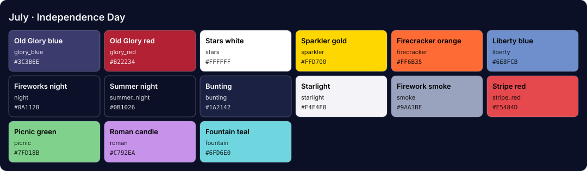

<!-- Generated by Generate-Themes.ps1 from season.jsonc. Edit season.jsonc, not this file. -->

# July: Independence Day

> Stars, stripes and fireworks over a summer night

July celebrates Independence Day with patriotic red, white and blue, stars, stripes and traditional American symbols.

Navy and firebrick red, the flag's own Old Glory blue and red, Air Force blue and white, with fireworks, sparklers and the eagle.

| | |
|---|---|
| **Appearance** | dark |
| **Mood** | patriotic, festive, proud, summery |
| **Holidays** | Independence Day (Jul 4) |
| **Imagery** | fireworks, American flag, sparklers, bald eagle, Statue of Liberty, backyard barbecue, parade |

## Palette

| Key | Name | Hex | Note |
|---|---|---|---|
| `navy` | Navy blue | `#000080` |  |
| `firebrick` | Firebrick red | `#B22222` |  |
| `glory_blue` | Old Glory blue | `#3C3B6E` |  |
| `glory_red` | Old Glory red | `#B31942` |  |
| `air_force` | Air Force blue | `#0A3161` |  |
| `stars` | Stars white | `#FFFFFF` |  |
| `gold` | Sparkler gold | `#FFD700` |  |
| `summer_night` | Summer night | `#0B1026` | Proposed: editor and terminal background |
| `bunting` | Bunting | `#1A2142` | Proposed: panels, borders, current line |
| `starlight` | Starlight | `#F4F4F8` | Proposed: editor text |
| `smoke` | Firework smoke | `#9AA3BE` | Proposed: comments, muted text |
| `stripe_red` | Stripe red | `#E5484D` | Proposed: Old Glory red lightened (terminal red, keywords, invalid code) |
| `liberty` | Liberty blue | `#6E8FCB` | Proposed: terminal blue, info |
| `picnic` | Picnic green | `#7FD18B` | Proposed: terminal green, strings |
| `roman` | Roman candle | `#C792EA` | Proposed: terminal magenta, types |
| `fountain` | Fountain teal | `#6FD6E0` | Proposed: terminal cyan, functions |

## Colour roles

Roles marked *inherits* are not set in `season.jsonc` and take the colour of the role named.

### Brand

The month's signature colours. Prompt segments, badges, status bars and accents.

| Role | Colour | Hex | Text on it | Notes |
|---|---|---|---|---|
| `primary` | navy | `#000080` | `#FFFFFF` 16.0:1 |  |
| `secondary` | firebrick | `#B22222` | `#FFFFFF` 6.7:1 |  |
| `accent` | glory_red | `#B31942` | `#FFFFFF` 6.7:1 |  |
| `tertiary` | glory_blue | `#3C3B6E` | `#FFFFFF` 10.3:1 |  |
| `accent_alt` | gold | `#FFD700` | `#000080` 11.4:1 |  |
| `highlight` | stars | `#FFFFFF` | `#000080` 16.0:1 |  |
| `deep` | air_force | `#0A3161` | `#FFFFFF` 12.9:1 |  |
| `text_accent` | stars | `#FFFFFF` | `#000080` 16.0:1 |  |
| `line` | gold | `#FFD700` | `#000080` 11.4:1 |  |

### UI

Surfaces and text of an application window.

| Role | Colour | Hex | Notes |
|---|---|---|---|
| `text_light` | stars | `#FFFFFF` |  |
| `text_dark` | navy | `#000080` |  |
| `background` | summer_night | `#0B1026` |  |
| `foreground` | starlight | `#F4F4F8` |  |
| `surface` | bunting | `#1A2142` |  |
| `line_highlight` | bunting | `#1A2142` |  |
| `border` | bunting | `#1A2142` |  |
| `muted` | smoke | `#9AA3BE` |  |
| `selection` | glory_blue | `#3C3B6E` |  |
| `cursor` | gold | `#FFD700` |  |

### Status

Meaningful states.

| Role | Colour | Hex | Notes |
|---|---|---|---|
| `error` | firebrick | `#B22222` |  |
| `success` | stars | `#FFFFFF` |  |
| `warning` | gold | `#FFD700` |  |
| `info` | liberty | `#6E8FCB` |  |

### Syntax

Code highlighting (editors, bat, delta...).

| Role | Colour | Hex | Notes |
|---|---|---|---|
| `comment` | smoke | `#9AA3BE` | italic |
| `keyword` | stripe_red | `#E5484D` |  |
| `string` | picnic | `#7FD18B` |  |
| `number` | gold | `#FFD700` |  |
| `constant` | gold | `#FFD700` |  |
| `function` | fountain | `#6FD6E0` |  |
| `type` | roman | `#C792EA` |  |
| `variable` | starlight | `#F4F4F8` |  |
| `parameter` | starlight | `#F4F4F8` | *inherits* `syntax.variable` |
| `property` | starlight | `#F4F4F8` | *inherits* `syntax.variable` |
| `operator` | starlight | `#F4F4F8` | *inherits* `ui.foreground` |
| `punctuation` | starlight | `#F4F4F8` | *inherits* `ui.foreground` |
| `tag` | stripe_red | `#E5484D` | *inherits* `syntax.keyword` |
| `attribute` | fountain | `#6FD6E0` | *inherits* `syntax.function` |
| `regex` | picnic | `#7FD18B` | *inherits* `syntax.string` |
| `invalid` | stripe_red | `#E5484D` |  |

### Terminal

The 16 ANSI colours plus terminal chrome. Used by terminal emulators and every CLI tool that prints colour. Keep each hue recognisable (red should read as red).

| Role | Colour | Hex | Notes |
|---|---|---|---|
| `background` | summer_night | `#0B1026` | *inherits* `ui.background` |
| `foreground` | starlight | `#F4F4F8` | *inherits* `ui.foreground` |
| `cursor` | gold | `#FFD700` | *inherits* `ui.cursor` |
| `selection` | glory_blue | `#3C3B6E` | *inherits* `ui.selection` |
| `black` | bunting | `#1A2142` |  |
| `red` | stripe_red | `#E5484D` |  |
| `green` | picnic | `#7FD18B` |  |
| `yellow` | gold | `#FFD700` |  |
| `blue` | liberty | `#6E8FCB` |  |
| `magenta` | roman | `#C792EA` |  |
| `cyan` | fountain | `#6FD6E0` |  |
| `white` | starlight | `#F4F4F8` |  |
| `bright_black` | smoke | `#9AA3BE` |  |
| `bright_red` | stripe_red | `#E5484D` | *inherits* `terminal.red` |
| `bright_green` | picnic | `#7FD18B` | *inherits* `terminal.green` |
| `bright_yellow` | gold | `#FFD700` | *inherits* `terminal.yellow` |
| `bright_blue` | liberty | `#6E8FCB` | *inherits* `terminal.blue` |
| `bright_magenta` | roman | `#C792EA` | *inherits* `terminal.magenta` |
| `bright_cyan` | fountain | `#6FD6E0` | *inherits* `terminal.cyan` |
| `bright_white` | stars | `#FFFFFF` |  |

## Icons

| Role | Icon | Code points | Notes |
|---|---|---|---|
| `shell` | 🎆 | U+1F386 |  |
| `path` | 🎇 | U+1F387 |  |
| `git` | 🌟 | U+1F31F |  |
| `exec_time` | 🎺 | U+1F3BA |  |
| `clock` | 🎉 | U+1F389 |  |
| `status_ok` | 🇺🇸 | U+1F1FA U+1F1F8 |  |
| `root` | 🦅 | U+1F985 |  |
| `folder` | 🎇 | U+1F387 |  |
| `home` | 🏛️ | U+1F3DB U+FE0F |  |
| `battery` | 🔥 | U+1F525 |  |
| `status_err` | 🧨 | U+1F9E8 |  |
| `language` | ⭐ | U+2B50 |  |
| `prompt` | ⌂ | U+2302 | *default* |

**Languages and tools** (anything not listed uses `language`: ⭐)

| Segment | Icon |
|---|---|
| `node` | 🍉 |
| `npm` | 🥧 |
| `yarn` | 🎈 |
| `python` | 🗽 |
| `java` | 🍔 |
| `dotnet` | 🎺 |
| `go` | 🎈 |
| `rust` | 🌭 |
| `dart` | 🎯 |
| `angular` | 🦅 |
| `nx` | 🎡 |
| `julia` | 🎠 |
| `ruby` | 🍒 |
| `aws` | 🎈 |
| `kubectl` | ⚓ |

**Operating systems** (anything not listed uses `shell`: 🎆)

| OS | Icon |
|---|---|
| `linux` | 🦅 |
| `macos` | 🍎 |
| `windows` | 🗽 |

**Spares:** 🇺🇸 🗽 🎺 🍖 🎉 ⚾ ☀️ 🎈 🎠 🎡 🔔 🤠 📜 🎪

## Ideas

- Alternate red, white and blue segments for a striped effect
- 🗽 Statue of Liberty as an alternative home icon
- 🍖 meat on the bone for barbecue references
- The old theme coloured execution time yellow over 300 ms and red over 1 s; the shared layout could bring that back for every month

## Links

- [Emojipedia: Independence Day](https://emojipedia.org/independence-day)

## Generated files

- [davids-July.omp.json](davids-July.omp.json): Oh My Posh prompt.
  Try it with `oh-my-posh init pwsh --config <repo>/July/davids-July.omp.json | Invoke-Expression`.
- [palette.svg](palette.svg): palette swatch sheet.
