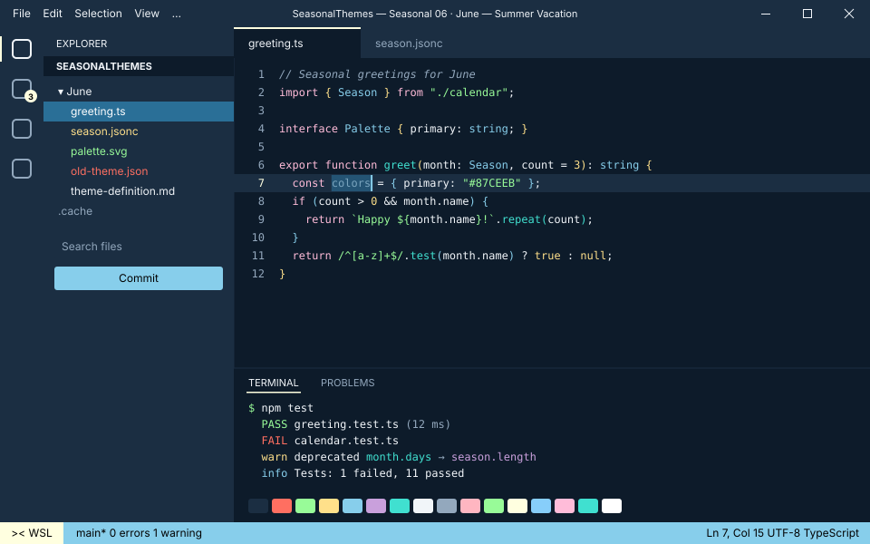
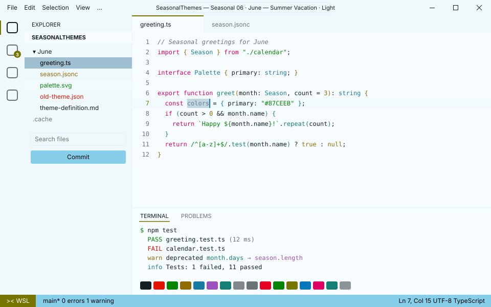

<!-- Generated by Generate-Themes.ps1 from season.jsonc. Edit season.jsonc, not this file. -->

# 😎 June: Summer Vacation

> Beach colours, sunglasses and the carefree first days of summer

June celebrates the beginning of summer with bright beach colours, vacation vibes and outdoor activity icons.

It brings the carefree feeling of summer vacation with cool sky and turquoise blues, mint, sunny pale yellow and beach-towel pinks.

<p> </p>

- **Holidays:** Father's Day (Jun 15, 3rd Sunday); Juneteenth (Jun 19); Summer solstice (Jun 21, around the 21st)
- **Mood:** carefree, sunny, cool, playful
- **Modes:** dark (default), light

## Colours

| Role | Colour |
|---|---|
| Primary | Sky blue `#87CEEB` |
| Secondary | Turquoise `#40E0D0` |
| Tertiary | Mint green `#98FB98` |
| Accent | Lemonade yellow `#FFFFE0` |
| Highlight | Flamingo pink `#FFBCD9` |
| VS Code status bar | Sky blue `#87CEEB` |
| Dark editor background | Night surf `#0D1B2A` |
| Light editor background | `#F7FCFE` |


## Icons

| Shell | Admin | Folder | Home | Git | Run time | Clock | Success | Failure |
|---|---|---|---|---|---|---|---|---|
| 😎 | 🏄 | 🕶️ | 🏝️ | 🌞 | 🏊 | ⛱️ | 🍉 | 🌋 |

The prompt, illustrated:

```text
╭─😎 pwsh  🕶️ ~/code  🌞 main ✏️ ~1  🏊 12ms          ⛱️ 7:30 PM
⌂──🍉
```

## Use it

- **VS Code:** pick *Seasonal 06 · June — Summer Vacation · Dark* or *Seasonal 06 · June — Summer Vacation · Light* with **Preferences: Color Theme**. The Seasonal Themes extension switches to it during June on its own.
- **Oh My Posh:** [davids-June.omp.json](davids-June.omp.json) (dark), [davids-June-light.omp.json](davids-June-light.omp.json) (light). `Get-SeasonalTheme.ps1` picks the right one for today.

---

Every colour role, the light-mode changes and all generated files are in [theme-definition.md](theme-definition.md). To change the month, edit [season.jsonc](season.jsonc) and run `pwsh ./Generate-Themes.ps1`.
