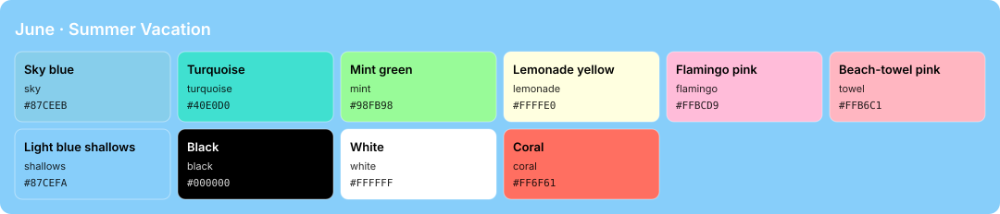

<!-- Generated by Generate-Themes.ps1 from season.jsonc. Edit season.jsonc, not this file. -->

# June: Summer Break

> Sunshine, sunglasses and the first day of summer

June celebrates the start of summer with bright, sunny colours and beach and vacation icons.

Summer sky, sunshine and lime set the tone, with ocean blue, watermelon and sunset orange around them. Graduation caps and Father's Day fit in too.

| | |
|---|---|
| **Appearance** | dark |
| **Mood** | sunny, carefree, bright, celebratory |
| **Holidays** | Father's Day (Jun 15), 3rd Sunday; Juneteenth (Jun 19); Summer solstice (Jun 21), around the 21st |
| **Imagery** | beach umbrella, sunglasses, surfboard, ocean waves, palm island, graduation caps, watermelon |

## Palette

| Key | Name | Hex | Note |
|---|---|---|---|
| `sky` | Summer sky | `#87CEEB` | From the June draft in ThemesDocumentation.md |
| `lime` | Lime | `#32CD32` | From the June draft |
| `sunshine` | Sunshine yellow | `#FFFF00` | From the June draft |
| `white` | White | `#FFFFFF` | From the June draft |
| `ocean` | Ocean blue | `#0077BE` |  |
| `watermelon` | Watermelon | `#FC6C85` |  |
| `sunset` | Sunset orange | `#FF9F43` |  |
| `deep_sea` | Deep sea | `#0B4F6C` |  |
| `shade` | Beach-umbrella shade | `#13293D` |  |
| `sunburn` | Sunburn red | `#E63946` |  |
| `night_surf` | Night surf | `#0D1B2A` | Proposed: editor and terminal background |
| `boardwalk` | Boardwalk | `#1B2E42` | Proposed: panels, borders, current line |
| `foam` | Sea foam | `#F1F5F9` | Proposed: editor text |
| `driftwood` | Driftwood | `#93A8BD` | Proposed: comments, muted text |
| `lagoon` | Lagoon blue | `#0087D8` | Proposed: ocean blue lightened (terminal blue, info) |
| `coral` | Coral red | `#E84753` | Proposed: sunburn lightened (terminal red, invalid code) |
| `orchid` | Orchid | `#C9A0DC` | Proposed: terminal magenta, types |
| `tide` | Turquoise tide | `#48D1CC` | Proposed: terminal cyan, functions |
| `sand` | Warm sand | `#FFE08A` | Proposed: strings |

## Colour roles

Roles marked *inherits* are not set in `season.jsonc` and take the colour of the role named.

### Brand

The month's signature colours. Prompt segments, badges, status bars and accents.

| Role | Colour | Hex | Text on it | Notes |
|---|---|---|---|---|
| `primary` | sky | `#87CEEB` | `#13293D` 8.5:1 |  |
| `secondary` | lime | `#32CD32` | `#13293D` 7.0:1 |  |
| `accent` | sunshine | `#FFFF00` | `#13293D` 13.8:1 |  |
| `tertiary` | ocean | `#0077BE` | `#FFFFFF` 4.8:1 |  |
| `accent_alt` | sunset | `#FF9F43` | `#13293D` 7.3:1 |  |
| `highlight` | watermelon | `#FC6C85` | `#13293D` 5.4:1 |  |
| `deep` | deep_sea | `#0B4F6C` | `#FFFFFF` 8.9:1 |  |
| `text_accent` | shade | `#13293D` | `#FFFFFF` 14.9:1 |  |
| `line` | sky | `#87CEEB` | `#13293D` 8.5:1 |  |

### UI

Surfaces and text of an application window.

| Role | Colour | Hex | Notes |
|---|---|---|---|
| `text_light` | white | `#FFFFFF` |  |
| `text_dark` | shade | `#13293D` |  |
| `background` | night_surf | `#0D1B2A` |  |
| `foreground` | foam | `#F1F5F9` |  |
| `surface` | boardwalk | `#1B2E42` |  |
| `line_highlight` | boardwalk | `#1B2E42` |  |
| `border` | boardwalk | `#1B2E42` |  |
| `muted` | driftwood | `#93A8BD` |  |
| `selection` | ocean | `#0077BE` |  |
| `cursor` | sunshine | `#FFFF00` |  |

### Status

Meaningful states.

| Role | Colour | Hex | Notes |
|---|---|---|---|
| `error` | sunburn | `#E63946` |  |
| `success` | lime | `#32CD32` |  |
| `warning` | sunset | `#FF9F43` |  |
| `info` | lagoon | `#0087D8` |  |

### Syntax

Code highlighting (editors, bat, delta...).

| Role | Colour | Hex | Notes |
|---|---|---|---|
| `comment` | driftwood | `#93A8BD` | italic |
| `keyword` | watermelon | `#FC6C85` |  |
| `string` | sand | `#FFE08A` |  |
| `number` | sunset | `#FF9F43` |  |
| `constant` | sunset | `#FF9F43` |  |
| `function` | tide | `#48D1CC` |  |
| `type` | sky | `#87CEEB` |  |
| `variable` | foam | `#F1F5F9` |  |
| `parameter` | foam | `#F1F5F9` | *inherits* `syntax.variable` |
| `property` | foam | `#F1F5F9` | *inherits* `syntax.variable` |
| `operator` | foam | `#F1F5F9` | *inherits* `ui.foreground` |
| `punctuation` | foam | `#F1F5F9` | *inherits* `ui.foreground` |
| `tag` | watermelon | `#FC6C85` | *inherits* `syntax.keyword` |
| `attribute` | tide | `#48D1CC` | *inherits* `syntax.function` |
| `regex` | sand | `#FFE08A` | *inherits* `syntax.string` |
| `invalid` | coral | `#E84753` |  |

### Terminal

The 16 ANSI colours plus terminal chrome. Used by terminal emulators and every CLI tool that prints colour. Keep each hue recognisable (red should read as red).

| Role | Colour | Hex | Notes |
|---|---|---|---|
| `background` | night_surf | `#0D1B2A` | *inherits* `ui.background` |
| `foreground` | foam | `#F1F5F9` | *inherits* `ui.foreground` |
| `cursor` | sunshine | `#FFFF00` | *inherits* `ui.cursor` |
| `selection` | ocean | `#0077BE` | *inherits* `ui.selection` |
| `black` | boardwalk | `#1B2E42` |  |
| `red` | coral | `#E84753` |  |
| `green` | lime | `#32CD32` |  |
| `yellow` | sunshine | `#FFFF00` |  |
| `blue` | lagoon | `#0087D8` |  |
| `magenta` | orchid | `#C9A0DC` |  |
| `cyan` | tide | `#48D1CC` |  |
| `white` | foam | `#F1F5F9` |  |
| `bright_black` | driftwood | `#93A8BD` |  |
| `bright_red` | watermelon | `#FC6C85` |  |
| `bright_green` | lime | `#32CD32` | *inherits* `terminal.green` |
| `bright_yellow` | sunshine | `#FFFF00` | *inherits* `terminal.yellow` |
| `bright_blue` | sky | `#87CEEB` |  |
| `bright_magenta` | orchid | `#C9A0DC` | *inherits* `terminal.magenta` |
| `bright_cyan` | tide | `#48D1CC` | *inherits* `terminal.cyan` |
| `bright_white` | white | `#FFFFFF` |  |

## Icons

| Role | Icon | Code points | Notes |
|---|---|---|---|
| `shell` | 🌞 | U+1F31E |  |
| `path` | 🕶️ | U+1F576 U+FE0F |  |
| `git` | 🏄 | U+1F3C4 |  |
| `exec_time` | 🛹 | U+1F6F9 |  |
| `clock` | ⛱️ | U+26F1 U+FE0F |  |
| `status_ok` | 😎 | U+1F60E |  |
| `root` | 🏖️ | U+1F3D6 U+FE0F |  |
| `folder` | 🕶️ | U+1F576 U+FE0F |  |
| `home` | 🏝️ | U+1F3DD U+FE0F |  |
| `battery` | 🍹 | U+1F379 |  |
| `status_err` | 🥵 | U+1F975 |  |
| `language` | 🌊 | U+1F30A |  |
| `prompt` | ⌂ | U+2302 | *default* |

**Languages and tools** (anything not listed uses `language`: 🌊)

| Segment | Icon |
|---|---|
| `node` | 🍉 |
| `npm` | 🍦 |
| `yarn` | 🍋 |
| `rust` | 🦀 |
| `go` | 🐚 |
| `dart` | 🐬 |
| `julia` | 🐠 |
| `ruby` | 🍓 |
| `kubectl` | ⛵ |

**Operating systems** (anything not listed uses `shell`: 🌞)

| OS | Icon |
|---|---|
| `linux` | 🐚 |
| `macos` | 🍍 |
| `windows` | 🏄 |

**Spares:** 😎 🎓 🍉 🛹 🏖️ 🏝️ ⛱️ 🌊 🕶️ 🏄 📜 🩴 🥥 🍹 🐬

## Ideas

- 🎓 graduation caps for a graduation-week variant
- A Father's Day variant around the 3rd Sunday

## Links

- [Emojipedia: Summer](https://emojipedia.org/summer)
- [Emojipedia: Graduation](https://emojipedia.org/graduation)

## Generated files

- [davids-June.omp.json](davids-June.omp.json): Oh My Posh prompt.
  Try it with `oh-my-posh init pwsh --config <repo>/June/davids-June.omp.json | Invoke-Expression`.
- [palette.svg](palette.svg): palette swatch sheet.
