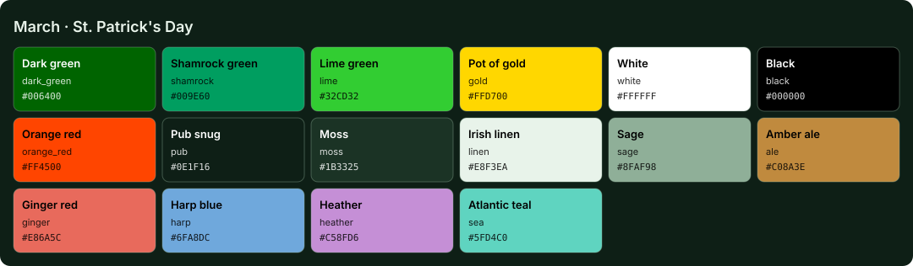

<!-- Generated by Generate-Themes.ps1 from season.jsonc. Edit season.jsonc, not this file. -->

# March: St. Patrick's Day

> Shamrocks, gold coins and a pint at the end of the rainbow

March is St. Patrick's Day: dark, shamrock and lime greens with a pot of gold.

Shamrocks, top hats, rainbows and a pint of beer, with the first hint of spring.

| | |
|---|---|
| **Appearance** | dark |
| **Mood** | lucky, festive, fresh, cheerful |
| **Holidays** | St. Patrick's Day (Mar 17); Spring equinox (Mar 20), around the 20th |
| **Imagery** | shamrocks, pot of gold, rainbow, top hat, green hills, Irish pub, four-leaf clover |

## Palette

| Key | Name | Hex | Note |
|---|---|---|---|
| `dark_green` | Dark green | `#006400` |  |
| `shamrock` | Shamrock green | `#009E60` |  |
| `lime` | Lime green | `#32CD32` |  |
| `gold` | Pot of gold | `#FFD700` |  |
| `white` | White | `#FFFFFF` |  |
| `black` | Black | `#000000` |  |
| `orange_red` | Orange red | `#FF4500` |  |

## Colour roles

Roles marked *inherits* are not set in `season.jsonc` and take the colour of the role named.

### Brand

The month's signature colours. Prompt segments, badges, status bars and accents.

| Role | Colour | Hex | Text on it | Notes |
|---|---|---|---|---|
| `primary` | dark_green | `#006400` | `#FFFFFF` 7.4:1 |  |
| `secondary` | shamrock | `#009E60` | `#000000` 6.1:1 |  |
| `accent` | gold | `#FFD700` | `#000000` 15.0:1 |  |
| `tertiary` | lime | `#32CD32` | `#000000` 9.9:1 |  |
| `accent_alt` | gold | `#FFD700` | `#000000` 15.0:1 |  |
| `highlight` | dark_green | `#006400` | `#FFFFFF` 7.4:1 |  |
| `deep` | shamrock | `#009E60` | `#000000` 6.1:1 |  |
| `text_accent` | white | `#FFFFFF` | `#000000` 21.0:1 |  |
| `line` | lime | `#32CD32` | `#000000` 9.9:1 |  |

### UI

Surfaces and text of an application window.

| Role | Colour | Hex | Notes |
|---|---|---|---|
| `text_light` | white | `#FFFFFF` |  |
| `text_dark` | black | `#000000` |  |
| `background` | shamrock | `#009E60` | *inherits* `brand.deep` |
| `foreground` | white | `#FFFFFF` | *inherits* `ui.text_light` |
| `surface` | shamrock | `#009E60` | *inherits* `ui.background` |
| `line_highlight` | shamrock | `#009E60` | *inherits* `ui.surface` |
| `border` | shamrock | `#009E60` | *inherits* `ui.surface` |
| `muted` | white | `#FFFFFF` | *inherits* `ui.foreground` |
| `selection` | shamrock | `#009E60` | *inherits* `brand.secondary` |
| `cursor` | dark_green | `#006400` | *inherits* `brand.primary` |

### Status

Meaningful states.

| Role | Colour | Hex | Notes |
|---|---|---|---|
| `error` | orange_red | `#FF4500` |  |
| `success` | white | `#FFFFFF` |  |
| `warning` | gold | `#FFD700` | *inherits* `brand.accent` |
| `info` | dark_green | `#006400` | *inherits* `brand.highlight` |

### Syntax

Code highlighting (editors, bat, delta...).

| Role | Colour | Hex | Notes |
|---|---|---|---|
| `comment` | white | `#FFFFFF` | *inherits* `ui.muted` |
| `keyword` | dark_green | `#006400` | *inherits* `brand.primary` |
| `string` | gold | `#FFD700` | *inherits* `brand.accent` |
| `number` | lime | `#32CD32` | *inherits* `brand.tertiary` |
| `constant` | lime | `#32CD32` | *inherits* `syntax.number` |
| `function` | gold | `#FFD700` | *inherits* `brand.accent_alt` |
| `type` | dark_green | `#006400` | *inherits* `brand.highlight` |
| `variable` | white | `#FFFFFF` | *inherits* `ui.foreground` |
| `parameter` | white | `#FFFFFF` | *inherits* `syntax.variable` |
| `property` | white | `#FFFFFF` | *inherits* `syntax.variable` |
| `operator` | white | `#FFFFFF` | *inherits* `ui.foreground` |
| `punctuation` | white | `#FFFFFF` | *inherits* `ui.foreground` |
| `tag` | dark_green | `#006400` | *inherits* `syntax.keyword` |
| `attribute` | gold | `#FFD700` | *inherits* `syntax.function` |
| `regex` | gold | `#FFD700` | *inherits* `syntax.string` |
| `invalid` | orange_red | `#FF4500` | *inherits* `status.error` |

### Terminal

The 16 ANSI colours plus terminal chrome. Used by terminal emulators and every CLI tool that prints colour. Keep each hue recognisable (red should read as red).

| Role | Colour | Hex | Notes |
|---|---|---|---|
| `background` | shamrock | `#009E60` | *inherits* `ui.background` |
| `foreground` | white | `#FFFFFF` | *inherits* `ui.foreground` |
| `cursor` | dark_green | `#006400` | *inherits* `ui.cursor` |
| `selection` | shamrock | `#009E60` | *inherits* `ui.selection` |
| `black` | shamrock | `#009E60` | *inherits* `ui.background` |
| `red` | orange_red | `#FF4500` | *inherits* `status.error` |
| `green` | white | `#FFFFFF` | *inherits* `status.success` |
| `yellow` | gold | `#FFD700` | *inherits* `status.warning` |
| `blue` | dark_green | `#006400` | *inherits* `status.info` |
| `magenta` | dark_green | `#006400` | *inherits* `brand.highlight` |
| `cyan` | dark_green | `#006400` | *inherits* `status.info` |
| `white` | white | `#FFFFFF` | *inherits* `ui.foreground` |
| `bright_black` | white | `#FFFFFF` | *inherits* `ui.muted` |
| `bright_red` | orange_red | `#FF4500` | *inherits* `terminal.red` |
| `bright_green` | white | `#FFFFFF` | *inherits* `terminal.green` |
| `bright_yellow` | gold | `#FFD700` | *inherits* `terminal.yellow` |
| `bright_blue` | dark_green | `#006400` | *inherits* `terminal.blue` |
| `bright_magenta` | dark_green | `#006400` | *inherits* `terminal.magenta` |
| `bright_cyan` | dark_green | `#006400` | *inherits* `terminal.cyan` |
| `bright_white` | white | `#FFFFFF` | *inherits* `terminal.white` |

## Icons

| Role | Icon | Code points | Notes |
|---|---|---|---|
| `shell` | ☘️ | U+2618 U+FE0F |  |
| `path` | 🍻 | U+1F37B |  |
| `git` | ☘️ | U+2618 U+FE0F |  |
| `exec_time` | ⌛ | U+231B |  |
| `clock` | 🌈🪙 | U+1F308 U+1FA99 |  |
| `status_ok` | 🍀🍺 | U+1F340 U+1F37A |  |
| `root` | 🎩 | U+1F3A9 |  |
| `folder` | 🍻 | U+1F37B |  |
| `home` | 🤞 | U+1F91E |  |
| `battery` | ☘️ | U+2618 U+FE0F |  |
| `status_err` | 😫 | U+1F62B |  |
| `language` | ☘️ | U+2618 U+FE0F |  |
| `prompt` | ⌂ | U+2302 | *default* |

**Languages and tools** (anything not listed uses `language`: ☘️)

| Segment | Icon |
|---|---|
| `yarn` | 🌈 |
| `python` | 🎩 |
| `java` | 🍺 |
| `go` | 🌈 |
| `rust` | 🎩 |
| `dart` | 🍺 |
| `nx` | 🌈 |
| `julia` | 🎩 |
| `ruby` | 🍺 |
| `aws` | 🌈 |
| `kubectl` | 🎩 |

**Operating systems** (anything not listed uses `shell`: ☘️)

| OS | Icon |
|---|---|
| `linux` | ☘️ |
| `macos` | 🍏 |
| `windows` | 🎩 |

**Spares:** 🍀 🌈 🇮🇪 🌱 🤞 🍺 💚 🟢 🥬 🍏 🎩 🥗 📗 🪙

## Ideas

- The old theme shortened the path to the last 3 folders and cut branch names at 15 characters; the shared layout could offer both to every month
- 🪙 gold coins or 🌈 rainbows in more segments

## Links

- [Emojipedia: St. Patrick's Day](https://emojipedia.org/st-patricks-day)

## Generated files

- [davids-March.omp.json](davids-March.omp.json): Oh My Posh prompt.
  Try it with `oh-my-posh init pwsh --config <repo>/March/davids-March.omp.json | Invoke-Expression`.
- [palette.svg](palette.svg): palette swatch sheet.
