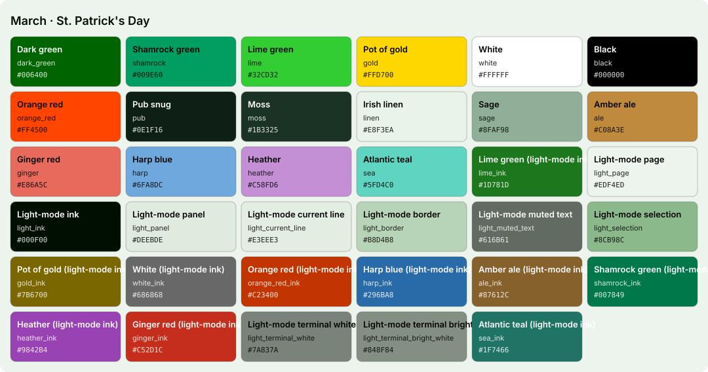
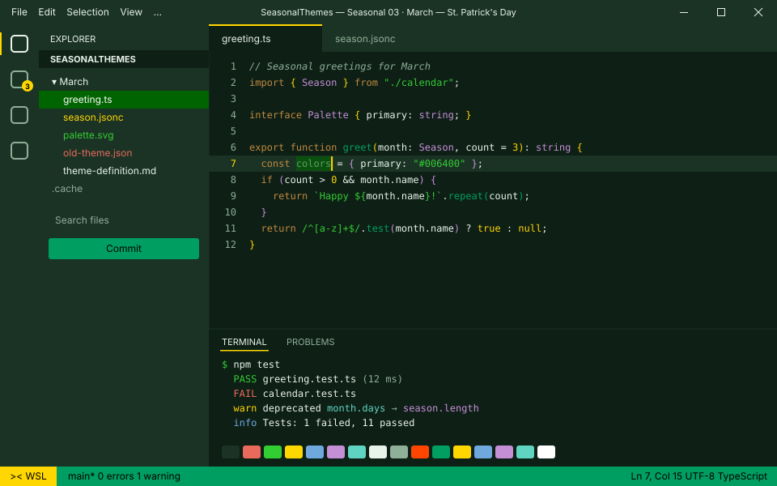
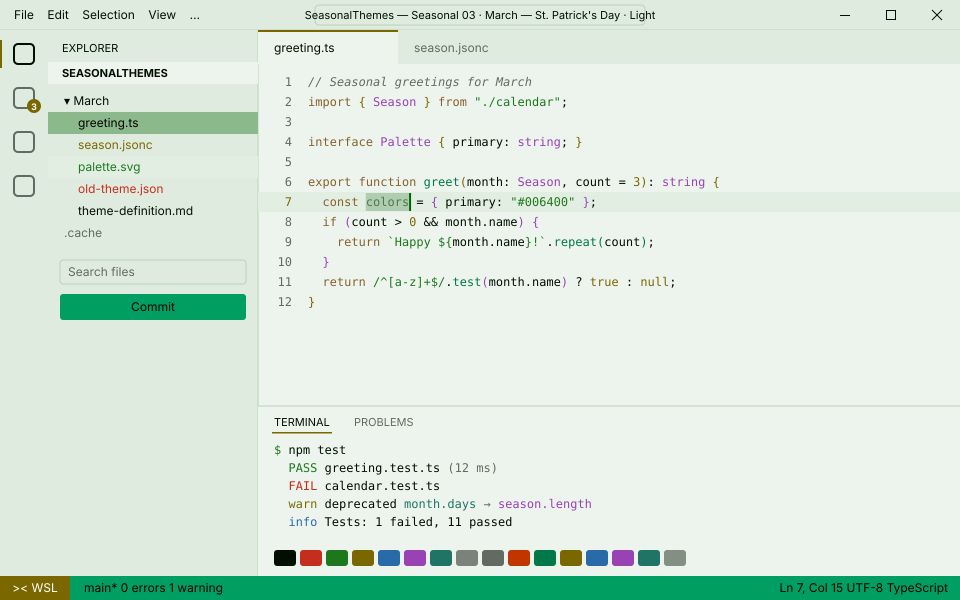

<!-- Generated by Generate-Themes.ps1 from season.jsonc. Edit season.jsonc, not this file. -->

# March: St. Patrick's Day

> Shamrocks, gold coins and a pint at the end of the rainbow

March is St. Patrick's Day: dark, shamrock and lime greens with a pot of gold.

Shamrocks, top hats, rainbows and a pint of beer, with the first hint of spring.

| | |
|---|---|
| **Appearance** | dark |
| **Mood** | lucky, festive, fresh, cheerful |
| **Holidays** | St. Patrick's Day (Mar 17); Spring equinox (Mar 20), around the 20th |
| **Imagery** | shamrocks, pot of gold, rainbow, top hat, green hills, Irish pub, four-leaf clover |

## Palette

| Key | Name | Hex | Note |
|---|---|---|---|
| `dark_green` | Dark green | `#006400` |  |
| `shamrock` | Shamrock green | `#009E60` |  |
| `lime` | Lime green | `#32CD32` |  |
| `gold` | Pot of gold | `#FFD700` |  |
| `white` | White | `#FFFFFF` |  |
| `black` | Black | `#000000` |  |
| `orange_red` | Orange red | `#FF4500` |  |
| `pub` | Pub snug | `#0E1F16` | Proposed: editor and terminal background |
| `moss` | Moss | `#1B3325` | Proposed: panels, borders, current line |
| `linen` | Irish linen | `#E8F3EA` | Proposed: editor text |
| `sage` | Sage | `#8FAF98` | Proposed: comments, muted text |
| `ale` | Amber ale | `#C08A3E` | Proposed: keywords |
| `ginger` | Ginger red | `#E86A5C` | Proposed: terminal red, invalid code |
| `harp` | Harp blue | `#6FA8DC` | Proposed: terminal blue, info |
| `heather` | Heather | `#C58FD6` | Proposed: terminal magenta, types |
| `sea` | Atlantic teal | `#5FD4C0` | Proposed: terminal cyan |

## Colour roles

Roles marked *inherits* are not set in `season.jsonc` and take the colour of the role named.

### Brand

The month's signature colours. Prompt segments, badges, status bars and accents.

| Role | Colour | Hex | Text on it | Notes |
|---|---|---|---|---|
| `primary` | dark_green | `#006400` | `#FFFFFF` 7.4:1 |  |
| `secondary` | shamrock | `#009E60` | `#000000` 6.1:1 |  |
| `accent` | gold | `#FFD700` | `#000000` 15.0:1 |  |
| `tertiary` | lime | `#32CD32` | `#000000` 9.9:1 |  |
| `accent_alt` | gold | `#FFD700` | `#000000` 15.0:1 |  |
| `highlight` | dark_green | `#006400` | `#FFFFFF` 7.4:1 |  |
| `deep` | shamrock | `#009E60` | `#000000` 6.1:1 |  |
| `text_accent` | white | `#FFFFFF` | `#000000` 21.0:1 |  |
| `line` | lime | `#32CD32` | `#000000` 9.9:1 |  |

### UI

Surfaces and text of an application window.

| Role | Colour | Hex | Notes |
|---|---|---|---|
| `text_light` | white | `#FFFFFF` |  |
| `text_dark` | black | `#000000` |  |
| `background` | pub | `#0E1F16` |  |
| `foreground` | linen | `#E8F3EA` |  |
| `surface` | moss | `#1B3325` |  |
| `line_highlight` | moss | `#1B3325` |  |
| `border` | moss | `#1B3325` |  |
| `muted` | sage | `#8FAF98` |  |
| `selection` | dark_green | `#006400` |  |
| `cursor` | gold | `#FFD700` |  |
| `accent` | gold | `#FFD700` | *inherits* `brand.accent` |

### Status

Meaningful states.

| Role | Colour | Hex | Notes |
|---|---|---|---|
| `error` | orange_red | `#FF4500` |  |
| `success` | white | `#FFFFFF` |  |
| `warning` | gold | `#FFD700` |  |
| `info` | harp | `#6FA8DC` |  |

### Syntax

Code highlighting (editors, bat, delta...).

| Role | Colour | Hex | Notes |
|---|---|---|---|
| `comment` | sage | `#8FAF98` | italic |
| `keyword` | ale | `#C08A3E` |  |
| `string` | lime | `#32CD32` |  |
| `number` | gold | `#FFD700` |  |
| `constant` | gold | `#FFD700` |  |
| `function` | shamrock | `#009E60` |  |
| `type` | heather | `#C58FD6` |  |
| `variable` | linen | `#E8F3EA` |  |
| `parameter` | linen | `#E8F3EA` | *inherits* `syntax.variable` |
| `property` | linen | `#E8F3EA` | *inherits* `syntax.variable` |
| `operator` | linen | `#E8F3EA` | *inherits* `ui.foreground` |
| `punctuation` | linen | `#E8F3EA` | *inherits* `ui.foreground` |
| `tag` | ale | `#C08A3E` | *inherits* `syntax.keyword` |
| `attribute` | shamrock | `#009E60` | *inherits* `syntax.function` |
| `regex` | lime | `#32CD32` | *inherits* `syntax.string` |
| `invalid` | ginger | `#E86A5C` |  |

### Terminal

The 16 ANSI colours plus terminal chrome. Used by terminal emulators and every CLI tool that prints colour. Keep each hue recognisable (red should read as red).

| Role | Colour | Hex | Notes |
|---|---|---|---|
| `background` | pub | `#0E1F16` | *inherits* `ui.background` |
| `foreground` | linen | `#E8F3EA` | *inherits* `ui.foreground` |
| `cursor` | gold | `#FFD700` | *inherits* `ui.cursor` |
| `selection` | dark_green | `#006400` | *inherits* `ui.selection` |
| `black` | moss | `#1B3325` |  |
| `red` | ginger | `#E86A5C` |  |
| `green` | lime | `#32CD32` |  |
| `yellow` | gold | `#FFD700` |  |
| `blue` | harp | `#6FA8DC` |  |
| `magenta` | heather | `#C58FD6` |  |
| `cyan` | sea | `#5FD4C0` |  |
| `white` | linen | `#E8F3EA` |  |
| `bright_black` | sage | `#8FAF98` |  |
| `bright_red` | orange_red | `#FF4500` |  |
| `bright_green` | shamrock | `#009E60` |  |
| `bright_yellow` | gold | `#FFD700` | *inherits* `terminal.yellow` |
| `bright_blue` | harp | `#6FA8DC` | *inherits* `terminal.blue` |
| `bright_magenta` | heather | `#C58FD6` | *inherits* `terminal.magenta` |
| `bright_cyan` | sea | `#5FD4C0` | *inherits* `terminal.cyan` |
| `bright_white` | white | `#FFFFFF` |  |

## Icons

| Role | Icon | Code points | Notes |
|---|---|---|---|
| `shell` | ☘️ | U+2618 U+FE0F |  |
| `path` | 🍻 | U+1F37B |  |
| `git` | ☘️ | U+2618 U+FE0F |  |
| `exec_time` | ⌛ | U+231B |  |
| `clock` | 🌈🪙 | U+1F308 U+1FA99 |  |
| `status_ok` | 🍀🍺 | U+1F340 U+1F37A |  |
| `root` | 🎩 | U+1F3A9 |  |
| `folder` | 🍻 | U+1F37B |  |
| `home` | 🤞 | U+1F91E |  |
| `battery` | ☘️ | U+2618 U+FE0F |  |
| `status_err` | 😫 | U+1F62B |  |
| `language` | ☘️ | U+2618 U+FE0F |  |
| `prompt` | ⌂ | U+2302 | *default* |

**Languages and tools** (anything not listed uses `language`: ☘️)

| Segment | Icon |
|---|---|
| `yarn` | 🌈 |
| `python` | 🎩 |
| `java` | 🍺 |
| `go` | 🌈 |
| `rust` | 🎩 |
| `dart` | 🍺 |
| `nx` | 🌈 |
| `julia` | 🎩 |
| `ruby` | 🍺 |
| `aws` | 🌈 |
| `kubectl` | 🎩 |

**Operating systems** (anything not listed uses `shell`: ☘️)

| OS | Icon |
|---|---|
| `linux` | ☘️ |
| `macos` | 🍏 |
| `windows` | 🎩 |

**Spares:** 🍀 🌈 🇮🇪 🌱 🤞 🍺 💚 🟢 🥬 🍏 🎩 🥗 📗 🪙

## Light mode

The month is dark by default. In light mode (for programs that follow the system's light/dark setting), these roles change; everything else is the same.

| Role | Dark | Light |
|---|---|---|
| `brand.line` | `#32CD32` | `#1D781D` lime_ink |
| `ui.background` | `#0E1F16` | `#EDF4ED` light_page |
| `ui.foreground` | `#E8F3EA` | `#000F00` light_ink |
| `ui.surface` | `#1B3325` | `#DEEBDE` light_panel |
| `ui.line_highlight` | `#1B3325` | `#E3EEE3` light_current_line |
| `ui.border` | `#1B3325` | `#B8D4B8` light_border |
| `ui.muted` | `#8FAF98` | `#616B61` light_muted_text |
| `ui.selection` | `#006400` | `#8CB98C` light_selection |
| `ui.cursor` | `#FFD700` | `#006400` dark_green |
| `ui.accent` | `#FFD700` | `#7B6700` gold_ink |
| `status.error` | `#FF4500` | `#C23400` orange_red_ink |
| `status.success` | `#FFFFFF` | `#686868` white_ink |
| `status.warning` | `#FFD700` | `#7B6700` gold_ink |
| `status.info` | `#6FA8DC` | `#296BA8` harp_ink |
| `syntax.comment` | `#8FAF98` | `#616B61` light_muted_text |
| `syntax.keyword` | `#C08A3E` | `#87612C` ale_ink |
| `syntax.string` | `#32CD32` | `#1D781D` lime_ink |
| `syntax.number` | `#FFD700` | `#7B6700` gold_ink |
| `syntax.constant` | `#FFD700` | `#7B6700` gold_ink |
| `syntax.function` | `#009E60` | `#007849` shamrock_ink |
| `syntax.type` | `#C58FD6` | `#9842B4` heather_ink |
| `syntax.variable` | `#E8F3EA` | `#000F00` light_ink |
| `syntax.parameter` | `#E8F3EA` | `#000F00` light_ink |
| `syntax.property` | `#E8F3EA` | `#000F00` light_ink |
| `syntax.operator` | `#E8F3EA` | `#000F00` light_ink |
| `syntax.punctuation` | `#E8F3EA` | `#000F00` light_ink |
| `syntax.tag` | `#C08A3E` | `#87612C` ale_ink |
| `syntax.attribute` | `#009E60` | `#007849` shamrock_ink |
| `syntax.regex` | `#32CD32` | `#1D781D` lime_ink |
| `syntax.invalid` | `#E86A5C` | `#C52D1C` ginger_ink |
| `terminal.background` | `#0E1F16` | `#EDF4ED` light_page |
| `terminal.foreground` | `#E8F3EA` | `#000F00` light_ink |
| `terminal.cursor` | `#FFD700` | `#006400` dark_green |
| `terminal.selection` | `#006400` | `#8CB98C` light_selection |
| `terminal.black` | `#1B3325` | `#000F00` light_ink |
| `terminal.red` | `#E86A5C` | `#C52D1C` ginger_ink |
| `terminal.green` | `#32CD32` | `#1D781D` lime_ink |
| `terminal.yellow` | `#FFD700` | `#7B6700` gold_ink |
| `terminal.blue` | `#6FA8DC` | `#296BA8` harp_ink |
| `terminal.magenta` | `#C58FD6` | `#9842B4` heather_ink |
| `terminal.cyan` | `#5FD4C0` | `#1F7466` sea_ink |
| `terminal.white` | `#E8F3EA` | `#7A837A` light_terminal_white |
| `terminal.bright_black` | `#8FAF98` | `#616B61` light_muted_text |
| `terminal.bright_red` | `#FF4500` | `#C23400` orange_red_ink |
| `terminal.bright_green` | `#009E60` | `#007849` shamrock_ink |
| `terminal.bright_yellow` | `#FFD700` | `#7B6700` gold_ink |
| `terminal.bright_blue` | `#6FA8DC` | `#296BA8` harp_ink |
| `terminal.bright_magenta` | `#C58FD6` | `#9842B4` heather_ink |
| `terminal.bright_cyan` | `#5FD4C0` | `#1F7466` sea_ink |
| `terminal.bright_white` | `#FFFFFF` | `#848F84` light_terminal_bright_white |

## VS Code

Part of the Seasonal Themes extension in `vscode/`.

- [Seasonal 03 · March — St. Patrick's Day · Dark](../vscode/themes/march-dark.json)
- [Seasonal 03 · March — St. Patrick's Day · Light](../vscode/themes/march-light.json)

## Ideas

- The old theme shortened the path to the last 3 folders and cut branch names at 15 characters; the shared layout could offer both to every month
- 🪙 gold coins or 🌈 rainbows in more segments

## Links

- [Emojipedia: St. Patrick's Day](https://emojipedia.org/st-patricks-day)

## Generated files

- [davids-March.omp.json](davids-March.omp.json): Oh My Posh prompt.
  Try it with `oh-my-posh init pwsh --config <repo>/March/davids-March.omp.json | Invoke-Expression`.
- [palette.svg](palette.svg): palette swatch sheet.
- [davids-March-light.omp.json](davids-March-light.omp.json): oh-my-posh, light mode.
- [palette-light.svg](palette-light.svg): palette-svg, light mode.
- [vscode-preview-light.svg](vscode-preview-light.svg): vscode-preview, light mode.
- [../vscode/themes/march-light.json](../vscode/themes/march-light.json): vscode-theme, light mode.
- [../vscode/themes/march-dark.json](../vscode/themes/march-dark.json): vscode theme.
- [vscode-preview-dark.svg](vscode-preview-dark.svg): vscode preview.
