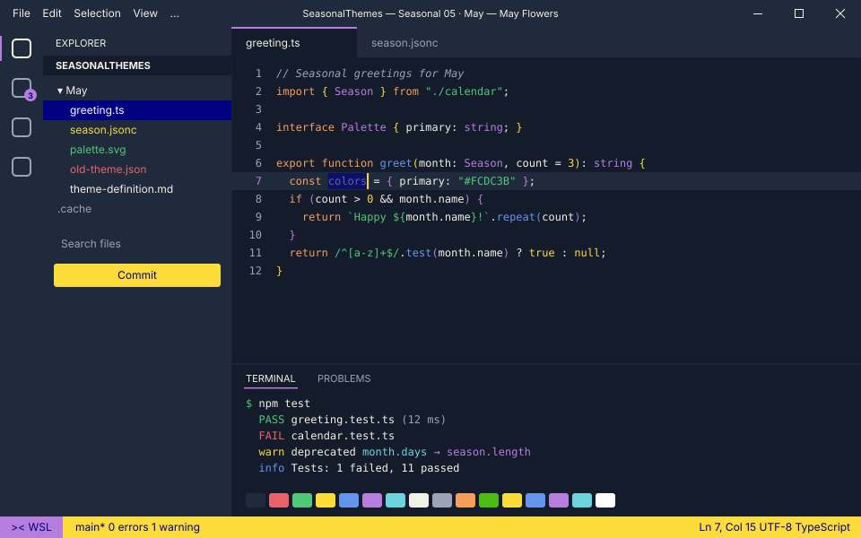
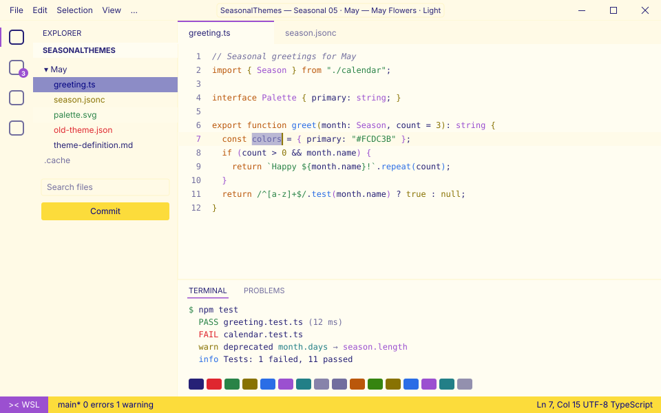

<!-- Generated by Generate-Themes.ps1 from season.jsonc. Edit season.jsonc, not this file. -->

# 🕊️ May: May Flowers

> Emerald meadows, Mother's Day bouquets and a Memorial Day cookout

May brings three things together: spring in full bloom, Mother's Day and Memorial Day.

The palette is emerald (May's birthstone), buttercup yellow, cornflower blue, lavender and meadow green. The icons mix bees and butterflies, bouquets and ribbons, doves and medals, and a backyard BBQ.

<p> </p>

- **Holidays:** Mother's Day (May 11, 2nd Sunday); Memorial Day (May 25, last Monday)
- **Mood:** bright, grateful, blooming, celebratory
- **Modes:** dark (default), light

## Colours

| Role | Colour |
|---|---|
| Primary | Buttercup yellow `#FCDC3B` |
| Secondary | Cornflower blue `#6495ED` |
| Tertiary | Meadow green `#4CBB17` |
| Accent | Lavender `#B57EDC` |
| VS Code status bar | Buttercup yellow `#FCDC3B` |
| Dark editor background | May dusk `#141C2B` |
| Light editor background | `#FFFDF1` |


## Icons

| Shell | Admin | Folder | Home | Git | Run time | Clock | Success | Failure |
|---|---|---|---|---|---|---|---|---|
| 🕊️ | 🕊️ | 🎖️ | 🫡 | ☀️ | 🌞 | 🌭🍔🥩 | 🌻 | 🐞 |

The prompt, illustrated:

```text
╭─🕊️ pwsh  🎖️ ~/code  ☀️ main ✏️ ~1  🌞 12ms          🌭🍔🥩 7:30 PM
⌂──🌻
```

## Use it

- **VS Code:** pick *Seasonal 05 · May — May Flowers · Dark* or *Seasonal 05 · May — May Flowers · Light* with **Preferences: Color Theme**. The Seasonal Themes extension switches to it during May on its own.
- **Oh My Posh:** [davids-May.omp.json](davids-May.omp.json) (dark), [davids-May-light.omp.json](davids-May-light.omp.json) (light). `Get-SeasonalTheme.ps1` picks the right one for today.

---

Every colour role, the light-mode changes and all generated files are in [theme-definition.md](theme-definition.md). To change the month, edit [season.jsonc](season.jsonc) and run `pwsh ./Generate-Themes.ps1`.
