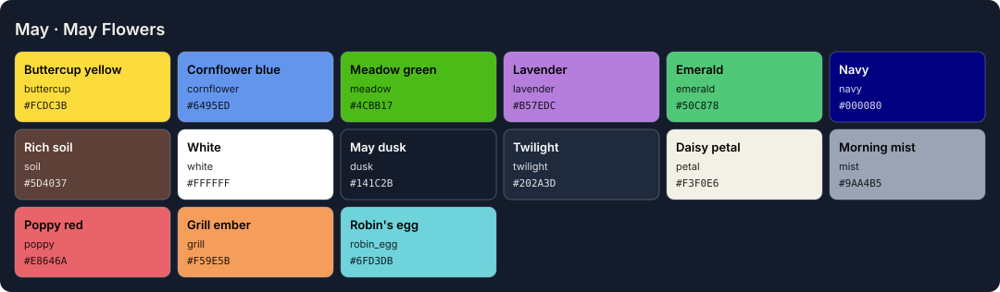

<!-- Generated by Generate-Themes.ps1 from season.jsonc. Edit season.jsonc, not this file. -->

# May: May Flowers

> Emerald meadows, Mother's Day bouquets and a Memorial Day cookout

May brings three things together: spring in full bloom, Mother's Day and Memorial Day.

The palette is emerald (May's birthstone), buttercup yellow, cornflower blue, lavender and meadow green. The icons mix bees and butterflies, bouquets and ribbons, doves and medals, and a backyard BBQ.

| | |
|---|---|
| **Appearance** | dark |
| **Mood** | bright, grateful, blooming, celebratory |
| **Holidays** | Mother's Day (May 11), 2nd Sunday; Memorial Day (May 25), last Monday |
| **Imagery** | flower meadow, bouquet, emerald, cornflowers, backyard barbecue, flags, doves |

## Palette

| Key | Name | Hex | Note |
|---|---|---|---|
| `buttercup` | Buttercup yellow | `#FCDC3B` |  |
| `cornflower` | Cornflower blue | `#6495ED` |  |
| `meadow` | Meadow green | `#4CBB17` |  |
| `lavender` | Lavender | `#B57EDC` |  |
| `emerald` | Emerald | `#50C878` | May's birthstone |
| `navy` | Navy | `#000080` |  |
| `soil` | Rich soil | `#5D4037` |  |
| `white` | White | `#FFFFFF` |  |
| `dusk` | May dusk | `#141C2B` | Proposed: editor and terminal background |
| `twilight` | Twilight | `#202A3D` | Proposed: panels, borders, current line |
| `petal` | Daisy petal | `#F3F0E6` | Proposed: editor text |
| `mist` | Morning mist | `#9AA4B5` | Proposed: comments, muted text |
| `poppy` | Poppy red | `#E8646A` | Proposed: terminal red, invalid code (poppies for Memorial Day) |
| `grill` | Grill ember | `#F59E5B` | Proposed: keywords |
| `robin_egg` | Robin's egg | `#6FD3DB` | Proposed: terminal cyan |

## Colour roles

Roles marked *inherits* are not set in `season.jsonc` and take the colour of the role named.

### Brand

The month's signature colours. Prompt segments, badges, status bars and accents.

| Role | Colour | Hex | Text on it | Notes |
|---|---|---|---|---|
| `primary` | buttercup | `#FCDC3B` | `#000080` 11.8:1 |  |
| `secondary` | cornflower | `#6495ED` | `#000080` 5.4:1 |  |
| `accent` | lavender | `#B57EDC` | `#000080` 5.3:1 |  |
| `tertiary` | meadow | `#4CBB17` | `#000080` 6.4:1 |  |
| `accent_alt` | emerald | `#50C878` | `#000080` 7.5:1 |  |
| `highlight` | lavender | `#B57EDC` | `#000080` 5.3:1 |  |
| `deep` | cornflower | `#6495ED` | `#000080` 5.4:1 |  |
| `text_accent` | navy | `#000080` | `#FFFFFF` 16.0:1 |  |
| `line` | meadow | `#4CBB17` | `#000080` 6.4:1 |  |

### UI

Surfaces and text of an application window.

| Role | Colour | Hex | Notes |
|---|---|---|---|
| `text_light` | white | `#FFFFFF` |  |
| `text_dark` | navy | `#000080` |  |
| `background` | dusk | `#141C2B` |  |
| `foreground` | petal | `#F3F0E6` |  |
| `surface` | twilight | `#202A3D` |  |
| `line_highlight` | twilight | `#202A3D` |  |
| `border` | twilight | `#202A3D` |  |
| `muted` | mist | `#9AA4B5` |  |
| `selection` | navy | `#000080` |  |
| `cursor` | buttercup | `#FCDC3B` |  |

### Status

Meaningful states.

| Role | Colour | Hex | Notes |
|---|---|---|---|
| `error` | lavender | `#B57EDC` |  |
| `success` | cornflower | `#6495ED` |  |
| `warning` | buttercup | `#FCDC3B` |  |
| `info` | cornflower | `#6495ED` |  |

### Syntax

Code highlighting (editors, bat, delta...).

| Role | Colour | Hex | Notes |
|---|---|---|---|
| `comment` | mist | `#9AA4B5` | italic |
| `keyword` | grill | `#F59E5B` |  |
| `string` | emerald | `#50C878` |  |
| `number` | buttercup | `#FCDC3B` |  |
| `constant` | buttercup | `#FCDC3B` |  |
| `function` | cornflower | `#6495ED` |  |
| `type` | lavender | `#B57EDC` |  |
| `variable` | petal | `#F3F0E6` |  |
| `parameter` | petal | `#F3F0E6` | *inherits* `syntax.variable` |
| `property` | petal | `#F3F0E6` | *inherits* `syntax.variable` |
| `operator` | petal | `#F3F0E6` | *inherits* `ui.foreground` |
| `punctuation` | petal | `#F3F0E6` | *inherits* `ui.foreground` |
| `tag` | grill | `#F59E5B` | *inherits* `syntax.keyword` |
| `attribute` | cornflower | `#6495ED` | *inherits* `syntax.function` |
| `regex` | emerald | `#50C878` | *inherits* `syntax.string` |
| `invalid` | poppy | `#E8646A` |  |

### Terminal

The 16 ANSI colours plus terminal chrome. Used by terminal emulators and every CLI tool that prints colour. Keep each hue recognisable (red should read as red).

| Role | Colour | Hex | Notes |
|---|---|---|---|
| `background` | dusk | `#141C2B` | *inherits* `ui.background` |
| `foreground` | petal | `#F3F0E6` | *inherits* `ui.foreground` |
| `cursor` | buttercup | `#FCDC3B` | *inherits* `ui.cursor` |
| `selection` | navy | `#000080` | *inherits* `ui.selection` |
| `black` | twilight | `#202A3D` |  |
| `red` | poppy | `#E8646A` |  |
| `green` | emerald | `#50C878` |  |
| `yellow` | buttercup | `#FCDC3B` |  |
| `blue` | cornflower | `#6495ED` |  |
| `magenta` | lavender | `#B57EDC` |  |
| `cyan` | robin_egg | `#6FD3DB` |  |
| `white` | petal | `#F3F0E6` |  |
| `bright_black` | mist | `#9AA4B5` |  |
| `bright_red` | grill | `#F59E5B` |  |
| `bright_green` | meadow | `#4CBB17` |  |
| `bright_yellow` | buttercup | `#FCDC3B` | *inherits* `terminal.yellow` |
| `bright_blue` | cornflower | `#6495ED` | *inherits* `terminal.blue` |
| `bright_magenta` | lavender | `#B57EDC` | *inherits* `terminal.magenta` |
| `bright_cyan` | robin_egg | `#6FD3DB` | *inherits* `terminal.cyan` |
| `bright_white` | white | `#FFFFFF` |  |

## Icons

| Role | Icon | Code points | Notes |
|---|---|---|---|
| `shell` | 🕊️ | U+1F54A U+FE0F |  |
| `path` | 🎖️ | U+1F396 U+FE0F |  |
| `git` | ☀️ | U+2600 U+FE0F |  |
| `exec_time` | 🌞 | U+1F31E |  |
| `clock` | 🌭🍔🥩 | U+1F32D U+1F354 U+1F969 |  |
| `status_ok` | 🌻 | U+1F33B |  |
| `root` | 🕊️ | U+1F54A U+FE0F |  |
| `folder` | 🎖️ | U+1F396 U+FE0F |  |
| `home` | 🫡 | U+1FAE1 |  |
| `battery` | 🍢 | U+1F362 |  |
| `status_err` | 🐞 | U+1F41E |  |
| `language` | 🌻 | U+1F33B |  |
| `prompt` | ⌂ | U+2302 | *default* |

**Languages and tools** (anything not listed uses `language`: 🌻)

| Segment | Icon |
|---|---|
| `node` | 🐝 |
| `npm` | 🐝 |
| `yarn` | 🌈 |
| `python` | 🦋 |
| `java` | 🎁 |
| `dotnet` | 🎀 |
| `go` | 🇺🇸 |
| `rust` | 🍖 |
| `dart` | ❤️ |
| `angular` | 🍔 |
| `julia` | 💐 |
| `ruby` | 🔥 |
| `azfunc` | ✨ |
| `aws` | 🌭 |
| `kubectl` | 🫡 |

**Operating systems** (anything not listed uses `shell`: 🕊️)

| OS | Icon |
|---|---|
| `linux` | 🐧 |
| `macos` | 🍎 |
| `windows` | 🪟 |

**Spares:** 🪇 🌽 🥩 🍔 💐 🎀 🎁 🌷 🌼 🐝 🦋 🇺🇸 🎖️ 👨‍🍳

## VS Code

Theme: [Seasonal 05 · May — May Flowers](../vscode/themes/may.json), part of the Seasonal Themes extension in `vscode/`.

## Ideas

- The old battery segment used May's own colours for charging / discharging / full
- More Mother's Day icons: 💐 🎁 🎀 ❤️

## Links

- [Emojipedia: Spring](https://emojipedia.org/spring)

## Generated files

- [davids-May.omp.json](davids-May.omp.json): Oh My Posh prompt.
  Try it with `oh-my-posh init pwsh --config <repo>/May/davids-May.omp.json | Invoke-Expression`.
- [palette.svg](palette.svg): palette swatch sheet.
- [../vscode/themes/may.json](../vscode/themes/may.json): VS Code colour theme.
- [vscode-preview.svg](vscode-preview.svg): preview of the VS Code theme.
