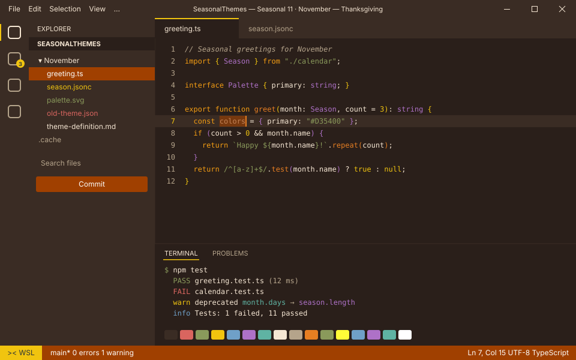
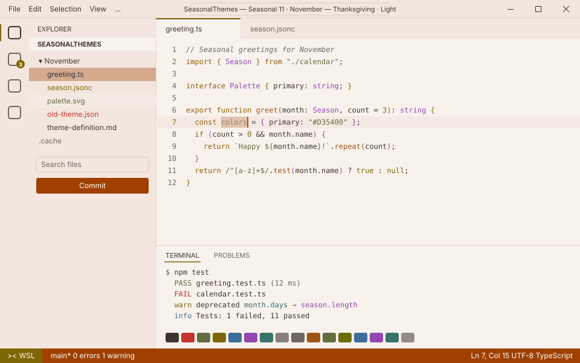

<!-- Generated by Generate-Themes.ps1 from season.jsonc. Edit season.jsonc, not this file. -->

# 🍂 November: Thanksgiving

> Falling leaves, a full table and a whole lot of gratitude

November is the height of fall: deep oranges, browns and golden tones with fall foliage and Thanksgiving feast imagery.

The colours are currently the same as October's; the turkeys, drumsticks and maple leaves are what set it apart.

<p> </p>

- **Holidays:** Thanksgiving (US) (Nov 22, 4th Thursday, between the 22nd and 28th)
- **Mood:** cozy, grateful, warm, abundant
- **Modes:** dark (default), light

## Colours

| Role | Colour |
|---|---|
| Primary | Warm orange `#D35400` |
| Secondary | Roast brown `#A04000` |
| Tertiary | Pumpkin orange `#E67E22` |
| Accent | Harvest gold `#F1C40F` |
| Highlight | Plum `#8E44AD` |
| VS Code status bar | Roast brown `#A04000` |
| Dark editor background | Hearth `#2A1F1A` |
| Light editor background | `#F8F2ED` |


## Icons

| Shell | Admin | Folder | Home | Git | Run time | Clock | Success | Failure |
|---|---|---|---|---|---|---|---|---|
| 🍂 | 🍂 | 🍗🍗🍗 | 🍁 | 🌽 | 🍽️ | 🦃 | 🍁 | 🍁 |

The prompt, illustrated:

```text
╭─🍂 pwsh  🍗🍗🍗 ~/code  🌽 main ✏️ ~1  🍽️ 12ms          🦃 7:30 PM
⌂──🍁
```

## Use it

- **VS Code:** pick *Seasonal 11 · November — Thanksgiving · Dark* or *Seasonal 11 · November — Thanksgiving · Light* with **Preferences: Color Theme**. The Seasonal Themes extension switches to it during November on its own.
- **Oh My Posh:** [davids-November.omp.json](davids-November.omp.json) (dark), [davids-November-light.omp.json](davids-November-light.omp.json) (light). `Get-SeasonalTheme.ps1` picks the right one for today.

---

Every colour role, the light-mode changes and all generated files are in [theme-definition.md](theme-definition.md). To change the month, edit [season.jsonc](season.jsonc) and run `pwsh ./Generate-Themes.ps1`.
