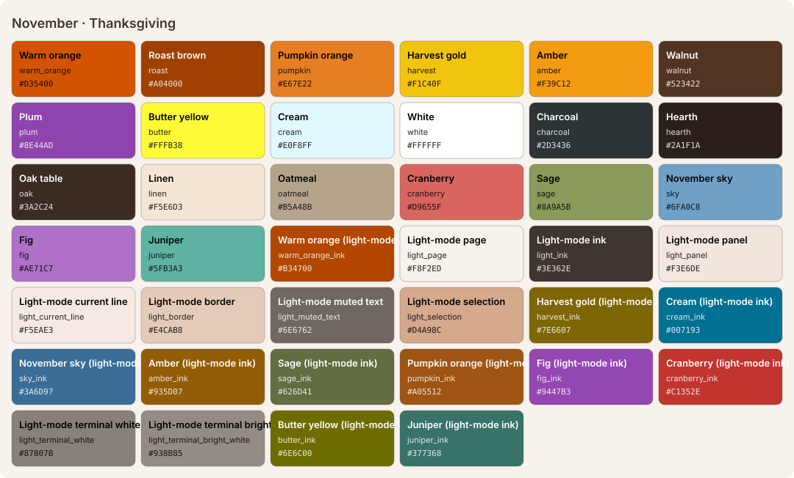

<!-- Generated by Generate-Themes.ps1 from season.jsonc. Edit season.jsonc, not this file. -->

# November: Thanksgiving

> Falling leaves, a full table and a whole lot of gratitude

November is the height of fall: deep oranges, browns and golden tones with fall foliage and Thanksgiving feast imagery.

The colours are currently the same as October's; the turkeys, drumsticks and maple leaves are what set it apart.

| | |
|---|---|
| **Appearance** | dark |
| **Mood** | cozy, grateful, warm, abundant |
| **Holidays** | Thanksgiving (US) (Nov 22), 4th Thursday, between the 22nd and 28th |
| **Imagery** | Thanksgiving table, roast turkey, pumpkin pie, maple leaves, corn harvest, cornucopia, fireplace |

## Palette

| Key | Name | Hex | Note |
|---|---|---|---|
| `warm_orange` | Warm orange | `#D35400` |  |
| `roast` | Roast brown | `#A04000` |  |
| `pumpkin` | Pumpkin orange | `#E67E22` |  |
| `harvest` | Harvest gold | `#F1C40F` |  |
| `amber` | Amber | `#F39C12` |  |
| `walnut` | Walnut | `#523422` |  |
| `plum` | Plum | `#8E44AD` |  |
| `butter` | Butter yellow | `#FFFB38` |  |
| `cream` | Cream | `#E0F8FF` |  |
| `white` | White | `#FFFFFF` |  |
| `charcoal` | Charcoal | `#2D3436` |  |
| `hearth` | Hearth | `#2A1F1A` | Proposed: editor and terminal background |
| `oak` | Oak table | `#3A2C24` | Proposed: panels, borders, current line |
| `linen` | Linen | `#F5E6D3` | Proposed: editor text |
| `oatmeal` | Oatmeal | `#B5A48B` | Proposed: comments, muted text |
| `cranberry` | Cranberry | `#D9655F` | Proposed: terminal red, invalid code |
| `sage` | Sage | `#8A9A5B` | Proposed: terminal green, strings |
| `sky` | November sky | `#6FA0C8` | Proposed: terminal blue, info |
| `fig` | Fig | `#AE71C7` | Proposed: plum lightened (terminal magenta, types) |
| `juniper` | Juniper | `#5FB3A3` | Proposed: terminal cyan |

## Colour roles

Roles marked *inherits* are not set in `season.jsonc` and take the colour of the role named.

### Brand

The month's signature colours. Prompt segments, badges, status bars and accents.

| Role | Colour | Hex | Text on it | Notes |
|---|---|---|---|---|
| `primary` | warm_orange | `#D35400` | `#FFFFFF` 4.2:1 |  |
| `secondary` | roast | `#A04000` | `#FFFFFF` 6.5:1 |  |
| `accent` | harvest | `#F1C40F` | `#2D3436` 7.6:1 |  |
| `tertiary` | pumpkin | `#E67E22` | `#2D3436` 4.5:1 |  |
| `accent_alt` | amber | `#F39C12` | `#2D3436` 5.8:1 |  |
| `highlight` | plum | `#8E44AD` | `#FFFFFF` 5.9:1 |  |
| `deep` | walnut | `#523422` | `#FFFFFF` 11.2:1 |  |
| `text_accent` | butter | `#FFFB38` | `#2D3436` 11.5:1 |  |
| `line` | warm_orange | `#D35400` | `#FFFFFF` 4.2:1 | *inherits* `brand.primary` |

### UI

Surfaces and text of an application window.

| Role | Colour | Hex | Notes |
|---|---|---|---|
| `text_light` | white | `#FFFFFF` |  |
| `text_dark` | charcoal | `#2D3436` |  |
| `background` | hearth | `#2A1F1A` |  |
| `foreground` | linen | `#F5E6D3` |  |
| `surface` | oak | `#3A2C24` |  |
| `line_highlight` | oak | `#3A2C24` |  |
| `border` | oak | `#3A2C24` |  |
| `muted` | oatmeal | `#B5A48B` |  |
| `selection` | roast | `#A04000` |  |
| `cursor` | pumpkin | `#E67E22` |  |
| `accent` | harvest | `#F1C40F` | *inherits* `brand.accent` |

### Status

Meaningful states.

| Role | Colour | Hex | Notes |
|---|---|---|---|
| `error` | roast | `#A04000` |  |
| `success` | cream | `#E0F8FF` |  |
| `warning` | harvest | `#F1C40F` |  |
| `info` | sky | `#6FA0C8` |  |

### Syntax

Code highlighting (editors, bat, delta...).

| Role | Colour | Hex | Notes |
|---|---|---|---|
| `comment` | oatmeal | `#B5A48B` | italic |
| `keyword` | amber | `#F39C12` |  |
| `string` | sage | `#8A9A5B` |  |
| `number` | harvest | `#F1C40F` |  |
| `constant` | harvest | `#F1C40F` |  |
| `function` | pumpkin | `#E67E22` |  |
| `type` | fig | `#AE71C7` |  |
| `variable` | linen | `#F5E6D3` |  |
| `parameter` | linen | `#F5E6D3` | *inherits* `syntax.variable` |
| `property` | linen | `#F5E6D3` | *inherits* `syntax.variable` |
| `operator` | linen | `#F5E6D3` | *inherits* `ui.foreground` |
| `punctuation` | linen | `#F5E6D3` | *inherits* `ui.foreground` |
| `tag` | amber | `#F39C12` | *inherits* `syntax.keyword` |
| `attribute` | pumpkin | `#E67E22` | *inherits* `syntax.function` |
| `regex` | sage | `#8A9A5B` | *inherits* `syntax.string` |
| `invalid` | cranberry | `#D9655F` |  |

### Terminal

The 16 ANSI colours plus terminal chrome. Used by terminal emulators and every CLI tool that prints colour. Keep each hue recognisable (red should read as red).

| Role | Colour | Hex | Notes |
|---|---|---|---|
| `background` | hearth | `#2A1F1A` | *inherits* `ui.background` |
| `foreground` | linen | `#F5E6D3` | *inherits* `ui.foreground` |
| `cursor` | pumpkin | `#E67E22` | *inherits* `ui.cursor` |
| `selection` | roast | `#A04000` | *inherits* `ui.selection` |
| `black` | oak | `#3A2C24` |  |
| `red` | cranberry | `#D9655F` |  |
| `green` | sage | `#8A9A5B` |  |
| `yellow` | harvest | `#F1C40F` |  |
| `blue` | sky | `#6FA0C8` |  |
| `magenta` | fig | `#AE71C7` |  |
| `cyan` | juniper | `#5FB3A3` |  |
| `white` | linen | `#F5E6D3` |  |
| `bright_black` | oatmeal | `#B5A48B` |  |
| `bright_red` | pumpkin | `#E67E22` |  |
| `bright_green` | sage | `#8A9A5B` | *inherits* `terminal.green` |
| `bright_yellow` | butter | `#FFFB38` |  |
| `bright_blue` | sky | `#6FA0C8` | *inherits* `terminal.blue` |
| `bright_magenta` | fig | `#AE71C7` | *inherits* `terminal.magenta` |
| `bright_cyan` | juniper | `#5FB3A3` | *inherits* `terminal.cyan` |
| `bright_white` | white | `#FFFFFF` |  |

## Icons

| Role | Icon | Code points | Notes |
|---|---|---|---|
| `shell` | 🍂 | U+1F342 |  |
| `path` | 🍗🍗🍗 | U+1F357 U+1F357 U+1F357 |  |
| `git` | 🌽 | U+1F33D |  |
| `exec_time` | 🍽️ | U+1F37D U+FE0F |  |
| `clock` | 🦃 | U+1F983 |  |
| `status_ok` | 🍁 | U+1F341 |  |
| `root` | 🍂 | U+1F342 |  |
| `folder` | 🦃 | U+1F983 |  |
| `home` | 🍁 | U+1F341 |  |
| `battery` | 🍂 | U+1F342 |  |
| `status_err` | 🍁 | U+1F341 |  |
| `language` | 🍁 | U+1F341 |  |
| `prompt` | ⌂ | U+2302 | *default* |

**Languages and tools** (anything not listed uses `language`: 🍁)

| Segment | Icon |
|---|---|
| `node` | 🦃 |
| `npm` | 🥧 |
| `python` | 🍂 |
| `dotnet` | 🍂 |
| `rust` | 🍂 |
| `angular` | 🍠 |
| `julia` | 🍂 |
| `azfunc` | 🍂 |
| `aws` | 🍂 |

**Operating systems** (anything not listed uses `shell`: 🍂)

| OS | Icon |
|---|---|
| `linux` | 🍁 |
| `macos` | 🍂 |
| `windows` | 🦃 |

**Spares:** 🍽️ 🍴 🌰 🍊 🥕 🥔 🥧 🍠 🌽 ☕ 🧣 🧤 🏈 🙏 🥂 🏡

## Light mode

The month is dark by default. In light mode (for programs that follow the system's light/dark setting), these roles change; everything else is the same.

| Role | Dark | Light |
|---|---|---|
| `brand.line` | `#D35400` | `#B34700` warm_orange_ink |
| `ui.background` | `#2A1F1A` | `#F8F2ED` light_page |
| `ui.foreground` | `#F5E6D3` | `#3E362E` light_ink |
| `ui.surface` | `#3A2C24` | `#F3E6DE` light_panel |
| `ui.line_highlight` | `#3A2C24` | `#F5EAE3` light_current_line |
| `ui.border` | `#3A2C24` | `#E4CAB8` light_border |
| `ui.muted` | `#B5A48B` | `#6E6762` light_muted_text |
| `ui.selection` | `#A04000` | `#D4A98C` light_selection |
| `ui.cursor` | `#E67E22` | `#B34700` warm_orange_ink |
| `ui.accent` | `#F1C40F` | `#7E6607` harvest_ink |
| `status.success` | `#E0F8FF` | `#007193` cream_ink |
| `status.warning` | `#F1C40F` | `#7E6607` harvest_ink |
| `status.info` | `#6FA0C8` | `#3A6D97` sky_ink |
| `syntax.comment` | `#B5A48B` | `#6E6762` light_muted_text |
| `syntax.keyword` | `#F39C12` | `#935D07` amber_ink |
| `syntax.string` | `#8A9A5B` | `#626D41` sage_ink |
| `syntax.number` | `#F1C40F` | `#7E6607` harvest_ink |
| `syntax.constant` | `#F1C40F` | `#7E6607` harvest_ink |
| `syntax.function` | `#E67E22` | `#A05512` pumpkin_ink |
| `syntax.type` | `#AE71C7` | `#9447B3` fig_ink |
| `syntax.variable` | `#F5E6D3` | `#3E362E` light_ink |
| `syntax.parameter` | `#F5E6D3` | `#3E362E` light_ink |
| `syntax.property` | `#F5E6D3` | `#3E362E` light_ink |
| `syntax.operator` | `#F5E6D3` | `#3E362E` light_ink |
| `syntax.punctuation` | `#F5E6D3` | `#3E362E` light_ink |
| `syntax.tag` | `#F39C12` | `#935D07` amber_ink |
| `syntax.attribute` | `#E67E22` | `#A05512` pumpkin_ink |
| `syntax.regex` | `#8A9A5B` | `#626D41` sage_ink |
| `syntax.invalid` | `#D9655F` | `#C1352E` cranberry_ink |
| `terminal.background` | `#2A1F1A` | `#F8F2ED` light_page |
| `terminal.foreground` | `#F5E6D3` | `#3E362E` light_ink |
| `terminal.cursor` | `#E67E22` | `#B34700` warm_orange_ink |
| `terminal.selection` | `#A04000` | `#D4A98C` light_selection |
| `terminal.black` | `#3A2C24` | `#3E362E` light_ink |
| `terminal.red` | `#D9655F` | `#C1352E` cranberry_ink |
| `terminal.green` | `#8A9A5B` | `#626D41` sage_ink |
| `terminal.yellow` | `#F1C40F` | `#7E6607` harvest_ink |
| `terminal.blue` | `#6FA0C8` | `#3A6D97` sky_ink |
| `terminal.magenta` | `#AE71C7` | `#9447B3` fig_ink |
| `terminal.cyan` | `#5FB3A3` | `#377368` juniper_ink |
| `terminal.white` | `#F5E6D3` | `#87807B` light_terminal_white |
| `terminal.bright_black` | `#B5A48B` | `#6E6762` light_muted_text |
| `terminal.bright_red` | `#E67E22` | `#A05512` pumpkin_ink |
| `terminal.bright_green` | `#8A9A5B` | `#626D41` sage_ink |
| `terminal.bright_yellow` | `#FFFB38` | `#6E6C00` butter_ink |
| `terminal.bright_blue` | `#6FA0C8` | `#3A6D97` sky_ink |
| `terminal.bright_magenta` | `#AE71C7` | `#9447B3` fig_ink |
| `terminal.bright_cyan` | `#5FB3A3` | `#377368` juniper_ink |
| `terminal.bright_white` | `#FFFFFF` | `#938B85` light_terminal_bright_white |

## VS Code

Part of the Seasonal Themes extension in `vscode/`.

- [Seasonal 11 · November — Thanksgiving · Dark](../vscode/themes/november-dark.json)
- [Seasonal 11 · November — Thanksgiving · Light](../vscode/themes/november-light.json)

## Ideas

- More Thanksgiving food: 🥧 pie, 🌽 corn, 🍠 sweet potato
- Use 🦃 turkey more prominently throughout the theme
- 🍊 tangerine for autumn fruit
- Give November its own harvest palette so it doesn't share October's colours

## Links

- [Emojipedia: Thanksgiving](https://emojipedia.org/thanksgiving)
- [Emojipedia: Fall / Autumn](https://emojipedia.org/fall-autumn)

## Generated files

- [davids-November.omp.json](davids-November.omp.json): Oh My Posh prompt.
  Try it with `oh-my-posh init pwsh --config <repo>/November/davids-November.omp.json | Invoke-Expression`.
- [palette.svg](palette.svg): palette swatch sheet.
- [davids-November-light.omp.json](davids-November-light.omp.json): oh-my-posh, light mode.
- [palette-light.svg](palette-light.svg): palette-svg, light mode.
- [vscode-preview-light.svg](vscode-preview-light.svg): vscode-preview, light mode.
- [../vscode/themes/november-light.json](../vscode/themes/november-light.json): vscode-theme, light mode.
- [../vscode/themes/november-dark.json](../vscode/themes/november-dark.json): vscode theme.
- [vscode-preview-dark.svg](vscode-preview-dark.svg): vscode preview.
