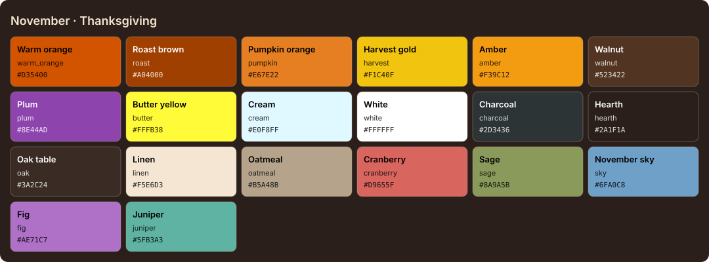

<!-- Generated by Generate-Themes.ps1 from season.jsonc. Edit season.jsonc, not this file. -->

# November: Thanksgiving

> Falling leaves, a full table and a whole lot of gratitude

November is the height of fall: deep oranges, browns and golden tones with fall foliage and Thanksgiving feast imagery.

The colours are currently the same as October's; the turkeys, drumsticks and maple leaves are what set it apart.

| | |
|---|---|
| **Appearance** | dark |
| **Mood** | cozy, grateful, warm, abundant |
| **Holidays** | Thanksgiving (US) (Nov 22), 4th Thursday, between the 22nd and 28th |
| **Imagery** | Thanksgiving table, roast turkey, pumpkin pie, maple leaves, corn harvest, cornucopia, fireplace |

## Palette

| Key | Name | Hex | Note |
|---|---|---|---|
| `warm_orange` | Warm orange | `#D35400` |  |
| `roast` | Roast brown | `#A04000` |  |
| `pumpkin` | Pumpkin orange | `#E67E22` |  |
| `harvest` | Harvest gold | `#F1C40F` |  |
| `amber` | Amber | `#F39C12` |  |
| `walnut` | Walnut | `#523422` |  |
| `plum` | Plum | `#8E44AD` |  |
| `butter` | Butter yellow | `#FFFB38` |  |
| `cream` | Cream | `#E0F8FF` |  |
| `white` | White | `#FFFFFF` |  |
| `charcoal` | Charcoal | `#2D3436` |  |

## Colour roles

Roles marked *inherits* are not set in `season.jsonc` and take the colour of the role named.

### Brand

The month's signature colours. Prompt segments, badges, status bars and accents.

| Role | Colour | Hex | Text on it | Notes |
|---|---|---|---|---|
| `primary` | warm_orange | `#D35400` | `#FFFFFF` 4.2:1 |  |
| `secondary` | roast | `#A04000` | `#FFFFFF` 6.5:1 |  |
| `accent` | harvest | `#F1C40F` | `#2D3436` 7.6:1 |  |
| `tertiary` | pumpkin | `#E67E22` | `#2D3436` 4.5:1 |  |
| `accent_alt` | amber | `#F39C12` | `#2D3436` 5.8:1 |  |
| `highlight` | plum | `#8E44AD` | `#FFFFFF` 5.9:1 |  |
| `deep` | walnut | `#523422` | `#FFFFFF` 11.2:1 |  |
| `text_accent` | butter | `#FFFB38` | `#2D3436` 11.5:1 |  |
| `line` | warm_orange | `#D35400` | `#FFFFFF` 4.2:1 | *inherits* `brand.primary` |

### UI

Surfaces and text of an application window.

| Role | Colour | Hex | Notes |
|---|---|---|---|
| `text_light` | white | `#FFFFFF` |  |
| `text_dark` | charcoal | `#2D3436` |  |
| `background` | walnut | `#523422` | *inherits* `brand.deep` |
| `foreground` | white | `#FFFFFF` | *inherits* `ui.text_light` |
| `surface` | walnut | `#523422` | *inherits* `ui.background` |
| `line_highlight` | walnut | `#523422` | *inherits* `ui.surface` |
| `border` | walnut | `#523422` | *inherits* `ui.surface` |
| `muted` | white | `#FFFFFF` | *inherits* `ui.foreground` |
| `selection` | roast | `#A04000` | *inherits* `brand.secondary` |
| `cursor` | warm_orange | `#D35400` | *inherits* `brand.primary` |

### Status

Meaningful states.

| Role | Colour | Hex | Notes |
|---|---|---|---|
| `error` | roast | `#A04000` |  |
| `success` | cream | `#E0F8FF` |  |
| `warning` | harvest | `#F1C40F` | *inherits* `brand.accent` |
| `info` | plum | `#8E44AD` | *inherits* `brand.highlight` |

### Syntax

Code highlighting (editors, bat, delta...).

| Role | Colour | Hex | Notes |
|---|---|---|---|
| `comment` | white | `#FFFFFF` | *inherits* `ui.muted` |
| `keyword` | warm_orange | `#D35400` | *inherits* `brand.primary` |
| `string` | harvest | `#F1C40F` | *inherits* `brand.accent` |
| `number` | pumpkin | `#E67E22` | *inherits* `brand.tertiary` |
| `constant` | pumpkin | `#E67E22` | *inherits* `syntax.number` |
| `function` | amber | `#F39C12` | *inherits* `brand.accent_alt` |
| `type` | plum | `#8E44AD` | *inherits* `brand.highlight` |
| `variable` | white | `#FFFFFF` | *inherits* `ui.foreground` |
| `parameter` | white | `#FFFFFF` | *inherits* `syntax.variable` |
| `property` | white | `#FFFFFF` | *inherits* `syntax.variable` |
| `operator` | white | `#FFFFFF` | *inherits* `ui.foreground` |
| `punctuation` | white | `#FFFFFF` | *inherits* `ui.foreground` |
| `tag` | warm_orange | `#D35400` | *inherits* `syntax.keyword` |
| `attribute` | amber | `#F39C12` | *inherits* `syntax.function` |
| `regex` | harvest | `#F1C40F` | *inherits* `syntax.string` |
| `invalid` | roast | `#A04000` | *inherits* `status.error` |

### Terminal

The 16 ANSI colours plus terminal chrome. Used by terminal emulators and every CLI tool that prints colour. Keep each hue recognisable (red should read as red).

| Role | Colour | Hex | Notes |
|---|---|---|---|
| `background` | walnut | `#523422` | *inherits* `ui.background` |
| `foreground` | white | `#FFFFFF` | *inherits* `ui.foreground` |
| `cursor` | warm_orange | `#D35400` | *inherits* `ui.cursor` |
| `selection` | roast | `#A04000` | *inherits* `ui.selection` |
| `black` | walnut | `#523422` | *inherits* `ui.background` |
| `red` | roast | `#A04000` | *inherits* `status.error` |
| `green` | cream | `#E0F8FF` | *inherits* `status.success` |
| `yellow` | harvest | `#F1C40F` | *inherits* `status.warning` |
| `blue` | plum | `#8E44AD` | *inherits* `status.info` |
| `magenta` | plum | `#8E44AD` | *inherits* `brand.highlight` |
| `cyan` | plum | `#8E44AD` | *inherits* `status.info` |
| `white` | white | `#FFFFFF` | *inherits* `ui.foreground` |
| `bright_black` | white | `#FFFFFF` | *inherits* `ui.muted` |
| `bright_red` | roast | `#A04000` | *inherits* `terminal.red` |
| `bright_green` | cream | `#E0F8FF` | *inherits* `terminal.green` |
| `bright_yellow` | harvest | `#F1C40F` | *inherits* `terminal.yellow` |
| `bright_blue` | plum | `#8E44AD` | *inherits* `terminal.blue` |
| `bright_magenta` | plum | `#8E44AD` | *inherits* `terminal.magenta` |
| `bright_cyan` | plum | `#8E44AD` | *inherits* `terminal.cyan` |
| `bright_white` | white | `#FFFFFF` | *inherits* `terminal.white` |

## Icons

| Role | Icon | Code points | Notes |
|---|---|---|---|
| `shell` | 🍂 | U+1F342 |  |
| `path` | 🍗🍗🍗 | U+1F357 U+1F357 U+1F357 |  |
| `git` | 🌽 | U+1F33D |  |
| `exec_time` | 🍽️ | U+1F37D U+FE0F |  |
| `clock` | 🦃 | U+1F983 |  |
| `status_ok` | 🍁 | U+1F341 |  |
| `root` | 🍂 | U+1F342 |  |
| `folder` | 🦃 | U+1F983 |  |
| `home` | 🍁 | U+1F341 |  |
| `battery` | 🍂 | U+1F342 |  |
| `status_err` | 🍁 | U+1F341 |  |
| `language` | 🍁 | U+1F341 |  |
| `prompt` | ⌂ | U+2302 | *default* |

**Languages and tools** (anything not listed uses `language`: 🍁)

| Segment | Icon |
|---|---|
| `node` | 🦃 |
| `npm` | 🥧 |
| `python` | 🍂 |
| `dotnet` | 🍂 |
| `rust` | 🍂 |
| `angular` | 🍠 |
| `julia` | 🍂 |
| `azfunc` | 🍂 |
| `aws` | 🍂 |

**Operating systems** (anything not listed uses `shell`: 🍂)

| OS | Icon |
|---|---|
| `linux` | 🍁 |
| `macos` | 🍂 |
| `windows` | 🦃 |

**Spares:** 🍽️ 🍴 🌰 🍊 🥕 🥔 🥧 🍠 🌽 ☕ 🧣 🧤 🏈 🙏 🥂 🏡

## Ideas

- More Thanksgiving food: 🥧 pie, 🌽 corn, 🍠 sweet potato
- Use 🦃 turkey more prominently throughout the theme
- 🍊 tangerine for autumn fruit
- Give November its own harvest palette so it doesn't share October's colours

## Links

- [Emojipedia: Thanksgiving](https://emojipedia.org/thanksgiving)
- [Emojipedia: Fall / Autumn](https://emojipedia.org/fall-autumn)

## Generated files

- [davids-November.omp.json](davids-November.omp.json): Oh My Posh prompt.
  Try it with `oh-my-posh init pwsh --config <repo>/November/davids-November.omp.json | Invoke-Expression`.
- [palette.svg](palette.svg): palette swatch sheet.
