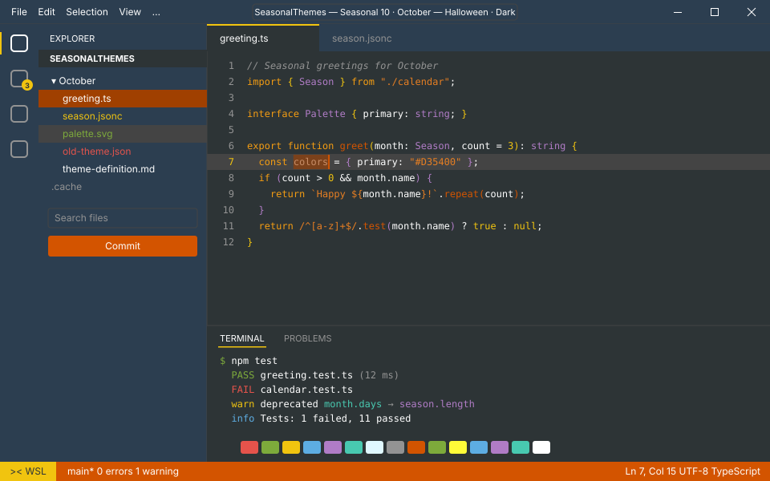
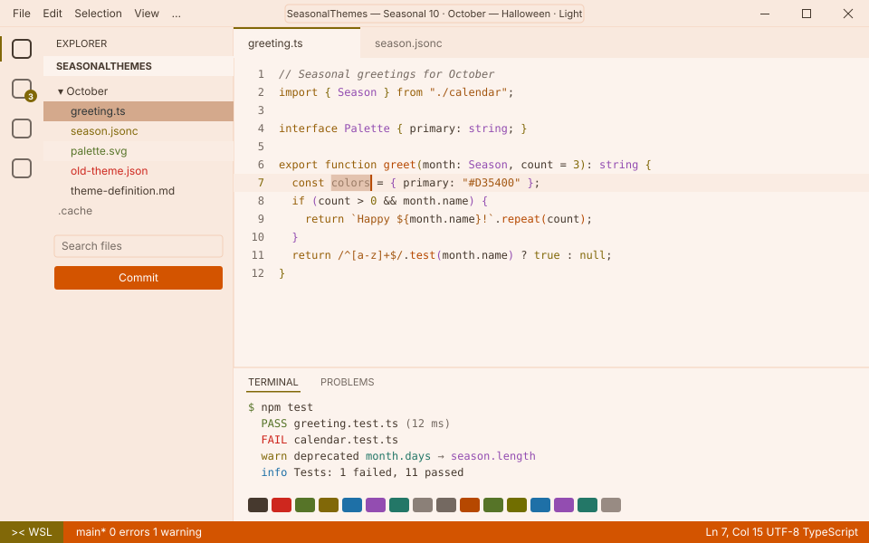

<!-- Generated by Generate-Themes.ps1 from season.jsonc. Edit season.jsonc, not this file. -->

# 🍂 October: Halloween

> Pumpkins, bones and candy corn on a dark autumn night

October embraces Halloween: pumpkin and carrot oranges, candy-corn gold and bark brown, with a witchy purple for contrast.

The icons mix the spooky (skulls, bones, ghosts, spiders) with the autumn harvest (fallen leaves, chestnuts, pie).

<p> </p>

- **Holidays:** Halloween (Oct 31)
- **Mood:** spooky, playful, cozy, autumnal
- **Modes:** dark (default), light

## Colours

| Role | Colour |
|---|---|
| Primary | Pumpkin orange `#D35400` |
| Secondary | Burnt orange `#A04000` |
| Tertiary | Carrot orange `#E67E22` |
| Accent | Candy-corn gold `#F1C40F` |
| Highlight | Witch purple `#8E44AD` |
| VS Code status bar | Pumpkin orange `#D35400` |
| Dark editor background | Charcoal `#2D3436` |
| Light editor background | `#FCF3ED` |


## Icons

| Shell | Admin | Folder | Home | Git | Run time | Clock | Success | Failure |
|---|---|---|---|---|---|---|---|---|
| 🍂 | 🍂 | 💀 | 🦴 | 🌰 | 🎃 | 🕷️ | 👻 | 👻 |

The prompt, illustrated:

```text
╭─🍂 pwsh  💀 ~/code  🌰 main ✏️ ~1  🎃 12ms          🕷️ 7:30 PM
⌂──👻
```

## Use it

- **VS Code:** pick *Seasonal 10 · October — Halloween · Dark* or *Seasonal 10 · October — Halloween · Light* with **Preferences: Color Theme**. The Seasonal Themes extension switches to it during October on its own.
- **Oh My Posh:** [davids-October.omp.json](davids-October.omp.json) (dark), [davids-October-light.omp.json](davids-October-light.omp.json) (light). `Get-SeasonalTheme.ps1` picks the right one for today.

---

Every colour role, the light-mode changes and all generated files are in [theme-definition.md](theme-definition.md). To change the month, edit [season.jsonc](season.jsonc) and run `pwsh ./Generate-Themes.ps1`.
