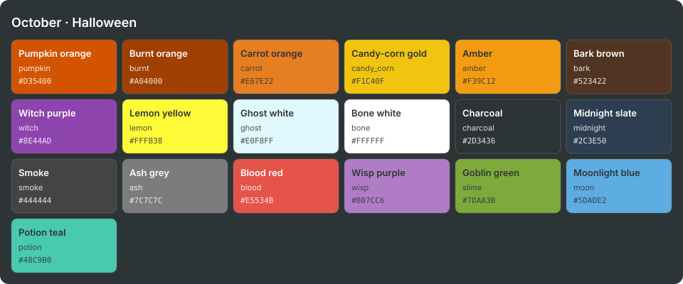
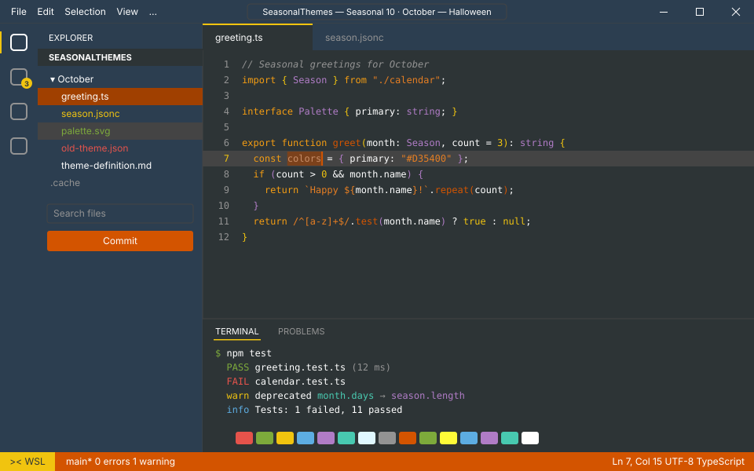

<!-- Generated by Generate-Themes.ps1 from season.jsonc. Edit season.jsonc, not this file. -->

# October: Halloween

> Pumpkins, bones and candy corn on a dark autumn night

October embraces Halloween: pumpkin and carrot oranges, candy-corn gold and bark brown, with a witchy purple for contrast.

The icons mix the spooky (skulls, bones, ghosts, spiders) with the autumn harvest (fallen leaves, chestnuts, pie).

| | |
|---|---|
| **Appearance** | dark |
| **Mood** | spooky, playful, cozy, autumnal |
| **Holidays** | Halloween (Oct 31) |
| **Imagery** | jack-o'-lantern, pumpkin patch, fallen leaves, haunted house, full moon, bats, fog, candy corn |

## Palette

| Key | Name | Hex | Note |
|---|---|---|---|
| `pumpkin` | Pumpkin orange | `#D35400` |  |
| `burnt` | Burnt orange | `#A04000` |  |
| `carrot` | Carrot orange | `#E67E22` |  |
| `candy_corn` | Candy-corn gold | `#F1C40F` |  |
| `amber` | Amber | `#F39C12` |  |
| `bark` | Bark brown | `#523422` |  |
| `witch` | Witch purple | `#8E44AD` |  |
| `lemon` | Lemon yellow | `#FFFB38` |  |
| `ghost` | Ghost white | `#E0F8FF` |  |
| `bone` | Bone white | `#FFFFFF` |  |
| `charcoal` | Charcoal | `#2D3436` |  |
| `midnight` | Midnight slate | `#2C3E50` | From the Fall VS Code theme's sidebar |
| `smoke` | Smoke | `#444444` |  |
| `ash` | Ash grey | `#939393` |  |
| `blood` | Blood red | `#E5534B` | Proposed: terminal red, invalid code |
| `wisp` | Wisp purple | `#B07CC6` | Proposed: witch purple lightened to read on charcoal (syntax types, terminal magenta) |
| `slime` | Goblin green | `#7DAA3B` | Proposed: terminal green |
| `moon` | Moonlight blue | `#5DADE2` | Proposed: terminal blue |
| `potion` | Potion teal | `#48C9B0` | Proposed: terminal cyan |

## Colour roles

Roles marked *inherits* are not set in `season.jsonc` and take the colour of the role named.

### Brand

The month's signature colours. Prompt segments, badges, status bars and accents.

| Role | Colour | Hex | Text on it | Notes |
|---|---|---|---|---|
| `primary` | pumpkin | `#D35400` | `#FFFFFF` 4.2:1 |  |
| `secondary` | burnt | `#A04000` | `#FFFFFF` 6.5:1 |  |
| `accent` | candy_corn | `#F1C40F` | `#2D3436` 7.6:1 |  |
| `tertiary` | carrot | `#E67E22` | `#2D3436` 4.5:1 |  |
| `accent_alt` | amber | `#F39C12` | `#2D3436` 5.8:1 |  |
| `highlight` | witch | `#8E44AD` | `#FFFFFF` 5.9:1 |  |
| `deep` | bark | `#523422` | `#FFFFFF` 11.2:1 |  |
| `text_accent` | lemon | `#FFFB38` | `#2D3436` 11.5:1 |  |
| `line` | pumpkin | `#D35400` | `#FFFFFF` 4.2:1 | *inherits* `brand.primary` |

### UI

Surfaces and text of an application window.

| Role | Colour | Hex | Notes |
|---|---|---|---|
| `text_light` | bone | `#FFFFFF` |  |
| `text_dark` | charcoal | `#2D3436` |  |
| `background` | charcoal | `#2D3436` |  |
| `foreground` | bone | `#FFFFFF` |  |
| `surface` | midnight | `#2C3E50` |  |
| `line_highlight` | smoke | `#444444` |  |
| `border` | smoke | `#444444` |  |
| `muted` | ash | `#939393` |  |
| `selection` | burnt | `#A04000` |  |
| `cursor` | pumpkin | `#D35400` |  |

### Status

Meaningful states.

| Role | Colour | Hex | Notes |
|---|---|---|---|
| `error` | burnt | `#A04000` |  |
| `success` | ghost | `#E0F8FF` |  |
| `warning` | candy_corn | `#F1C40F` |  |
| `info` | moon | `#5DADE2` |  |

### Syntax

Code highlighting (editors, bat, delta...).

| Role | Colour | Hex | Notes |
|---|---|---|---|
| `comment` | ash | `#939393` | italic |
| `keyword` | amber | `#F39C12` |  |
| `string` | carrot | `#E67E22` |  |
| `number` | candy_corn | `#F1C40F` |  |
| `constant` | candy_corn | `#F1C40F` |  |
| `function` | pumpkin | `#D35400` |  |
| `type` | wisp | `#B07CC6` |  |
| `variable` | bone | `#FFFFFF` |  |
| `parameter` | bone | `#FFFFFF` | *inherits* `syntax.variable` |
| `property` | bone | `#FFFFFF` | *inherits* `syntax.variable` |
| `operator` | bone | `#FFFFFF` | *inherits* `ui.foreground` |
| `punctuation` | bone | `#FFFFFF` | *inherits* `ui.foreground` |
| `tag` | amber | `#F39C12` | *inherits* `syntax.keyword` |
| `attribute` | pumpkin | `#D35400` | *inherits* `syntax.function` |
| `regex` | carrot | `#E67E22` | *inherits* `syntax.string` |
| `invalid` | blood | `#E5534B` |  |

### Terminal

The 16 ANSI colours plus terminal chrome. Used by terminal emulators and every CLI tool that prints colour. Keep each hue recognisable (red should read as red).

| Role | Colour | Hex | Notes |
|---|---|---|---|
| `background` | charcoal | `#2D3436` | *inherits* `ui.background` |
| `foreground` | bone | `#FFFFFF` | *inherits* `ui.foreground` |
| `cursor` | pumpkin | `#D35400` | *inherits* `ui.cursor` |
| `selection` | burnt | `#A04000` | *inherits* `ui.selection` |
| `black` | charcoal | `#2D3436` |  |
| `red` | blood | `#E5534B` |  |
| `green` | slime | `#7DAA3B` |  |
| `yellow` | candy_corn | `#F1C40F` |  |
| `blue` | moon | `#5DADE2` |  |
| `magenta` | wisp | `#B07CC6` |  |
| `cyan` | potion | `#48C9B0` |  |
| `white` | ghost | `#E0F8FF` |  |
| `bright_black` | ash | `#939393` |  |
| `bright_red` | pumpkin | `#D35400` |  |
| `bright_green` | slime | `#7DAA3B` | *inherits* `terminal.green` |
| `bright_yellow` | lemon | `#FFFB38` |  |
| `bright_blue` | moon | `#5DADE2` | *inherits* `terminal.blue` |
| `bright_magenta` | wisp | `#B07CC6` | *inherits* `terminal.magenta` |
| `bright_cyan` | potion | `#48C9B0` | *inherits* `terminal.cyan` |
| `bright_white` | bone | `#FFFFFF` |  |

## Icons

| Role | Icon | Code points | Notes |
|---|---|---|---|
| `shell` | 🍂 | U+1F342 |  |
| `path` | 💀 | U+1F480 |  |
| `git` | 🌰 | U+1F330 |  |
| `exec_time` | 🎃 | U+1F383 |  |
| `clock` | 🕷️ | U+1F577 U+FE0F |  |
| `status_ok` | 👻 | U+1F47B |  |
| `root` | 🍂 | U+1F342 |  |
| `folder` | 💀 | U+1F480 |  |
| `home` | 🦴 | U+1F9B4 |  |
| `battery` | 🍂 | U+1F342 |  |
| `status_err` | 👻 | U+1F47B |  |
| `language` | 🍂 | U+1F342 |  |
| `prompt` | ⌂ | U+2302 |  |

**Languages and tools** (anything not listed uses `language`: 🍂)

| Segment | Icon |
|---|---|
| `node` | 🎃 |
| `npm` | 🥧 |
| `yarn` | 🍁 |
| `java` | 🍁 |
| `go` | 🍁 |
| `dart` | 🍁 |
| `angular` | 🎃 |
| `nx` | 🍁 |
| `ruby` | 🍁 |
| `kubectl` | 🍁 |

**Operating systems** (anything not listed uses `shell`: 🍂)

| OS | Icon |
|---|---|
| `linux` | ☠️ |
| `macos` | 🍂 |
| `windows` | 🎃 |

**Spares:** ☠️ 👺 👽 🕸️ 🥷 🧙‍♂️ 🩻 🪦 🏴‍☠️ 🧹 🦇 🧛 🔮 🕯️ ⚰️ 🌕 🍬 🍭 🥧

## VS Code

Theme: [Seasonal 10 · October — Halloween](../vscode/themes/october.json), part of the Seasonal Themes extension in `vscode/`.

## Ideas

- More Halloween icons: 🧙 witch, 🧛 vampire, 🦇 bat
- 👁️ eye for watching processes
- 🎭 theater masks for git changes
- 🔮 crystal ball for predictive / suggestion segments
- 🧠 brain for memory usage

## Links

- [Emojipedia: Halloween](https://emojipedia.org/halloween)
- [Emojipedia: Fall / Autumn](https://emojipedia.org/fall-autumn)

## Generated files

- [davids-October.omp.json](davids-October.omp.json): Oh My Posh prompt.
  Try it with `oh-my-posh init pwsh --config <repo>/October/davids-October.omp.json | Invoke-Expression`.
- [palette.svg](palette.svg): palette swatch sheet.
- [../vscode/themes/october.json](../vscode/themes/october.json): VS Code colour theme.
- [vscode-preview.svg](vscode-preview.svg): preview of the VS Code theme.
