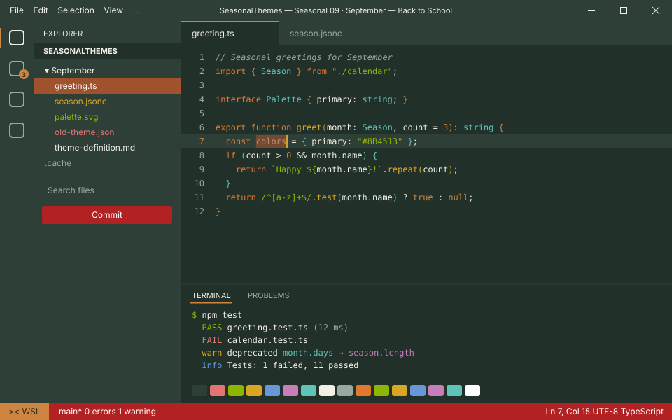
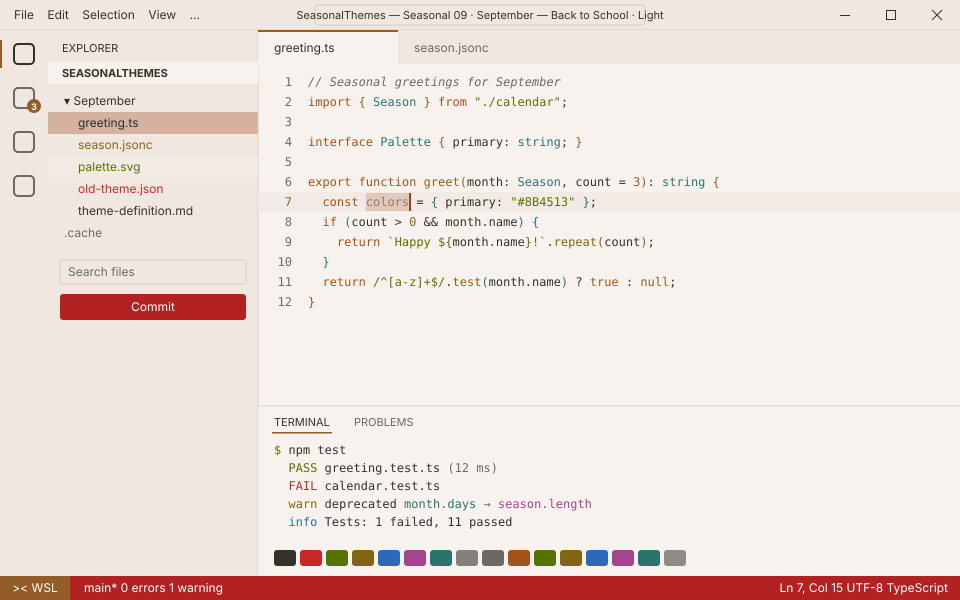

<!-- Generated by Generate-Themes.ps1 from season.jsonc. Edit season.jsonc, not this file. -->

# 🍎 September: Back to School

> Apples, notebooks and the first falling leaves

September is the turn from summer to fall: early autumn browns, sienna and goldenrod, paired with back-to-school icons.

Apples, books and notebooks sit alongside the first fallen leaves; the dark text is chalkboard green.

<p> </p>

- **Holidays:** Labor Day (Sep 1, first Monday); Autumn equinox (Sep 22, around the 22nd)
- **Mood:** studious, crisp, warm, nostalgic
- **Modes:** dark (default), light

## Colours

| Role | Colour |
|---|---|
| Primary | Bark brown `#8B4513` |
| Secondary | Burnt sienna `#A0522D` |
| Tertiary | Goldenrod `#DAA520` |
| Accent | Peru `#CD853F` |
| Highlight | Harvest gold `#B8860B` |
| VS Code status bar | Apple red `#B22222` |
| Dark editor background | Chalkboard `#22302A` |
| Light editor background | `#F7F2EE` |


## Icons

| Shell | Admin | Folder | Home | Git | Run time | Clock | Success | Failure |
|---|---|---|---|---|---|---|---|---|
| 🍎 | 📚 | 🍂 | 🏫 | 🍁 | 🚌 | 🔔 | 🍏 | 🍎 |

The prompt, illustrated:

```text
╭─🍎 pwsh  🍂 ~/code  🍁 main ✏️ ~1  🚌 12ms          🔔 7:30 PM
⌂──🍏
```

## Use it

- **VS Code:** pick *Seasonal 09 · September — Back to School · Dark* or *Seasonal 09 · September — Back to School · Light* with **Preferences: Color Theme**. The Seasonal Themes extension switches to it during September on its own.
- **Oh My Posh:** [davids-September.omp.json](davids-September.omp.json) (dark), [davids-September-light.omp.json](davids-September-light.omp.json) (light). `Get-SeasonalTheme.ps1` picks the right one for today.

---

Every colour role, the light-mode changes and all generated files are in [theme-definition.md](theme-definition.md). To change the month, edit [season.jsonc](season.jsonc) and run `pwsh ./Generate-Themes.ps1`.
