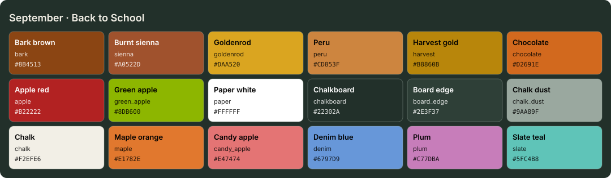

<!-- Generated by Generate-Themes.ps1 from season.jsonc. Edit season.jsonc, not this file. -->

# September: Back to School

> Apples, notebooks and the first falling leaves

September is the turn from summer to fall: early autumn browns, sienna and goldenrod, paired with back-to-school icons.

Apples, books and notebooks sit alongside the first fallen leaves; the dark text is chalkboard green.

| | |
|---|---|
| **Appearance** | dark |
| **Mood** | studious, crisp, warm, nostalgic |
| **Holidays** | Labor Day (Sep 1), first Monday; Autumn equinox (Sep 22), around the 22nd |
| **Imagery** | red apple, chalkboard, stack of books, school bus, first fallen leaves, goldenrod, pencils |

## Palette

| Key | Name | Hex | Note |
|---|---|---|---|
| `bark` | Bark brown | `#8B4513` |  |
| `sienna` | Burnt sienna | `#A0522D` |  |
| `goldenrod` | Goldenrod | `#DAA520` |  |
| `peru` | Peru | `#CD853F` |  |
| `harvest` | Harvest gold | `#B8860B` |  |
| `chocolate` | Chocolate | `#D2691E` |  |
| `apple` | Apple red | `#B22222` |  |
| `green_apple` | Green apple | `#8DB600` | Status success, to match the 🍏 |
| `paper` | Paper white | `#FFFFFF` |  |
| `chalkboard` | Chalkboard | `#22302A` | Dark text on the light segments; also the editor background |
| `board_edge` | Board edge | `#2E3F37` | Proposed: panels, borders, current line |
| `chalk_dust` | Chalk dust | `#9AA89F` | Proposed: comments, muted text |
| `chalk` | Chalk | `#F2EFE6` | Proposed: editor text |
| `maple` | Maple orange | `#E1782E` | Proposed: chocolate lightened to read on chalkboard (keywords) |
| `candy_apple` | Candy apple | `#E47474` | Proposed: apple red lightened (terminal red, invalid code) |
| `denim` | Denim blue | `#6797D9` | Proposed: terminal blue, info |
| `plum` | Plum | `#C77DBA` | Proposed: terminal magenta |
| `slate` | Slate teal | `#5FC4B8` | Proposed: terminal cyan, types |

## Colour roles

Roles marked *inherits* are not set in `season.jsonc` and take the colour of the role named.

### Brand

The month's signature colours. Prompt segments, badges, status bars and accents.

| Role | Colour | Hex | Text on it | Notes |
|---|---|---|---|---|
| `primary` | bark | `#8B4513` | `#FFFFFF` 7.1:1 |  |
| `secondary` | sienna | `#A0522D` | `#FFFFFF` 5.6:1 |  |
| `accent` | peru | `#CD853F` | `#22302A` 4.6:1 |  |
| `tertiary` | goldenrod | `#DAA520` | `#22302A` 6.2:1 |  |
| `accent_alt` | apple | `#B22222` | `#FFFFFF` 6.7:1 |  |
| `highlight` | harvest | `#B8860B` | `#22302A` 4.2:1 |  |
| `deep` | chocolate | `#D2691E` | `#22302A` 3.8:1 |  |
| `text_accent` | paper | `#FFFFFF` | `#22302A` 13.8:1 |  |
| `line` | bark | `#8B4513` | `#FFFFFF` 7.1:1 | *inherits* `brand.primary` |

### UI

Surfaces and text of an application window.

| Role | Colour | Hex | Notes |
|---|---|---|---|
| `text_light` | paper | `#FFFFFF` |  |
| `text_dark` | chalkboard | `#22302A` |  |
| `background` | chalkboard | `#22302A` |  |
| `foreground` | chalk | `#F2EFE6` |  |
| `surface` | board_edge | `#2E3F37` |  |
| `line_highlight` | board_edge | `#2E3F37` |  |
| `border` | board_edge | `#2E3F37` |  |
| `muted` | chalk_dust | `#9AA89F` |  |
| `selection` | sienna | `#A0522D` |  |
| `cursor` | goldenrod | `#DAA520` |  |

### Status

Meaningful states.

| Role | Colour | Hex | Notes |
|---|---|---|---|
| `error` | apple | `#B22222` |  |
| `success` | green_apple | `#8DB600` |  |
| `warning` | goldenrod | `#DAA520` |  |
| `info` | denim | `#6797D9` |  |

### Syntax

Code highlighting (editors, bat, delta...).

| Role | Colour | Hex | Notes |
|---|---|---|---|
| `comment` | chalk_dust | `#9AA89F` | italic |
| `keyword` | maple | `#E1782E` |  |
| `string` | green_apple | `#8DB600` |  |
| `number` | peru | `#CD853F` |  |
| `constant` | peru | `#CD853F` |  |
| `function` | goldenrod | `#DAA520` |  |
| `type` | slate | `#5FC4B8` |  |
| `variable` | chalk | `#F2EFE6` |  |
| `parameter` | chalk | `#F2EFE6` | *inherits* `syntax.variable` |
| `property` | chalk | `#F2EFE6` | *inherits* `syntax.variable` |
| `operator` | chalk | `#F2EFE6` | *inherits* `ui.foreground` |
| `punctuation` | chalk | `#F2EFE6` | *inherits* `ui.foreground` |
| `tag` | maple | `#E1782E` | *inherits* `syntax.keyword` |
| `attribute` | goldenrod | `#DAA520` | *inherits* `syntax.function` |
| `regex` | green_apple | `#8DB600` | *inherits* `syntax.string` |
| `invalid` | candy_apple | `#E47474` |  |

### Terminal

The 16 ANSI colours plus terminal chrome. Used by terminal emulators and every CLI tool that prints colour. Keep each hue recognisable (red should read as red).

| Role | Colour | Hex | Notes |
|---|---|---|---|
| `background` | chalkboard | `#22302A` | *inherits* `ui.background` |
| `foreground` | chalk | `#F2EFE6` | *inherits* `ui.foreground` |
| `cursor` | goldenrod | `#DAA520` | *inherits* `ui.cursor` |
| `selection` | sienna | `#A0522D` | *inherits* `ui.selection` |
| `black` | board_edge | `#2E3F37` |  |
| `red` | candy_apple | `#E47474` |  |
| `green` | green_apple | `#8DB600` |  |
| `yellow` | goldenrod | `#DAA520` |  |
| `blue` | denim | `#6797D9` |  |
| `magenta` | plum | `#C77DBA` |  |
| `cyan` | slate | `#5FC4B8` |  |
| `white` | chalk | `#F2EFE6` |  |
| `bright_black` | chalk_dust | `#9AA89F` |  |
| `bright_red` | maple | `#E1782E` |  |
| `bright_green` | green_apple | `#8DB600` | *inherits* `terminal.green` |
| `bright_yellow` | goldenrod | `#DAA520` | *inherits* `terminal.yellow` |
| `bright_blue` | denim | `#6797D9` | *inherits* `terminal.blue` |
| `bright_magenta` | plum | `#C77DBA` | *inherits* `terminal.magenta` |
| `bright_cyan` | slate | `#5FC4B8` | *inherits* `terminal.cyan` |
| `bright_white` | paper | `#FFFFFF` |  |

## Icons

| Role | Icon | Code points | Notes |
|---|---|---|---|
| `shell` | 🍎 | U+1F34E |  |
| `path` | 🍂 | U+1F342 |  |
| `git` | 🍁 | U+1F341 |  |
| `exec_time` | 🚌 | U+1F68C |  |
| `clock` | 🔔 | U+1F514 |  |
| `status_ok` | 🍏 | U+1F34F |  |
| `root` | 📚 | U+1F4DA |  |
| `folder` | 📓 | U+1F4D3 |  |
| `home` | 🏫 | U+1F3EB |  |
| `battery` | 🧃 | U+1F9C3 |  |
| `status_err` | 🍎 | U+1F34E |  |
| `language` | 🍂 | U+1F342 |  |
| `prompt` | ⌂ | U+2302 | *default* |

**Languages and tools** (anything not listed uses `language`: 🍂)

| Segment | Icon |
|---|---|
| `node` | 🍏 |
| `npm` | 🥧 |
| `yarn` | 🍁 |
| `java` | 📚 |
| `go` | 📚 |
| `dart` | 📚 |
| `nx` | 📚 |
| `ruby` | 🍎 |
| `kubectl` | 📚 |

**Operating systems** (anything not listed uses `shell`: 🍎)

| OS | Icon |
|---|---|
| `linux` | 🍂 |
| `macos` | 🍏 |
| `windows` | 📐 |

**Spares:** 🎒 🧑‍🏫 ✏️ 📏 📐 📝 📄 🎓 📜 🍊 🌰 ☕ 🥧 🌾

## Ideas

- More school supplies: ✏️ 📏 📐 for various segments
- 🎒 backpack as an alternative home icon
- 📝 memo or 📄 document icons for file-related segments
- The old theme coloured execution time yellow over 300 ms and red over 1 s; the shared layout could bring that back for every month

## Links

- [Emojipedia: Fall / Autumn](https://emojipedia.org/fall-autumn)
- [Emojipedia: Graduation](https://emojipedia.org/graduation)

## Generated files

- [davids-September.omp.json](davids-September.omp.json): Oh My Posh prompt.
  Try it with `oh-my-posh init pwsh --config <repo>/September/davids-September.omp.json | Invoke-Expression`.
- [palette.svg](palette.svg): palette swatch sheet.
